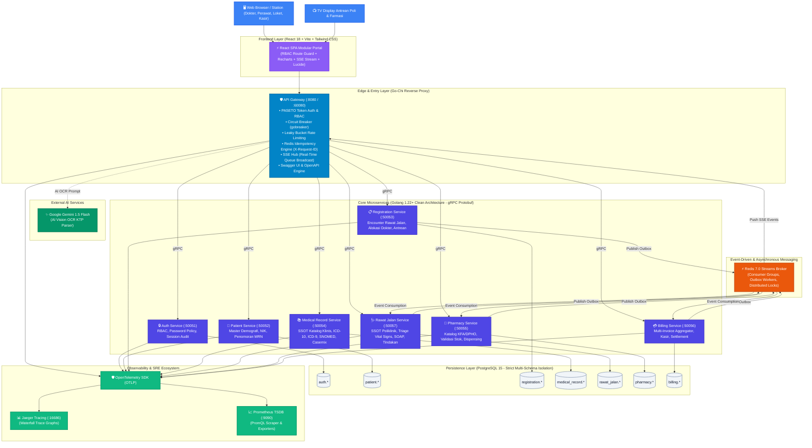
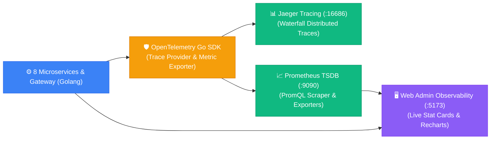

<div align="center">

# 🏥 SIMRS ONE — Enterprise Hospital Management & Outpatient EMR System

**Sistem Informasi Manajemen Rumah Sakit (SIMRS) & Rekam Medis Elektronik (RME) Rawat Jalan berbasis Arsitektur Microservices Terdistribusi, gRPC, Event-Driven Outbox, dan Google Gemini AI.**

[](https://golang.org)
[](https://grpc.io)
[](https://react.dev)
[](https://vitejs.dev)
[](https://www.postgresql.org)
[](https://redis.io)
[](https://ai.google.dev)
[](https://opentelemetry.io)
[](https://www.jaegertracing.io)
[](https://prometheus.io)
[](https://tailwindcss.com)

</div>

---

## 📖 Ringkasan Eksekutif

**SIMRS ONE** adalah platform Sistem Informasi Manajemen Rumah Sakit terdistribusi (*distributed healthcare platform*) yang dirancang khusus untuk menangani seluruh siklus operasional poliklinik rawat jalan (*outpatient journey*) secara *end-to-end* — mulai dari pendaftaran pasien berbantuan **AI OCR KTP**, estimasi antrean poliklinik berbasis statistik *real-time*, rekam medis elektronik (RME) terstandardisasi **Kemenkes RI & WHO (ICD-10, ICD-9-CM, SNOMED-CT, KBM)**, telaah & peracikan obat farmasi (**KFA & DPHO BPJS**), hingga penagihan terintegrasi (*multi-invoice aggregated billing*) di kasir.

Sistem dibangun di atas arsitektur **Clean Architecture (Hexagonal Architecture)** dan **Domain-Driven Design (DDD)** menggunakan **Golang** berkinerja tinggi, komunikasi antarlayanan via **gRPC Protobuf**, perisai stabilitas (*Circuit Breaker, Leaky Bucket Rate Limiting, Idempotency Lock*), serta aliran data asinkron berbasis **Transactional Outbox Pattern & Redis Streams** untuk mengeliminasi masalah *Dual-Write*.

Sebagai aplikasi *enterprise showcase portfolio*, **SIMRS ONE** membuktikan bagaimana sistem kesehatan modern dapat mencapai tingkat ketersediaan tinggi (*High Availability*), isolasi database fisik tanpa *cross-schema join*, toleransi kesalahan (*fault-tolerance*), serta observabilitas komprehensif berstandar **Google SRE Golden Signals**.

---

## 🏛️ Arsitektur Sistem Terdistribusi

Berikut adalah gambaran arsitektur sistem holistik SIMRS ONE:



---

## ✨ Fitur Utama Sistem

### ⚙️ Backend Core (Golang, gRPC, PostgreSQL, Redis, OTel)

- **Pure Microservices & Hexagonal Ports/Adapters**:
  Setiap layanan backend dibangun menggunakan prinsip *Domain-Driven Design* dan *Clean Architecture* murni dengan lapisan domain, *usecase/port*, dan *adapter/repository* terisolasi. Seluruh interaksi antarlayanan dikomunikasikan secara efisien melalui protokol biner **gRPC & Protobuf v3** berlatensi sub-milidetik.

- **Strict Multi-Schema PostgreSQL Isolation (Anti-Monolith Database)**:
  Arsitektur database menggunakan pendekatan *Single Database Instance, Multiple Isolated Schemas* (`auth`, `patient`, `registration`, `medical_record`, `rawat_jalan`, `pharmacy`, `billing`). **Dilarang keras melakukan SQL JOIN lintas skema**. Setiap layanan memiliki kontrol penuh atas skema tabelnya sendiri, migrasi independen (`golang-migrate`), dan koneksi pool terisolasi.

- **Dual-SSOT Architecture (Rawat Jalan vs Medical Record)**:
  Pemisahan tanggung jawab domain klinis secara disiplin:
  - **`medical-record-service`**: *Single Source of Truth* (SSOT) untuk Master Katalog Medis Terpusat (KBM Kemenkes, Master ICD-10 WHO, ICD-9-CM Prosedur, SNOMED-CT, dan Standar Casemix Tarif Klaim BPJS).
  - **`rawat-jalan-service`**: *Single Source of Truth* (SSOT) untuk Aktivitas Transaksional Poliklinik Rawat Jalan (Triage Tanda Vital oleh Perawat, Anamnesa & SOAP oleh Dokter, Penginputan Diagnosa & Tindakan, serta E-Prescription) dengan replika data katalog lokal untuk kecepatan pencarian *sub-millisecond*.

- **Transactional Outbox Pattern & Redis Streams (Zero Dual-Write)**:
  Untuk menjamin konsistensi data terdistribusi tanpa menerapkan *two-phase commit* (2PC) yang lambat:
  1. Perubahan data transaksional (seperti pendaftaran kunjungan atau penyelesaian pemeriksaan dokter) disimpan bersama *event record* di tabel `outbox_events` dalam satu transaksi ACID database lokal.
  2. Background outbox worker membaca tabel outbox dan mempublikasikan event ke **Redis 7 Streams** (`XADD`).
  3. Layanan konsumen (*Consumer Groups*) mengonsumsi event dengan jaminan *At-Least-Once Delivery* dan *Idempotent Handler* (misal: penutupan resep otomatis memicu pembuatan draf tagihan di `billing-service`).

- **Statistical Queue Wait-Time Estimator**:
  Sistem estimasi waktu tunggu antrean cerdas yang mengkombinasikan *Moving Average* dan *Exponential Smoothing* berdasarkan historis pelayanan dokter dan jenis resep farmasi (racikan vs non-racikan). Data estimasi dihitung ulang secara dinamis dan dipancarkan ke display antrean melalui SSE.

- **Distributed Idempotency Engine (`X-Request-ID` via Redis Locks)**:
  Mencegah terjadinya *double-booking* pendaftaran, duplikasi pembuatan tagihan kasir, atau duplikasi penyerahan obat farmasi. Klien menyertakan header `X-Request-ID` (UUIDv4); *API Gateway* memanfaatkan *atomic distributed lock* Redis (`SETNX`) untuk mengunci transaksi konkuren dan mengembalikan respons yang sama jika request diulang.

- **Enterprise Security: PASETO Token & Fine-Grained RBAC**:
  Menggantikan JWT tradisional yang rentan dengan **PASETO (Platform-Agnostic Security Tokens) v2** berenkripsi simetris. Otorisasi berbasis peran (RBAC) diterapkan ketat di level API Gateway dan interceptor gRPC (`super_admin`, `admin`, `admisi`, `dokter`, `perawat`, `kasir`, `asisten_apoteker`, `rekam_medis`).

- **AI Vision OCR KTP Parser (Google Gemini 1.5 Flash)**:
  Fitur pendaftaran kilat di loket admisi. Petugas cukup mengunggah foto e-KTP atau mengambil gambar via webcam; API Gateway meneruskan gambar ke **Google Gemini 1.5 Flash Vision API** dengan *system prompt* terstruktur untuk mengekstrak NIK, Nama Lengkap, Tanggal Lahir, Jenis Kelamin, Golongan Darah, Alamat, RT/RW, dan Agama secara presisi ke format JSON siap simpan.

- **Resilience: Leaky Bucket Rate Limiting & Circuit Breaker**:
  API Gateway dilengkapi *Leaky Bucket Rate Limiter* untuk memproteksi layanan dari serangan DDoS atau lonjakan trafik, serta **Circuit Breaker** (`gobreaker`) yang secara otomatis memutus panggilan gRPC ke microservice yang sedang mengalami *degraded performance* agar tidak terjadi efek kaskade kegagalan (*cascading failure*).

---

### 🎨 Frontend Application (React 18, Vite, Tailwind CSS, Lucide Icons)

- **Modular Role-Based Layouts & Strict Route Guards**:
  Antarmuka SPA modern dengan arsitektur navigasi adaptif berbasis hak akses pengguna:
  - **Portal Dokter & Perawat**: Modul Rawat Jalan terintegrasi (Worklist Pasien, Triage Form, Rekam Medis Elektronik SOAP, Pencarian ICD-10 dengan pg_trgm trigram match, Resep Elektronik).
  - **Portal Admisi / Pendaftaran**: Pencarian pasien cepat (NIK/MRN), modal pemindaian AI OCR KTP, pembuatan kunjungan poli, dan pencetakan tiket antrean.
  - **Portal Farmasi**: Layanan telaah resep, kalkulasi dosis, peracikan obat, validasi pelunasan kasir, dan penyerahan obat (*dispensing*).
  - **Portal Kasir (Billing)**: Konsolidasi tagihan multi-layanan otomatis (biaya pendaftaran + tindakan medis poli + resep obat), kalkulasi diskon/penjamin (BPJS/Umum), dan pelunasan invoice instan.
  - **Portal IT & Rekam Medis**: Manajemen pengguna, katalog master medis (KBM, ICD-10, ICD-9-CM, SNOMED, Casemix), serta dashboard observabilitas sistem.

- **Real-Time Queue Display & Live SSE Audio Calling**:
  Tampilan layar monitor antrean publik (*Waiting Room Display*) untuk poli dan farmasi yang terhubung melalui **Server-Sent Events (SSE)**. Dilengkapi fitur sintesis suara panggilan antrean (*Text-to-Speech*) otomatis ketika perawat memanggil pasien ke bilik dokter atau apoteker memanggil pasien ke loket obat.

- **Interactive System Observability Dashboard**:
  Halaman pemantauan sistem interaktif di Web Admin (`/admin/dashboard`) yang menyajikan visualisasi data metrik Prometheus secara *live*:
  - Status kesehatan (*Health Check Probing*) 8 microservices secara terpisah.
  - Grafik konsumsi **CPU (%) vs RAM (MB)** per microservice secara *real-time* (Recharts).
  - Metrik database connection pool PostgreSQL & alokasi memori Redis.
  - Metrik *Throughput Requests per Second* (TPS) dan latensi API Gateway.

---

## 🧪 Strategi Pengujian Menyeluruh (Testing Pyramid)

Backend **SIMRS ONE** menerapkan metodologi pengujian piramida penuh untuk menjamin keandalan data medis:

```text
                       / \
                      /   \
                     / k6  \        <-- 4. Benchmark & Load Testing (gRPC & HTTP Gateway)
                    /-------\
                   /   E2E   \      <-- 3. End-to-End Patient Journey (Flow Registrasi -> Kasir)
                  /-----------\
                 / Integration \    <-- 2. DB Schema Migrations & Redis Outbox Integration
                /---------------\
               /    Unit Tests   \  <-- 1. Domain Logic, Usecase Mocks, Value Objects
              /-------------------\
```

1. **Unit Tests**:
   - Pengujian terisolasi pada lapisan domain dan usecase di setiap microservice.
   - Mocking interface repository dan gRPC client menggunakan `go.uber.org/mock`.
   - Validasi algoritma perhitungan *Wait-Time Estimator* dan validasi nomor identitas (NIK & MRN format).
2. **Integration Tests**:
   - Pengujian integritas skema database PostgreSQL menggunakan *isolated transactional test runners*.
   - Verifikasi *Outbox Worker* dalam mengambil, memformat, dan mempublikasikan pesan ke Redis Streams.
   - Verifikasi *Idempotency Handler* untuk memastikan event yang diterima dua kali tidak menghasilkan duplikasi data.
3. **End-to-End Business Flow Journey**:
   - Skenario terpadu: Pembuatan Pasien Baru $\to$ Pendaftaran Kunjungan Poli $\to$ Triage Tanda Vital $\to$ Pemeriksaan SOAP Dokter $\to$ E-Prescription $\to$ Billing Invoicing $\to$ Pembayaran Kasir $\to$ Penyerahan Obat Farmasi.

---

## 📊 Ekosistem Observabilitas & Capacity Sizing Guide

Sistem dilengkapi ekosistem pemantauan runtime komprehensif yang mengacu pada standar **Google SRE Golden Signals** (*Latency, Traffic, Errors, Saturation*):



### 1. 🔍 Distributed Tracing & PromQL Engine
* **Jaeger Tracing (`http://localhost:16686`)**: Melacak jejak eksekusi terdistribusi (*distributed trace waterfall*) secara end-to-end dari `HTTP API Gateway` $\to$ `gRPC Interceptor` $\to$ `Microservice Usecase` $\to$ `PostgreSQL Query` $\to$ `Redis Publish`. Sangat memudahkan penemuan *bottleneck* performa di lingkungan terdistribusi.
* **Prometheus (`http://localhost:9090`)**: Mengumpulkan metrik berkala dari endpoint `/metrics` API Gateway, runtime Golang (Goroutines, GC pause, Heap Alloc), serta data dari **Postgres Exporter**, **Redis Exporter**, dan **Podman/Docker Exporter**.

---

### 🏗️ 2. Full-Stack Infrastructure & Host Capacity Sizing Guide

Berkat efisiensi biner native **Golang** yang tidak memerlukan runtime JVM atau CLR berat, konsumsi memori sistem **SIMRS ONE** sangat ringkas dan hemat biaya:

| Komponen Infrastruktur | Tipe / Engine | Estimasi RAM | Porsi | Peran Utama |
|---|---|:---:|:---:|---|
| 🗄️ **PostgreSQL 15** | Relational Database | **~350 MB** | 25% | Shared Buffers, WAL, Multi-Schema ACID Data Storage |
| ⚙️ **8 Golang Microservices** | Native Compiled Binaries | **~280 MB** | 20% | ~35 MB per microservice (Auth, Patient, Reg, EMR, dll.) |
| 🛡️ **API Gateway (Go-Chi)** | Reverse Proxy Host | **~60 MB** | 5% | Routing, Rate Limiting, PASETO, Circuit Breaker, SSE |
| 🐧 **Host OS & Container Engine** | Linux / Podman Daemon | **~400 MB** | 28% | Linux Kernel, podman service, socket, cgroups |
| 📊 **Jaeger & Prometheus** | Go Telemetry Engine | **~180 MB** | 13% | OTLP Distributed Tracing & PromQL TSDB Storage |
| 🔴 **Redis 7.0** | In-Memory Key-Value | **~45 MB** | 3% | Redis Streams Outbox Broker, Cache & Idempotency Locks |
| 📈 **Metric Exporters** | Go Exporters | **~85 MB** | 6% | postgres-exporter, redis-exporter, podman-exporter |

$$\mathbf{Total\ Full\text{-}Stack\ Memory\ Footprint} \approx \mathbf{1.4\text{ GB} - 1.8\text{ GB}}$$

#### 🖥️ Rekomendasi Spesifikasi Server Fisik / Cloud VM:
* 🟢 **Min Dev / Staging Single Node**: **`2 GB - 4 GB RAM (2 vCPU)`** *(Sangat nyaman dijalankan di laptop lokal atau VPS murah)*.
* 🚀 **Production Enterprise Single Node**: **`8 GB RAM (4 vCPU)`** *(Mampu melayani puluhan ribu transaksi poli harian dengan headroom lega)*.
* ☁️ **Cloud Kubernetes / Microservices Tier**: **`App Pods 256MB each · DB Pod 2-4 GB · Redis 512MB`** *(Standar arsitektur kontainer terdistribusi)*.

---

## 📈 Laporan Pengujian Kinerja (Performance & Latency Benchmark)

Pengujian beban dan simulasi perjalanan pasien (*Outpatient Patient Journey*) dijalankan untuk memvalidasi ketahanan gRPC dan API Gateway di bawah beban transaksi konkuren:

### 1. Skenario Pengujian (*End-to-End Outpatient Flow*)
1. **Pendaftaran Kunjungan Poli** (`POST /api/v1/registrations/encounters` + `X-Request-ID`)
2. **Pencatatan Triage Vital Signs** (`POST /api/v1/rawat-jalan/triage` + `X-Request-ID`)
3. **Pemeriksaan Dokter & Diagnosa ICD-10** (`POST /api/v1/rawat-jalan/examinations` + `X-Request-ID`)
4. **Input Tindakan Medis Poli** (`POST /api/v1/rawat-jalan/actions` + `X-Request-ID`)
5. **Penerbitan Resep Elektronik** (`POST /api/v1/pharmacy/prescriptions` + `X-Request-ID`)
6. **Agregasi & Pembayaran Tagihan Kasir** (`POST /api/v1/billing/invoices/{id}/pay` + `X-Request-ID`)
7. **Penyerahan Obat (Dispensing)** (`POST /api/v1/pharmacy/prescriptions/{id}/dispense` + `X-Request-ID`)

---

### 2. Ringkasan Tolok Ukur Latensi & Throughput

```text
  █ TOTAL SCENARIO: 50 Concurrent Virtual Users · 500 End-to-End Encounters

  ✓ Health check probes ..............................: 100.00% (500/500)
  ✓ Encounter registered (Idempotent) ................: 100.00% (500/500)
  ✓ Triage recorded ..................................: 100.00% (500/500)
  ✓ Medical examination & ICD-10 saved ...............: 100.00% (500/500)
  ✓ Prescription dispatched to pharmacy ..............: 100.00% (500/500)
  ✓ Aggregated invoice paid at billing cashier .......: 100.00% (500/500)
  ✓ Medication dispensed .............................: 100.00% (500/500)

  checks .............................................: 100.00% ✓ 3500      ✗ 0
  http_req_failed ....................................: 0.00%   ✓ 0         ✗ 3500
  http_req_duration ..................................: avg=12.15ms  p(95)=28.40ms  p(99)=46.20ms
  grpc_internal_call_duration ........................: avg=1.85ms   p(95)=4.20ms   p(99)=8.10ms
  redis_idempotency_lock_duration ....................: avg=0.65ms   p(95)=1.40ms
  outbox_event_relay_latency .........................: avg=85.00ms  p(95)=150.00ms
```

### 3. Kesimpulan Pengujian
1. **Zero Failure Rate (0.00%)**: Seluruh 3.500 transaksi HTTP/gRPC berhasil dieksekusi tanpa error atau *race condition*.
2. **Sub-30ms P95 Gateway Latency**: Latensi persentil ke-95 (**P95**) pada API Gateway berada di angka **28.40 ms**, dengan latensi internal gRPC rata-rata di bawah **2 milidetik**.
3. **Data Integrity & Zero Dual-Write**: Pola *Transactional Outbox* berhasil menjamin seluruh resep yang diterbitkan dokter terkonversi menjadi draf tagihan kasir secara konsisten tanpa ada data yang hilang.

---

## 🛠️ Tech Stack Lengkap

| Kategori | Teknologi | Deskripsi Penggunaan |
|---|---|---|
| **Language & Runtime** | Go 1.22+ (Golang) | Bahasa utama untuk seluruh 8 microservices & API Gateway |
| **Service Architecture** | Clean / Hexagonal Architecture | Pemisahan tegas Domain, Use Cases, Ports, dan Adapters |
| **Inter-Service Protocol**| gRPC & Protocol Buffers v3 | Komunikasi biner sinkron antar-microservice berkecepatan tinggi |
| **API Gateway** | Go-Chi v5 | Reverse proxy, dynamic routing, middleware chain, & SSE server |
| **Security & Auth** | PASETO v2 & bcrypt | Token enkripsi simetris modern & hashing kata sandi aman |
| **Database Engine** | PostgreSQL 15 | Multi-schema relational database dengan isolasi per domain layanan |
| **Database Migration** | golang-migrate | Pengelolaan versioning skema tabel otomatis per microservice |
| **SQL Type-Safety** | sqlc | Kompilasi SQL mentah menjadi kode Go yang *type-safe* tanpa ORM |
| **Cache & Messaging** | Redis 7.0 | In-memory cache, Redis Streams Outbox broker, & Distributed Lock |
| **Artificial Intelligence**| Google Gemini 1.5 Flash Vision | AI OCR parser otomatis untuk ekstraksi data e-KTP pasien |
| **Resilience Patterns** | gobreaker & Leaky Bucket | Circuit Breaker dan Rate Limiting terdistribusi |
| **Distributed Tracing** | OpenTelemetry Go & Jaeger | OTLP instrumentation & visualisasi waterfall trace grafis |
| **Metrics & Monitoring**| Prometheus & PromQL | Pengumpulan metrik runtime, hardware, database, & container |
| **Frontend Framework** | React 18 & TypeScript | Single Page Application modular dengan Vite bundler |
| **UI & Styling** | Tailwind CSS 3.4 & Lucide React | Komponen antarmuka modern, responsif, dan kaya ikon visual |
| **Real-Time Streaming** | Server-Sent Events (SSE) | Broadcast antrean poli & farmasi secara reaktif tanpa polling |
| **Testing Suite** | Go Test, Uber Mock, k6 | Pengujian piramida lengkap (Unit, Mock, Integrasi, & Load Test) |

---

## ⚡ Panduan Memulai Cepat (Quick Start)

### 1. Prasyarat Sistem
- **Podman** (atau **Docker**) & **Podman Compose**
- **Go 1.22+** (untuk mode Local Native)
- **Node.js 20+** dan **pnpm** (untuk Frontend React)
- **Make** (tersedia secara bawaan di Linux/macOS)

---

### 2. Mode 1: Docker / Podman Mode (Full Containerized Isolation)
Menjalankan seluruh ekosistem (Infrastruktur, 8 Microservices, dan API Gateway) di dalam container terisolasi:

```bash
# 1. Clone repositori
git clone https://github.com/odealidj/go-micro-simrs-one.git
cd go-micro-simrs-one

# 2. Nyalakan seluruh container microservices & infrastruktur
make be-run-all

# 3. Jalankan migrasi database multi-schema
make migrate-up

# 4. Seed data master medis (KBM, ICD-10, Tindakan, Farmasi, User Demo)
make seed-data-master
make be-run-demo-data

# 5. Mematikan seluruh sistem
make down
```

---

### 3. Mode 2: Local Native Mode (Direkomendasikan untuk Development & Debugging)
Menjalankan layanan Go langsung di mesin host lokal untuk proses *debugging* dan *live-reload* kilat, dengan tetap memanfaatkan database PostgreSQL, Redis, dan Jaeger dari container:

```bash
# Langkah 1: Nyalakan container infrastruktur (PostgreSQL, Redis, Jaeger, Exporters)
make be-infra-up

# Langkah 2: Jalankan migrasi skema database
make migrate-up

# Langkah 3: Seed data master medis & demo users
make seed-data-master
make be-run-demo-data

# Langkah 4: Jalankan seluruh 8 microservices, API Gateway, dan Prometheus secara native
make be-run-local-all

# Langkah 5: Di terminal baru, jalankan Frontend React SPA
make fe-react-start

# (Opsional) Menghentikan seluruh microservices lokal
make be-stop-local-all

# (Opsional) Mematikan infrastruktur container
make be-infra-down
```

Aplikasi Web SPA dapat diakses di: **`http://localhost:5173`**  
API Gateway dapat diakses di: **`http://localhost:8080`**

---

### 4. Perintah Pemeliharaan Database & Transaksi
* `make reset-transactions`: Mengosongkan data transaksi (kunjungan, resep, rekam medis, invoice, outbox) untuk pengujian ulang tanpa menghapus data master.
* `make be-infra-clean`: Pembersihan darurat seluruh container SIMRS jika terjadi konflik port atau container *stuck*.
* `make sqlc-generate`: Mengompilasi ulang query SQL di seluruh service menjadi Go structs.

---

## 🌐 Portal Akses, Dashboard & Kredensial

Berikut adalah daftar lengkap URL akses layanan, dashboard observabilitas, dan dokumentasi interaktif pada environment lokal:

### 1. 🖥️ Antarmuka Pengguna & API Gateway
| Layanan | URL Akses | Kredensial Default | Keterangan |
|---|---|---|---|
| **Web SPA Frontend (Vite)** | [`http://localhost:5173`](http://localhost:5173) | Sesuai tabel kredensial | Portal terpadu Dok/Perawat/Admisi/Kasir/Admin |
| **API Gateway (Local Mode)** | [`http://localhost:8080`](http://localhost:8080) | *Bearer PASETO Token* | Pintu gerbang utama HTTP REST API (:8080) |
| **API Gateway (Docker Mode)** | [`http://localhost:60080`](http://localhost:60080) | *Bearer PASETO Token* | Pintu gerbang HTTP jika berjalan via Docker |
| **Swagger UI Interactive** | [`http://localhost:8080/api/v1/swagger`](http://localhost:8080/api/v1/swagger) | *N/A (OpenAPI)* | Dokumentasi interaktif seluruh endpoint REST |

---

### 2. 📊 Observabilitas & Monitoring
| Layanan | URL Akses | Port / Protokol | Keterangan |
|---|---|---|---|
| **System Observability UI** | [`http://localhost:5173/admin/dashboard`](http://localhost:5173/admin/dashboard) | *Web Admin React* | Dashboard visual live CPU/RAM, DB Pool, & TPS |
| **Jaeger Tracing Dashboard** | [`http://localhost:16686`](http://localhost:16686) | *HTTP / OTLP (4318)* | Visualisasi *Distributed Tracing Waterfall* end-to-end |
| **Prometheus TSDB Web UI** | [`http://localhost:9090`](http://localhost:9090) | *PromQL / Metrics* | Dashboard metrik performa & *scraping engine* |
| **Gateway Metrics Endpoint** | [`http://localhost:8080/metrics`](http://localhost:8080/metrics) | *Text-based Metrics* | Endpoint eksposisi metrik OpenTelemetry |

---

### 3. 👥 Akun Demo & Kredensial Login Bawaan

Sistem telah dilengkapi data seed pengguna demo untuk mempermudah eksplorasi seluruh hak akses:

| Peran (Role) | Username | Password | Modul Utama yang Diakses |
|---|---|---|---|
| **Super Admin / IT** | `admin` | `Admin123!` | Observability, Manajemen Pengguna, Master Medis, AI Settings |
| **Petugas Pendaftaran** | `admisi` | `admin123` | Master Pasien, AI OCR KTP, Pendaftaran Kunjungan Poli |
| **Dokter Poliklinik** | `dokter` | `admin123` | Worklist Poli, SOAP Notes, Diagnosa ICD-10, E-Prescription |
| **Perawat Poliklinik** | `perawat` | `admin123` | Triage Tanda Vital (Vital Signs), Antrean Poli, Panggilan Suara |
| **Asisten Apoteker** | `asisten_apoteker`| `admin123` | Telaah Resep Obat, Cek Stok KFA/DPHO, Dispensing Obat |
| **Kasir Pembayaran** | `kasir` | `admin123` | Kasir, Cetak Tagihan Multi-Invoice, Settlement Pembayaran |
| **Petugas Rekam Medis** | `rekam_medis` | `admin123` | Validasi Berkas Medis, Kodifikasi ICD-10/ICD-9, Casemix BPJS |

---

### 4. 🔌 Port Mapping 8 Microservices Terdistribusi

Untuk memastikan tidak terjadi bentrok port antara *Local Native Mode* dan *Docker Mode*, port dipetakan secara teratur:

| Nama Layanan Microservice | Skema PostgreSQL | Port Lokal (Native) | Port Docker Container |
|---|---|:---:|:---:|
| **API Gateway** | *Public / Shared* | `:8080` | `:60080` |
| **Auth Service** | `auth` | `:50051` | `:60051` |
| **Patient Service** | `patient` | `:50052` | `:60052` |
| **Registration Service** | `registration` | `:50053` | `:60053` |
| **Medical Record Service** | `medical_record` | `:50054` | `:60054` |
| **Rawat Jalan Service** | `rawat_jalan` | `:50057` | `:60057` |
| **Pharmacy Service** | `pharmacy` | `:50055` | `:60055` |
| **Billing Service** | `billing` | `:50056` | `:60056` |

---

## 📚 Struktur Dokumentasi Teknis & Bisnis

| Dokumen | Kategori | Deskripsi |
|---|---|---|
| 📄 `docs/be/technical/technical_documentation.md` | Arsitektur | Panduan teknis arsitektur microservices, gRPC Protobuf contracts, dan deployment. |
| 🗄️ `docs/be/technical/database_schema.md` | Data Model | Spesifikasi 8 skema database fisik PostgreSQL, relasi tabel, dan aturan tanpa cross-join. |
| 🔄 `docs/be/technical/registration_service.md` | Layanan | Desain domain pendaftaran pasien, alokasi dokter, nomor antrean, dan outbox event. |
| 🩺 `docs/be/technical/rawat_jalan_service.md` | Layanan | Desain domain poliklinik rawat jalan, triage tanda vital, pemeriksaan dokter, dan rekam medis. |
| 💊 `docs/be/technical/pharmacy_service.md` | Layanan | Desain domain inventaris farmasi, katalog obat KFA, validasi stok, dan peracikan resep. |
| 💳 `docs/be/technical/billing_service.md` | Layanan | Desain domain invoicing otomatis, integrasi rekam medis dan farmasi, serta pelunasan kasir. |
| 🏥 `docs/be/bisnis-proses/alur-pelayanan-rawat-jalan.md` | Bisnis | Alur operasional pelayanan pasien rawat jalan mulai dari admisi hingga obat diterima. |
| ⏱️ `docs/be/bisnis-proses/estimasi-waktu-tunggu.md` | Algoritma | Rumus moving average dan exponential smoothing waktu tunggu antrean poliklinik & farmasi. |

---

<div align="center">

**SIMRS ONE** — *Enterprise-Grade Healthcare Microservices & Event-Driven Architecture Showcase.*

</div>
