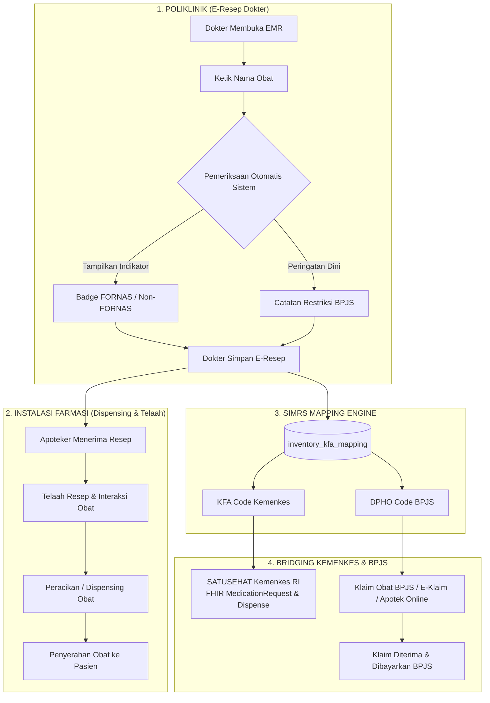

# Panduan Proses Bisnis & Teknis: Standar Farmasi (KFA Kemenkes, DPHO/FORNAS BPJS), SATUSEHAT, dan Klaim Obat

Dokumen ini menjelaskan secara komprehensif teori, konsep, regulasi, alur proses bisnis, arsitektur data, serta implementasi teknis integrasi **Inventaris Obat SIMRS**, **KFA Kemenkes RI (SATUSEHAT FHIR)**, **DPHO / FORNAS (BPJS Kesehatan)**, dan **Sistem Klaim Obat** pada aplikasi **go-micro-simrs-one**.

---

## 1. Teori & Pemahaman Konsep

Dalam pengelolaan perbekalan farmasi rumah sakit, terdapat perbedaan mendasar antara **Manajemen Stok Internal Rumah Sakit**, **Standar Interoperabilitas Nasional (Kemenkes)**, dan **Standar Jaminan Pembiayaan (BPJS Kesehatan)**.

```
+-----------------------------------------------------------------------------------+
|                        HIERARKI STANDARISASI FARMASI RS                           |
+-----------------------------------------------------------------------------------+
|                                                                                   |
|  1. INVENTARIS OBAT SIMRS (Local Inventory & Billing)                             |
|     - Mengatur nama dagang, stok fisik, harga perolehan/jual, dan ketersediaan depo|
|     Contoh: "Paracetamol 500mg Tab Sanbe" (Stok: 500 tab, Rp 1.500/tab)          |
|                               |                                                   |
|                               +-------------------------+                         |
|                               |                         |                         |
|                               v                         v                         |
|  2. KEMENKES RI (SATUSEHAT)              3. BPJS KESEHATAN (KLAIM JKN)            |
|     => Standar KFA (Kamus Farmasi & Alkes)  => Standar DPHO / FORNAS / PRB        |
|     - Format FHIR Medication/Request        - Plafon Harga & Batas Maks Klaim     |
|     - KFA Code: 93000108                    - DPHO Code: 0101001                  |
|     - NIE BPOM: DBL8500201010A1             - Status: FORNAS & PRB                |
|     - ATC: N02BE01 | SNOMED: 387584000      - Restriksi: Maks 30 tab/bulan        |
|                                                                                   |
+-----------------------------------------------------------------------------------+
```

### A. KFA (Kamus Farmasi dan Alat Kesehatan) — *Kemenkes RI*
- **Tujuan**: Kamus data induk (*Master Patient/Product Data*) resmi yang dirilis oleh Kementerian Kesehatan Republik Indonesia sebagai referensi tunggal obat dan alat kesehatan di seluruh faskes Indonesia.
- **Karakteristik & Metadata**:
  - `kfa_code`: Kode unik KFA (9 digit angka).
  - `active_substance`: Nama zat aktif generik berstandar INN (*International Nonproprietary Name*).
  - `dosage_form`: Bentuk sediaan baku (Tablet, Sirup, Injeksi, Salep).
  - `strength`: Kekuatan dosis zat aktif (misal: 500 mg, 10 mg/ml).
  - `bpom_nie`: Nomor Izin Edar resmi dari Badan POM RI.
  - `atc_code` & `snomed_concept_id`: Pemetaan ke standar farmakologi dunia (*Anatomical Therapeutic Chemical*) dan ontologi SNOMED-CT.
- **Peran dalam SATUSEHAT**: Menjadi *identifier* wajib pada resource FHIR `Medication`, `MedicationRequest`, dan `MedicationDispense`.

### B. FORNAS (Formularium Nasional) & DPHO BPJS Kesehatan
- **FORNAS**: Daftar obat terpilih yang ditetapkan oleh Menteri Kesehatan berdasarkan bukti ilmiah terkini, berkhasiat, aman, dan dengan harga terjangkau untuk jaminan kesehatan nasional.
- **DPHO (Daftar dan Plafon Harga Obat)**: Buku panduan resmi BPJS Kesehatan yang memuat daftar obat FORNAS, harga satuan maksimal (*ceiling price*), dan restriksi indikasi medis.
- **PRB (Program Rujuk Balik)**: Pelayanan obat untuk pasien penyakit kronis (Diabetes Melitus, Hipertensi, Asma, PPOK, Jantung, Epilepsi, Skizofrenia, Stroke, SLE) dengan peresepan obat maksimal untuk 30 hari.

### C. Restriksi Peresepan & Risiko Gagal Klaim (*Dispute Claim*)
- **Definisi Restriksi**: Batasan kewenangan klinis atau indikasi tertentu di mana suatu obat boleh diresepkan dan dijamin oleh BPJS.
  - *Contoh 1*: "Omeprazole Injeksi hanya untuk perdarahan saluran cerna atas atau pasien tidak bisa minum oral."
  - *Contoh 2*: "Ceftriaxone hanya untuk infeksi bakteri berat lini ke-3 dengan hasil kultur."
  - *Contoh 3*: "Atorvastatin maksimal 30 tablet per bulan dengan target LDL tertentu."
- **Konsekuensi Pelanggaran**:
  1. Resep obat dinyatakan **Tidak Layak Klaim** oleh Verifikator BPJS.
  2. Biaya obat dibebankan menjadi kerugian operasional Rumah Sakit (*Hospital Cost Uncovered*).
  3. Potensi temuan audit (*fraud / non-compliance*).

---

## 2. Arsitektur Hubungan & Diagram Alir Data Farmasi



---

## 3. Alur Proses Bisnis (*Business Process Flow*)

### Langkah 1: Peresepan Obat oleh Dokter di Poliklinik (E-Prescription)
1. Dokter memilih obat pada form E-Resep.
2. Sistem secara cerdas memberikan informasi kontekstual:
   - Status **FORNAS (BPJS)** (Badge Hijau) atau Non-FORNAS.
   - Kode resmi **KFA** (misal: `KFA: 93000108`).
   - Jika obat memiliki aturan pembatasan, muncul **Warning Box Restriksi BPJS** (misal: *"Restriksi: Maksimum 30 tablet per bulan, untuk profilaksis stroke"*).
3. Dokter meresepkan jumlah, satuan, dan aturan pakai (*Signa*) yang sesuai regulasi, meminimalisir kesalahan sebelum resep dikirim.

### Langkah 2: Telaah & Peracikan oleh Asisten Apoteker / Apoteker
1. Resep yang telah dikirim masuk ke antrean farmasi secara real-time.
2. Apoteker melakukan telaah resep (keabsahan, dosis, duplikasi, dan kesesuaian stok depo poliklinik).
3. Obat disiapkan dan status resep diperbarui menjadi siap diambil.

### Langkah 3: Interoperabilitas SATUSEHAT Kemenkes RI (FHIR)
1. Sistem mengambil metadata KFA dari tabel `inventory_kfa_mapping` dan `kfa_catalog`.
2. Sistem menyusun JSON Payload FHIR **`MedicationRequest`**:
   ```json
   {
     "resourceType": "MedicationRequest",
     "status": "completed",
     "intent": "order",
     "medicationCodeableConcept": {
       "coding": [
         {
           "system": "http://sys-ids.kemkes.go.id/kfa",
           "code": "93000108",
           "display": "Paracetamol 500 mg Tablet"
         },
         {
           "system": "http://snomed.info/sct",
           "code": "387584000",
           "display": "Paracetamol"
         }
       ]
     },
     "dosageInstruction": [
       {
         "text": "3 x 1 Tablet sesudah makan",
         "timing": {
           "repeat": {
             "frequency": 3,
             "period": 1,
             "periodUnit": "d"
           }
         }
       }
     ]
   }
   ```
3. Data terkirim dan tercatat pada *Timeline* Rekam Medis Nasional pasien di SATUSEHAT.

### Langkah 4: Pengajuan Klaim Obat BPJS Kesehatan
1. Data obat diverifikasi terhadap master DPHO (`bpjs_dpho_catalog`).
2. Kode DPHO, jumlah unit, dan harga satuan diteruskan ke modul klaim (baik sebagai bagian dari paket INA-CBGs maupun Klaim Obat Kronis / PRB Apotek Online).
3. Karena peresepan sejak awal telah mengikuti kaidah restriksi DPHO, berkas klaim lolos verifikasi tanpa *dispute*.

---

## 4. Implementasi Teknis pada Sistem Saat Ini

### A. Struktur Skema Database (`pharmacy-service`)

| Nama Tabel | Fungsi Utama | Relasi Kunci |
|---|---|---|
| `inventory` | Master Fisik Obat, Stok, dan Tarif SIMRS | `item_code` (PK) |
| `kfa_catalog` | Master Kamus Farmasi & Alkes Kemenkes RI | `kfa_code` (PK) |
| `bpjs_dpho_catalog` | Master DPHO / FORNAS / PRB BPJS Kesehatan | `dpho_code` (PK) |
| `inventory_kfa_mapping` | Relasi Many-to-Many cross-map Obat SIMRS ke KFA & DPHO | `item_code` &harr; `kfa_code` &harr; `dpho_code` |
| `inventory_polyclinic_mappings` | Filter Ketersediaan Obat per Poliklinik/Depo | `item_code` &harr; `polyclinic_code` |
| `prescriptions` | Header Resep Elektronik Pasien | `id`, `encounter_no` |
| `prescription_items` | Rincian Item Obat dalam Resep | `prescription_id`, `drug_code` |

### B. Arsitektur Backend & API Endpoints

1. **gRPC Services (`src/be/pharmacy-service`)**:
   - `GetMasterKFA`: Pagination, pencarian nama/zat aktif KFA.
   - `GetMasterDPHO`: Pagination, filter FORNAS/PRB, pencarian nama DPHO.
   - `GetObatMappingDetails`: Mengambil relasi cross-map lengkap (KFA, DPHO, Poliklinik).
   - `GetMasterObat` & `GetMasterObatByPoli`: Menyertakan atribut `kfa_count`, `dpho_count`, `is_fornas`, `kfa_code`, `bpjs_dpho_code`, `restriction`.

2. **API Gateway Endpoints (`src/be/api-gateway`)**:
   - `GET /api/v1/master/kfa` &mdash; Query param: `page`, `page_size`, `search`.
   - `GET /api/v1/master/dpho` &mdash; Query param: `page`, `page_size`, `search`, `is_fornas`, `is_prb`.
   - `GET /api/v1/master/obat/:item_code/mappings` &mdash; Detail cross-map per obat.
   - `GET /api/v1/master/obat` & `GET /api/v1/master/obat/poli/{poli_code}`

### C. Antarmuka Frontend (React UI)

1. **Admin Master Data Navigation (`AdminLayout.tsx`)**:
   - Menu **Farmasi**:
     - *Inventaris Obat* (`/admin/master/obat`) &mdash; Tabel master obat lengkap dengan kolom **Pemetaan** (Badge `N KFA`, `FORNAS/DPHO`) dan tombol **Detail Map**.
     - *Katalog KFA (Kemenkes)* (`/admin/master/kfa`) &mdash; Tabel katalog KFA resmi Kemenkes RI, Zat Aktif, Sediaan, NIE BPOM, ATC/SNOMED.
     - *Katalog DPHO / FORNAS (BPJS)* (`/admin/master/dpho`) &mdash; Tabel katalog DPHO BPJS dengan filter cepat (*Semua*, *FORNAS*, *PRB*), catatan restriksi, dan batas klaim.
     - *Obat - Poliklinik* (`/admin/master/assign-obat`) &mdash; Pemetaan ketersediaan obat ke poliklinik/depo.

2. **Modal Detail Map Obat ([`ObatPage.tsx`](file:///home/aliube/Workspace/Project-Personal/Go/Gemini/go-micro-simrs-one/src/fe/react/src/features/admin/pages/master/ObatPage.tsx))**:
   - Menampilkan 3 kartu rincian:
     1. **Pemetaan KFA Kemenkes**: Kode KFA, Nama Produk KFA, Zat Aktif, Sediaan, NIE BPOM, ATC/SNOMED, Status Primary/Sekunder.
     2. **Pemetaan BPJS DPHO / FORNAS**: Kode DPHO, Status FORNAS/PRB, Catatan Restriksi BPJS, Batas Maksimal Klaim.
     3. **Ketersediaan Poliklinik**: Daftar poliklinik/depo yang berhak meresepkan obat tersebut.

3. **Form E-Resep Terintegrasi ([`PrescriptionForm.tsx`](file:///home/aliube/Workspace/Project-Personal/Go/Gemini/go-micro-simrs-one/src/fe/react/src/features/emr/components/PrescriptionForm.tsx))**:
   - Dropdown pencarian obat menampilkan badge `FORNAS` dan kode `KFA`.
   - Menampilkan *alert* interaktif peringatan restriksi BPJS saat obat dipilih oleh dokter.

---

## 5. Ringkasan Manfaat Bisnis & Kepatuhan Regulasi

| Indikator | Sebelum Standarisasi | Dengan Sistem Terintegrasi SIMRS |
|---|---|---|
| **Interoperabilitas Kemenkes** | Obat tidak memiliki kode KFA / NIE BPOM sehingga gagal kirim ke SATUSEHAT. | Otomatis terpetakan ke KFA dan SNOMED-CT sesuai standar FHIR. |
| **Kepatuhan Formularium BPJS** | Dokter berpotensi meresepkan obat Non-FORNAS tanpa disadari. | Ada indikator visual hijau `FORNAS (BPJS)` saat memilih obat di EMR. |
| **Pencegahan Dispute Klaim** | Pelanggaran restriksi baru diketahui saat klaim ditolak BPJS. | Restriksi BPJS dimunculkan langsung ke dokter saat peresepan (*Real-time Clinical Decision Support*). |
| **Efisiensi Apoteker** | Apoteker harus bolak-balik konfirmasi ke dokter jika resep tidak sesuai DPHO. | Resep dari poliklinik sudah terfilter dan valid sejak dari sumbernya. |
