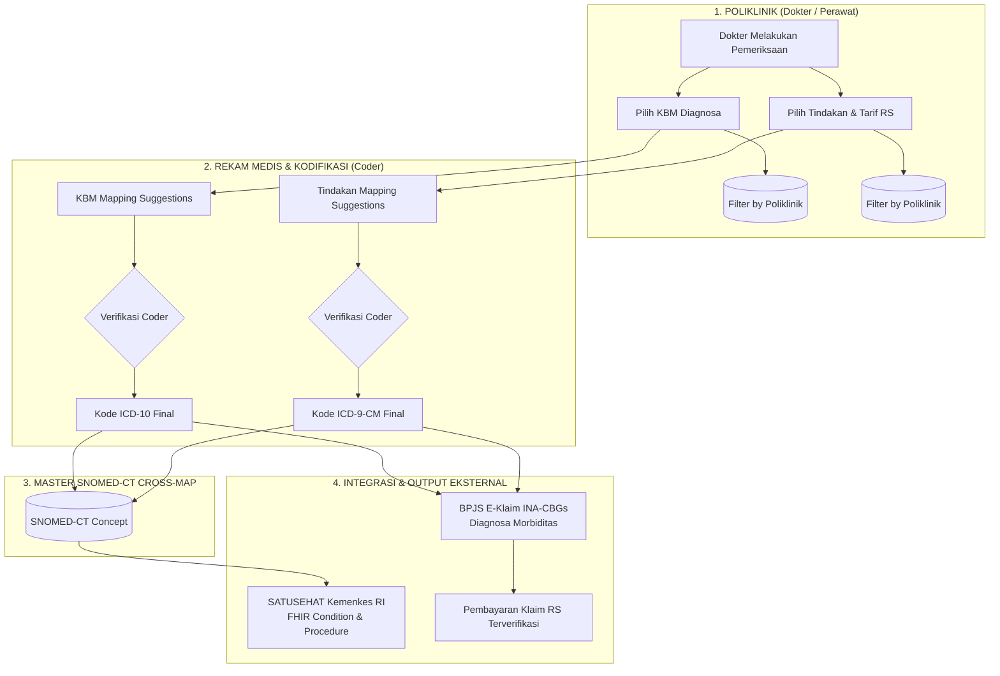

# Panduan Proses Bisnis & Teknis: Terminologi Medis (KBM, ICD-10, ICD-9, SNOMED-CT), SATUSEHAT, dan Klaim BPJS

Dokumen ini menjelaskan secara komprehensif teori, konsep, proses bisnis, arsitektur data, serta implementasi teknis mengenai relasi antara **Kamus Bahasa Medis (KBM)**, **ICD-10**, **ICD-9-CM**, **SNOMED-CT**, **Kemenkes SATUSEHAT (HL7 FHIR)**, dan **Sistem Klaim BPJS Kesehatan (INA-CBGs)** pada aplikasi **go-micro-simrs-one**.

---

## 1. Teori & Pemahaman Konsep

Dalam dunia informatika medis (*Health Informatics*), terdapat perbedaan fundamental antara **Bahasa Antarmuka Klinis (*Clinical Interface Terminology*)**, **Klasifikasi Statistik (*Statistical Classification*)**, **Terminologi Ontologi Semantik (*Reference Terminology*)**, dan **Sistem Pengelompokan Klaim (*Case-Mix Grouping*)**.

```
+-----------------------------------------------------------------------------------+
|                            HIERARKI TERMINOLOGI MEDIS                             |
+-----------------------------------------------------------------------------------+
|                                                                                   |
|  1. CLINICAL INTERFACE (Input Dokter)                                             |
|     => Kamus Bahasa Medis (KBM) / Tindakan RS                                     |
|     - Bahasa natural dokter, mudah dipahami di poli, spesifik per layanan.        |
|                               |                                                   |
|                               v (Mapping 1:N / Multi-mapping)                     |
|  2. STATISTICAL CLASSIFICATION (Standar Klaim & Morbiditas)                       |
|     => ICD-10 (Diagnosa) & ICD-9-CM (Prosedur/Tindakan)                           |
|     - Digunakan oleh Perekam Medis (Coder) & Grouper INA-CBGs BPJS Kesehatan.     |
|                               |                                                   |
|                               v (Cross-Mapping Semantik)                          |
|  3. CLINICAL REFERENCE ONTOLOGY (Standar Interoperabilitas Nasional & Global)     |
|     => SNOMED-CT (Systematized Nomenclature of Medicine -- Clinical Terms)        |
|     - Digunakan Kemenkes RI untuk interoperabilitas Rekam Medis SATUSEHAT (FHIR). |
|                                                                                   |
+-----------------------------------------------------------------------------------+
```

### A. KBM (Kamus Bahasa Medis) — *Clinical Interface Terminology*
- **Tujuan**: Memudahkan dokter dalam menginput diagnosa di poliklinik menggunakan istilah klinis sehari-hari (Bahasa Indonesia / istilah medis praktis) tanpa memaksa dokter mengingat ribuan kode alfanumerik ICD-10.
- **Karakteristik**:
  - Disesuaikan dengan kebutuhan spesifik poliklinik (misal: Poli Gigi, Poli Penyakit Dalam, Poli Anak).
  - Satu istilah KBM dapat memiliki derajat keparahan atau manifestasi yang memetakan ke beberapa kode ICD-10 (Relasi *1-to-Many*).

### B. ICD-10 (WHO) — *Statistical Disease Classification & Klaim Diagnosa*
- **Tujuan**: Klasifikasi internasional standar WHO untuk pencatatan morbiditas, mortalitas, pelaporan epidemiologi, dan penentuan **Diagnosa Utama (*Primary Diagnosis*)** serta **Diagnosa Sekunder (*Comorbidity / Complication*)** dalam klaim asuransi kesehatan.
- **Peran dalam Klaim BPJS**: Menjadi variabel input utama pada *software* E-Klaim INA-CBGs untuk menentukan tarif paket klaim rawat jalan/rawat inap.

### C. ICD-9-CM (WHO / CDC) — *Procedure Classification & Klaim Tindakan*
- **Tujuan**: Klasifikasi prosedur pembedahan dan tindakan medis diagnostik/terapeutik.
- **Peran dalam Klaim BPJS**: Menjadi variabel input kedua pada E-Klaim INA-CBGs. Tindakan medis tertentu (misal: *Hemodialisis*, *Endoskopi*, *Nebulisasi*, *USG*) akan meningkatkan atau mengubah kelompok tarif klaim (*CBG Code*).

### D. SNOMED-CT — *Reference Terminology for Clinical Semantic Interoperability*
- **Tujuan**: Standar terminologi klinis global paling komprehensif di dunia yang memiliki struktur hierarki ontologis (*polyhierarchical*) dan kode konsep berbasis konsep unik (*Concept ID*).
- **Peran dalam SATUSEHAT**: Kementerian Kesehatan RI mewajibkan pencatatan rekam medis elektronik (RME) merujuk pada konsep SNOMED-CT agar data riwayat medis pasien dapat dipertukarkan dan dipahami secara semantik antar fasilitas pelayanan kesehatan di seluruh Indonesia.

### E. SATUSEHAT Kemenkes RI (HL7 FHIR Platform)
- **Tujuan**: Platform integrasi data kesehatan nasional Indonesia berbasis arsitektur **HL7 FHIR (*Fast Healthcare Interoperability Resources*)**.
- **Resource Terkait**:
  - `Condition`: Diagnosa pasien (mengandung *Coding System* SNOMED-CT dan ICD-10).
  - `Procedure`: Tindakan medis pasien (mengandung *Coding System* SNOMED-CT dan ICD-9-CM).
  - `Encounter`: Kunjungan rawat jalan pasien di poliklinik.

### F. Sistem Klaim BPJS Kesehatan (INA-CBGs)
- **Tujuan**: Sistem pembayaran prospektif berbasis paket *Case-Based Groups*.
- **Mekanisme**:
  $$\text{Klaim INA-CBGs} = f(\text{ICD-10 Primary}, \text{ICD-10 Secondary}, \text{ICD-9-CM Procedures}, \text{Severity Level})$$
- Jika diagnosa atau tindakan tidak dipetakan ke ICD-10 dan ICD-9-CM resmi, klaim BPJS akan mengalami **Pending Klaim**, **Dispute Koding**, atau **Gagal Klaim**.

---

## 2. Arsitektur Hubungan & Diagram Alir Data



---

## 3. Alur Proses Bisnis (*Business Process Flow*)

### Langkah 1: Input Pemeriksaan oleh Dokter di Poliklinik
1. Dokter membuka aplikasi EMR pada menu pemeriksaan pasien.
2. Saat mengisi **Diagnosa**:
   - Dokter mengetik keluhan/istilah medis umum. Sistem menampilkan daftar **KBM (Kamus Bahasa Medis)** yang telah di-filter sesuai poliklinik dokter yang bersangkutan (`kbm_polyclinic_mappings`).
   - Dokter memilih KBM yang paling tepat tanpa perlu mencari kode ICD-10 manual.
3. Saat mengisi **Tindakan**:
   - Dokter memilih tindakan medis internal RS (misal: "Nebulisasi Anak", "Scalling Gigi"). Tindakan ini juga telah di-filter berdasarkan poliklinik (`action_polyclinic_mappings`).

### Langkah 2: Verifikasi & Kodifikasi oleh Perekam Medis (*Coder*)
1. Perekam Medis membuka dashboard *Medical Record Verification*.
2. Sistem secara cerdas menampilkan rekomendasi (*suggestions*):
   - KBM terpilih &rarr; Rekomendasi Kode ICD-10 berdasarkan tabel `kbm_icd10_mapping`.
   - Tindakan terpilih &rarr; Rekomendasi Kode ICD-9-CM berdasarkan tabel `tindakan_icd9_mapping`.
3. *Coder* memilih kode ICD-10 (Primary/Secondary) dan ICD-9-CM yang akurat sesuai aturan kodifikasi WHO dan kaidah koding BPJS.

### Langkah 3: Interoperabilitas SATUSEHAT Kemenkes RI (FHIR)
1. Sistem SIMRS melakukan *cross-reference* otomatis dari ICD-10 dan ICD-9-CM ke **SNOMED-CT Concept ID** melalui tabel `snomed_icd10_mapping` dan `snomed_icd9_mapping`.
2. Sistem menyusun JSON Payload standar FHIR:
   - **Resource `Condition`**:
     ```json
     {
       "resourceType": "Condition",
       "code": {
         "coding": [
           {
             "system": "http://snomed.info/sct",
             "code": "386661006",
             "display": "Fever"
           },
           {
             "system": "http://hl7.org/fhir/sid/icd-10",
             "code": "R50.9",
             "display": "Fever, unspecified"
           }
         ]
       }
     }
     ```
   - **Resource `Procedure`**:
     ```json
     {
       "resourceType": "Procedure",
       "code": {
         "coding": [
           {
             "system": "http://snomed.info/sct",
             "code": "182655006",
             "display": "Inhalation therapy"
           },
           {
             "system": "http://hl7.org/fhir/sid/icd-9-cm",
             "code": "93.94",
             "display": "Respiratory medication administered by nebulizer"
           }
         ]
       }
     }
     ```
3. Data terkirim secara *seamless* ke server SATUSEHAT Kemenkes RI.

### Langkah 4: Pengajuan Klaim BPJS Kesehatan (INA-CBGs)
1. Modul Penagihan & Klaim mengumpulkan data kunjungan (*Encounter*), ICD-10 Utama, ICD-10 Sekunder, dan ICD-9-CM Prosedur.
2. Data dikirim ke Web Service E-Klaim INA-CBGs BPJS.
3. *Grouper* INA-CBGs memproses kode tersebut menjadi *CBG Tarif Code* (misal: `Q-5-44-0` Rawat Jalan Tingkat Lanjut).
4. Klaim disetujui (*Approved*) tanpa resiko *pending code* karena seluruh kode telah tervalidasi di master data.

---

## 4. Implementasi Teknis pada Sistem Saat Ini

### A. Struktur Skema Database (`emr-service`)

| Nama Tabel | Fungsi Utama | Relasi Kunci |
|---|---|---|
| `kbm_catalog` | Master Kamus Bahasa Medis (terminologi lokal RS) | `kbm_code` (PK) |
| `icd10_catalog` | Master Kode Diagnosa ICD-10 WHO | `icd10_code` (PK) |
| `kbm_icd10_mapping` | Relasi Many-to-Many antara KBM dan ICD-10 | `kbm_code` &harr; `icd10_code` |
| `tindakan_catalog` | Master Tindakan & Tarif Medis RS | `action_code` (PK) |
| `icd9_catalog` | Master Kode Prosedur ICD-9-CM | `icd9_code` (PK) |
| `tindakan_icd9_mapping` | Relasi Many-to-Many antara Tindakan RS dan ICD-9-CM | `action_code` &harr; `icd9_code` |
| `snomed_catalog` | Master Terminologi Ontologi SNOMED-CT Kemenkes | `concept_id` (PK) |
| `snomed_icd10_mapping` | Cross-mapping antara SNOMED-CT dan ICD-10 | `snomed_concept_id` &harr; `icd10_code` |
| `snomed_icd9_mapping` | Cross-mapping antara SNOMED-CT dan ICD-9-CM | `snomed_concept_id` &harr; `icd9_code` |
| `kbm_polyclinic_mappings` | Filter KBM per Poliklinik | `kbm_code` &harr; `polyclinic_code` |
| `action_polyclinic_mappings` | Filter Tindakan per Poliklinik | `action_code` &harr; `polyclinic_code` |

### B. Arsitektur Backend & API Endpoints

1. **gRPC Services (`src/be/emr-service`)**:
   - `GetMasterKBM`, `GetMasterKBMByPoli`
   - `GetMasterICD10`, `GetMasterICD10ByPoli`, `GetICD10ByKBM`
   - `GetMasterICD9`, `GetICD9SuggestionsForTindakan`
   - `GetMasterSNOMED`, `GetSNOMEDCrossMap`
   - `GetMasterTindakan`, `GetMasterTindakanByPoli`

2. **API Gateway Endpoints (`src/be/api-gateway`)**:
   - `GET /api/v1/master/kbm` & `GET /api/v1/master/kbm/poli/{poli_code}`
   - `GET /api/v1/master/icd10` & `GET /api/v1/master/icd10/kbm/{kbm_code}`
   - `GET /api/v1/master/icd9` & `GET /api/v1/master/icd9/poli/{poli_code}`
   - `GET /api/v1/master/snomed` & `GET /api/v1/master/snomed/:concept_id/cross-map`
   - `GET /api/v1/master/tindakan` & `GET /api/v1/master/tindakan/:action_code/icd9-suggestions`

### C. Antarmuka Frontend (React UI)

1. **Admin Master Data Navigation (`AdminLayout.tsx`)**:
   - Menu **Katalog Medis**:
     - *Katalog KBM* (`/admin/master/kbm`) &mdash; Dilengkapi indikator badge pemetaan ICD-10 & Detail Map.
     - *Katalog ICD-10* (`/admin/master/icd10`) &mdash; Dilengkapi indikator badge pemetaan KBM & Detail Map.
     - *Katalog ICD-9* (`/admin/master/icd9`) &mdash; Dilengkapi indikator badge pemetaan Tindakan & Detail Map.
     - *Katalog SNOMED-CT* (`/admin/master/snomed`) &mdash; Dilengkapi modal Detail Cross-Map (ICD-10, ICD-9, Poliklinik).
     - *Tindakan & Tarif* (`/admin/master/tindakan`) &mdash; Dilengkapi indikator badge pemetaan ICD-9 & Detail Map.
   - Menu **Pemetaan Poliklinik**:
     - *KBM - Poliklinik* (`/admin/master/assign-kbm`)
     - *Katalog ICD10 - Poliklinik* (`/admin/master/assign-icd10`)
     - *Tindakan - Poliklinik* (`/admin/master/assign-tindakan`)

2. **EMR Poliklinik & Kodifikasi Rekam Medis**:
   - Dokter memilih diagnosa via KBM dan tindakan via master tindakan.
   - Rekam medis memverifikasi mapping ke ICD-10/ICD-9 untuk klaim dan pengiriman SATUSEHAT.

---

## 5. Ringkasan Manfaat Bisnis & Operasional

| Aspek | Tanpa Integrasi Standar | Dengan Sistem SIMRS go-micro-simrs-one |
|---|---|---|
| **Beban Kerja Dokter** | Dokter harus menghafal ribuan kode ICD-10/ICD-9 yang rumit. | Dokter fokus menginput istilah klinis KBM & Tindakan natural. |
| **Akurasi Koding** | Sering terjadi *miss-coding* antara diagnosa dokter dan koder. | Rekam Medis mendapat *mapping suggestions* otomatis dan konsisten. |
| **Klaim BPJS (INA-CBGs)** | Risiko *dispute* dan *pending claim* tinggi akibat salah kode. | Kode ICD-10 dan ICD-9 valid dan terpetakan langsung ke tarif klaim. |
| **SATUSEHAT Kemenkes** | Data rekam medis tidak dapat terkirim karena ketiadaan SNOMED-CT. | Otomatis terpetakan ke SNOMED-CT dan siap dikirim via FHIR standard. |
