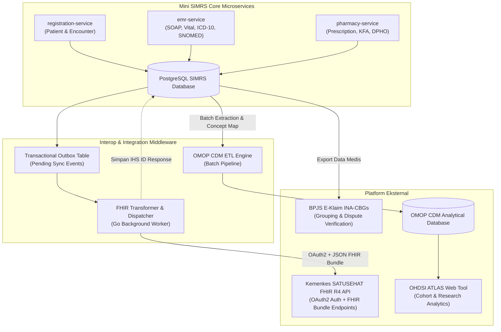

# Roadmap dan Rancangan Interoperabilitas Mini SIMRS: Menuju HL7 FHIR (SATUSEHAT) dan OMOP CDM (OHDSI)

Dokumen ini menyajikan peta jalan (*roadmap*), rancangan arsitektur, analisis pencapaian saat ini (*current achievements*), serta analisis kesenjangan (*gap analysis*) Mini SIMRS menuju kepatuhan penuh terhadap standar interoperabilitas nasional (**HL7 FHIR Release 4 / Kemenkes SATUSEHAT**) dan standar data analitik riset internasional (**OMOP CDM / OHDSI**).

---

## 1. Latar Belakang & Visi Strategis

Transformasi digital layanan kesehatan di Indonesia menuntut sistem informasi rumah sakit (SIMRS) tidak hanya berfungsi sebagai sistem pencatatan operasional (*billing & EMR*), melainkan sebagai penyedia data yang terstandardisasi dan dapat dipertukarkan secara nasional dan global:

1. **Mandat Nasional (SATUSEHAT Kemenkes RI)**:
   - Sesuai **Permenkes No. 24 Tahun 2022 tentang Rekam Medis Elektronik (RME)**, seluruh fasilitas pelayanan kesehatan di Indonesia wajib menghubungkan dan mengirimkan data rekam medis terstandarisasi ke platform nasional **SATUSEHAT** menggunakan standar **HL7 FHIR Release 4**.
   - Integrasi ini mewajibkan penggunaan kamus data nasional seperti **KFA (Kamus Farmasi & Alat Kesehatan)** dan terminologi referensi **SNOMED-CT**.

2. **Kebutuhan Riset & Analitik Sekunder (OMOP CDM - OHDSI)**:
   - **Observational Medical Outcomes Partnership (OMOP) Common Data Model (CDM)** dari konsorsium global **OHDSI** merupakan standar emas untuk standardisasi data observasional kesehatan.
   - OMOP CDM memungkinkan rumah sakit melakukan analisis kohort populasi, pemantauan efek samping obat (*pharmacovigilance*), registri penyakit kronis (diabetes, hipertensi, onkologi), hingga pelatihan model kecerdasan buatan (*AI/ML Healthcare*) lintas pusat (*multi-center*).

---

## 2. Perbedaan Filosofis: HL7 FHIR vs OMOP CDM

SIMRS dirancang untuk melayani dua kebutuhan data yang berbeda namun saling melengkapi:

```
+---------------------------------------------------------------------------------------+
|                                MINI SIMRS OPERASIONAL                                 |
|         (PostgreSQL, Microservices, EMR SOAP, Billing, Registrasi, Farmasi)           |
+-------------------------------------------+-------------------------------------------+
                                            |
                    +-----------------------+-----------------------+
                    |                                               |
                    v                                               v
     [ OPERATIONAL DATA EXCHANGE ]                     [ ANALYTICAL DATA WAREHOUSE ]
          HL7 FHIR Release 4                                  OMOP CDM v5.4
          (SATUSEHAT Kemenkes)                               (OHDSI Research)
  - Fokus: Pertukaran pesan transaksional           - Fokus: Analitik data agregat & kohort
  - Waktu: Real-time (Event-driven per kunjungan)   - Waktu: Batch ETL (Harian / Mingguan)
  - Format: Dokumen JSON Resource / Bundle          - Format: Tabel Relasional Kolom Standar
  - Target: Satu Sehat Kemenkes, BPJS, Faskes lain  - Target: Riset Klinis, Registri, AI Model
```

| Dimensi Komparasi | HL7 FHIR R4 (SATUSEHAT) | OMOP CDM v5.4 (OHDSI) |
| :--- | :--- | :--- |
| **Fokus Utama** | Interoperabilitas pertukaran data klinis antar sistem. | Standardisasi analisis data sekunder dan penelitian observasional. |
| **Model Data** | Hirarki berorientasi dokumen/resource JSON. | Tabel relasional datar (*person-centric dimensional tables*). |
| **Standar Terminologi** | KFA (Obat), SNOMED-CT, ICD-10, ICD-9-CM, LOINC. | SNOMED-CT (Diagnosa & Prosedur), RxNorm/ATC (Obat), LOINC (Lab). |
| **Aktor Konsumen** | Platform SATUSEHAT Kemenkes, Rujuk Balik BPJS. | Peneliti Medis, Komite Mutu RS, Tim AI/Data Science. |

---

## 3. Matriks Pencapaian SIMRS Saat Ini (*Current State Capabilities*)

Mini SIMRS kita telah membangun fondasi arsitektural dan pemetaan terminologi yang kuat:

```
+----------------------------------------------------------------------------------------------------+
| DOMAIN MEDIS         STATUS SAAT INI             MAPPING FHIR R4             MAPPING OMOP CDM v5.4 |
+----------------------------------------------------------------------------------------------------+
| Pasien & Demografi   Lengkap (NIK, No.RM, TTL)   Patient Resource            PERSON Table          |
| Kunjungan & Poli     Lengkap (Encounter, Status) Encounter Resource          VISIT_OCCURRENCE      |
| Anamnesis & Vital    Lengkap (TTV, Keluhan SOAP) Observation Resource        MEASUREMENT / OBS     |
| Diagnosa Medis       KBM + ICD-10 + SNOMED-CT    Condition Resource          CONDITION_OCCURRENCE  |
| Prosedur / Tindakan  Tindakan + ICD-9 + SNOMED   Procedure Resource          PROCEDURE_OCCURRENCE  |
| Inventaris & Resep   Obat + KFA + DPHO/FORNAS    MedicationRequest / Dispense DRUG_EXPOSURE         |
| Nakes & Faskes       Dokter, Perawat, Poli       Practitioner / Location     CARE_SITE / PROVIDER  |
+----------------------------------------------------------------------------------------------------+
```

### Rincian Fondasi yang Telah Selesai Dibangun:
1. **Multi-Level Diagnostic Mapping**:
   - `KBM (Kelompok Basis Masalah)` $\leftrightarrow$ `ICD-10 (INA-CBGs & Statistik)` $\leftrightarrow$ `SNOMED-CT (SCTID, FSN, Semantic Tag)`.
   - Menghasilkan *dual-coding* otomatis saat dokter memilih diagnosis di Poliklinik.
2. **Standardized Pharmacy Catalog**:
   - `Master Obat RS` $\leftrightarrow$ `KFA Kemenkes RI (Kode 93000xxx, Zat Aktif, Sediaan, Kekuatan, NIE BPOM)` $\leftrightarrow$ `DPHO BPJS (FORNAS & PRB)`.
   - Menjamin resep obat valid untuk klaim BPJS sekaligus mematuhi spesifikasi FHIR Medication.
3. **Pemisahan Entitas EMR Terstruktur**:
   - Tidak menggabungkan SOAP ke dalam satu teks bebas (*free-text blob*), melainkan menyimpannya ke kolom dan tabel terpisah (Tanda Vital terukur, Diagnosa terpisah dengan status Primer/Sekunder, Resep terpisah per item obat).
4. **Arsitektur Microservices Modular**:
   - Terdiri dari `emr-service`, `pharmacy-service`, `registration-service`, `billing-service`, dan `api-gateway` yang siap diintegrasikan dengan modul integrasi eksternal.

---

## 4. Analisis Kesenjangan (*Gap Analysis*) Menuju Full Live Integration

Meskipun model data internal sudah sesuai, terdapat beberapa komponen infrastruktur dan *middleware* yang perlu dibangun untuk tahap implementasi penuh:

### A. Kesenjangan Menuju HL7 FHIR (SATUSEHAT Kemenkes)
1. **OAuth2 Authentication Client**:
   - Belum adanya modul *token manager* untuk request dan *refresh token* OAuth2 ke server Auth SATUSEHAT Kemenkes (`https://api-satusehat.kemkes.go.id/oauth2/v1`).
2. **FHIR Payload Builder & Profiling Engine**:
   - Diperlukan *converter package* dalam Go untuk mengonversi data Go struct EMR menjadi format payload JSON FHIR R4 Bundle sesuai *Implementation Guide (IG) Kemenkes RI*.
3. **Outbox Pattern & Worker Dispatcher**:
   - Diperlukan mekanisme *transactional outbox* di database agar saat dokter menekan tombol *"Simpan / Finalisasi Rekam Medis"*, event pengiriman ke SATUSEHAT diproses di latar belakang (*asynchronous worker*) dengan mekanisme *retry* otomatis jika koneksi Kemenkes mengalami gangguan.
4. **IHS Identifier Persistence**:
   - Penyimpanan `ihs_patient_id`, `ihs_practitioner_id`, `ihs_encounter_id`, dan `ihs_condition_id` yang dikembalikan oleh Kemenkes ke tabel database lokal.

### B. Kesenjangan Menuju OMOP CDM (OHDSI)
1. **Skema Basis Data OMOP CDM Terdedikasi**:
   - Belum adanya *database instance* khusus untuk skema analitik OMOP CDM (tabel `person`, `visit_occurrence`, `condition_occurrence`, `procedure_occurrence`, `drug_exposure`, `measurement`, `concept`, `concept_relationship`).
2. **ETL Pipeline (Extract-Transform-Load)**:
   - Diperlukan pipeline berkala (misal menggunakan Airflow, Go batch script, atau dbt) yang mengekstraksi data transaksional SIMRS, memetakan ID ke *Standard Concept ID*, dan memuatnya ke dalam skema OMOP CDM.
3. **OHDSI Tooling Integration**:
   - Pemasangan alat analisis berbasis web seperti **ATLAS** (antarmuka analitik kohort OHDSI) dan **ACHILLES** (alat penilaian kualitas data).

---

## 5. Rancangan Arsitektur Integrasi (*Target Architecture Design*)



---

## 6. Contoh Rancangan Pemetaan Payload FHIR SATUSEHAT

Berikut adalah spesifikasi pemetaan data dari tabel SIMRS kita ke JSON Resource FHIR R4:

### 1. Condition Resource (Diagnosa Dokter)
```json
{
  "resourceType": "Condition",
  "clinicalStatus": {
    "coding": [{
      "system": "http://terminology.hl7.org/CodeSystem/condition-clinical",
      "code": "active",
      "display": "Active"
    }]
  },
  "category": [{
    "coding": [{
      "system": "http://terminology.hl7.org/CodeSystem/condition-category",
      "code": "encounter-diagnosis",
      "display": "Encounter Diagnosis"
    }]
  }],
  "code": {
    "coding": [
      {
        "system": "http://hl7.org/fhir/sid/icd-10",
        "code": "E11.9",
        "display": "Type 2 diabetes mellitus without complications"
      },
      {
        "system": "http://snomed.info/sct",
        "code": "44054006",
        "display": "Diabetes mellitus type 2 (disorder)"
      }
    ],
    "text": "Diabetes Melitus Tipe 2"
  },
  "subject": {
    "reference": "Patient/10000000001",
    "display": "Budi Santoso"
  },
  "encounter": {
    "reference": "Encounter/ENC-20260826-001"
  }
}
```

### 2. MedicationRequest Resource (Resep Obat Dokter)
```json
{
  "resourceType": "MedicationRequest",
  "status": "active",
  "intent": "order",
  "medicationCodeableConcept": {
    "coding": [
      {
        "system": "http://sys-ids.kemkes.go.id/kfa",
        "code": "93000678",
        "display": "Metformin HCl 500 mg Tablet"
      }
    ]
  },
  "subject": {
    "reference": "Patient/10000000001"
  },
  "encounter": {
    "reference": "Encounter/ENC-20260826-001"
  },
  "dosageInstruction": [
    {
      "sequence": 1,
      "text": "3 x 1 tablet sehari sesudah makan",
      "timing": {
        "repeat": {
          "frequency": 3,
          "period": 1,
          "periodUnit": "d"
        }
      }
    }
  ],
  "dispenseRequest": {
    "quantity": {
      "value": 30,
      "unit": "Tablet",
      "system": "http://unitsofmeasure.org",
      "code": "TAB"
    }
  }
}
```

---

## 7. Peta Jalan Pelaksanaan (*Phased Implementation Roadmap*)

```
[ Fase 1: Fondasi & Kamus ] =======> [ Fase 2: FHIR Adapter SATUSEHAT ] =======> [ Fase 3: OMOP CDM Pipeline ] =======> [ Fase 4: AI & Advanced Analytics ]
- Selesai: EMR SOAP                 - Target: OAuth2 SATUSEHAT Engine           - Target: Database OMOP CDM v5.4          - Target: AI Diagnostic CDSS
- Selesai: KBM-ICD10-SNOMED         - Target: FHIR JSON Bundle Transformers     - Target: Automated Daily ETL             - Target: Clinical Cohort Engine
- Selesai: Obat-KFA-DPHO            - Target: Outbox Background Worker          - Target: OHDSI Vocabulary Integration    - Target: Predictive Outcome Models
- Selesai: UI/Admin Master          - Target: Sandbox & Production Verification - Target: Dashboard ATLAS Deployment      - Target: Automated Quality Audits
```

### Rincian Tahapan Rencana:

#### **Fase 1: Kesiapan Fondasi Data & Terminologi (STATUS: SELESAI / CURRENT)**
- [x] Struktur database EMR berbasis SOAP (Anamnesis, Vital Signs, Diagnosa, Prosedur, Resep).
- [x] Standardisasi master data KBM, ICD-10, ICD-9-CM, SNOMED-CT, KFA Kemenkes, dan DPHO/FORNAS BPJS.
- [x] Antarmuka administrasi master data terpadu dengan navigasi grup modular (*accordion*).

#### **Fase 2: Adapter Integrasi HL7 FHIR SATUSEHAT (TARGET MASA MENDATANG 1)**
- [ ] Pembuatan modul `satusehat-adapter` (Microservice atau sub-modul Go):
  - Modul otentikasi OAuth2 (Client ID, Client Secret, Token Caching).
  - Profiling Builder: `Patient`, `Encounter`, `Condition`, `Procedure`, `Observation`, `MedicationRequest`, `MedicationDispense`.
- [ ] Implementasi *Transactional Outbox Table* di PostgreSQL dan *background worker* pengirim data.
- [ ] Pengujian pada lingkungan *Sandbox DTO Kemenkes* dan proses sertifikasi kelayakan integrasi RME.

#### **Fase 3: OMOP CDM Data Warehouse & ETL Pipeline (TARGET MASA MENDATANG 2)**
- [ ] Pembuatan database analitik berbasis OMOP CDM v5.4.
- [ ] Pengembangan pipeline ETL berbasis SQL/Go/Python untuk mengekstraksi data transaksional SIMRS ke skema OMOP CDM:
  - Konversi data diagnosis ke `CONDITION_OCCURRENCE` menggunakan `concept_id` SNOMED-CT.
  - Konversi data obat ke `DRUG_EXPOSURE` menggunakan `concept_id` KFA / RxNorm / ATC.
- [ ] Pemasangan alat analisis visual OHDSI (**ATLAS**) untuk eksplorasi kohort pasien.

#### **Fase 4: Pemanfaatan AI & Analitik Klinis Lanjut (TARGET MASA MENDATANG 3)**
- [ ] *Clinical Decision Support System (CDSS)* berbasis AI/LLM yang memanfaatkan standarisasi data SNOMED-CT dan KFA untuk deteksi interaksi obat dan rekomendasi protokol terapi.
- [ ] Pelaporan epidemiologi dan audit mutu klinis otomatis (*Automated Clinical Auditing*).

---

## 8. Standar Kepatuhan & Keamanan Data Medis

Dalam menjalankan interoperabilitas FHIR dan OMOP CDM, SIMRS wajib mematuhi regulasi keamanan data:
1. **Kepatuhan UU PDP No. 27 Tahun 2022**:
   - Seluruh data rekam medis berstatus Data Pribadi Spesifik.
   - Akses data dibatasi ketat melalui sistem *Role-Based Access Control (RBAC)*.
   - Untuk kebutuhan analitik sekunder (OMOP CDM), diterapkan teknik **De-identifikasi / Pseudonimisasi** (penghapusan NIK, nama lengkap, dan alamat spesifik sebelum data masuk ke repositori analitik).
2. **Keamanan Komunikasi Data**:
   - Seluruh pertukaran data FHIR wajib menggunakan protokol terenkripsi **HTTPS (TLS 1.3)** dengan autentikasi berbasis Bearer Token JWT.

---

## 9. Kesimpulan

Mini SIMRS kita telah berada pada posisi **fondasi arsitektural yang sangat matang**. Keputusan strategis untuk menerapkan *mapping* multi-terminologi (KBM, ICD-10, ICD-9, SNOMED-CT, KFA, DPHO) sejak awal telah memangkas hingga 80% hambatan teknis yang biasanya dialami oleh SIMRS konvensional. Langkah berikutnya adalah membangun *integration bridge* untuk menghubungkan data siap-pakai ini ke SATUSEHAT Kemenkes RI dan ekosistem riset OMOP CDM.
