# Dokumentasi Teknis: go-micro-simrs-one (SIMRS)

> Sistem Informasi Manajemen Rumah Sakit berbasis Microservices

---

## Daftar Isi

1. [Gambaran Umum Arsitektur](#1-gambaran-umum-arsitektur)
2. [Infrastruktur Global](#2-infrastruktur-global)
3. [Service Catalog](#3-service-catalog)
4. [Entity Relationship Diagram (ERD)](#4-entity-relationship-diagram-erd)
5. [API Endpoint Reference](#5-api-endpoint-reference)
6. [Event Flow (Outbox Pattern)](#6-event-flow-outbox-pattern)
7. [Shared Packages](#7-shared-packages)
8. [Deployment & Port Mapping](#8-deployment--port-mapping)

---

## 1. Gambaran Umum Arsitektur

Sistem SIMRS mengadopsi pola **Microservices** dengan komunikasi internal menggunakan **gRPC**, sementara klien eksternal (Frontend/Mobile) berinteraksi hanya melalui satu pintu yaitu **API Gateway** yang mengekspos **REST HTTP**.

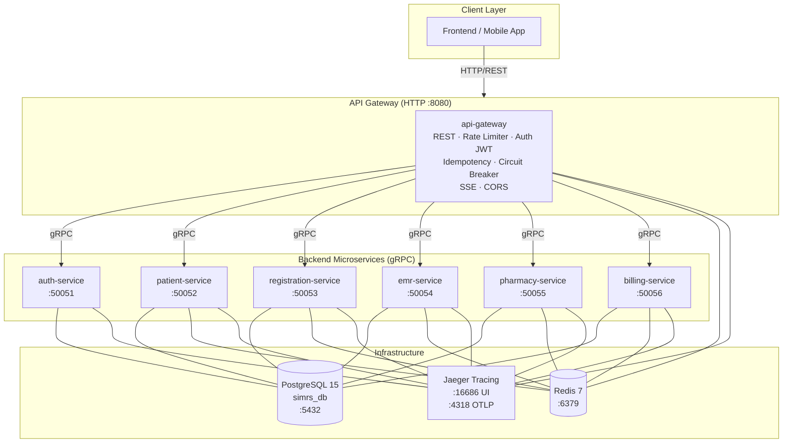

### Prinsip Arsitektur

| Prinsip | Implementasi |
|---|---|
| **Database per Service** | Setiap service memiliki skema tabel sendiri pada database `simrs_db` |
| **Loose Coupling** | Komunikasi antar service via event (Outbox + Redis Streams) |
| **Single Entry Point** | Semua traffic eksternal hanya melalui API Gateway |
| **Resilience** | Circuit Breaker (Sony gobreaker) pada setiap panggilan gRPC di Gateway |
| **Idempotency** | Middleware `X-Request-ID` + Redis cache (TTL 24 jam) |
| **Observability** | Structured logging (`log/slog`) + Jaeger Distributed Tracing |
| **Security** | JWT/Paseto token + RBAC per endpoint |

---

## 2. Infrastruktur Global

### Komponen Infrastruktur

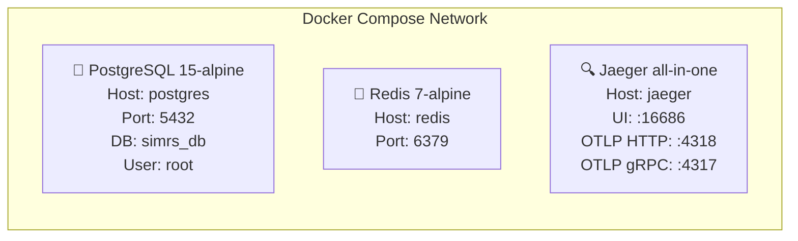

### Peran Redis

Redis digunakan untuk **tiga fungsi berbeda**:

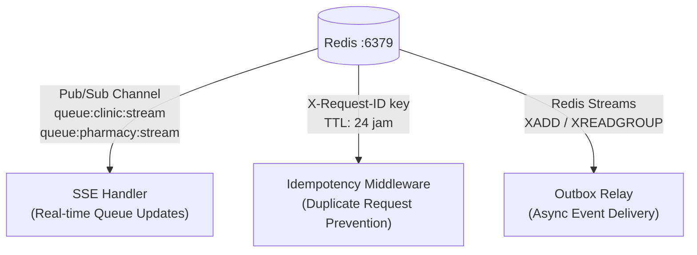

### Alur Request End-to-End

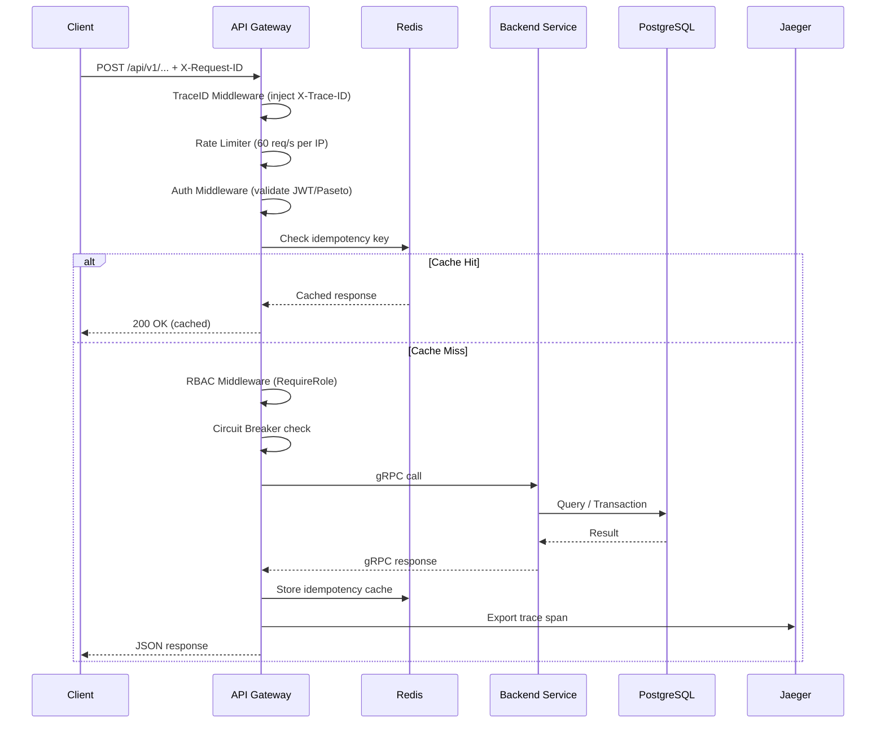

---

## 3. Service Catalog

### 3.1 API Gateway

```
Module   : api-gateway
Protocol : HTTP/1.1 + SSE
Port     : 8080 (Docker: 60080)
```

**Middleware Stack (urutan eksekusi):**

```mermaid
flowchart LR
    REQ["Incoming\nRequest"] --> M1
    M1["RequestID\n(chi)"] --> M2
    M2["RealIP\n(chi)"] --> M3
    M3["Logger\n(chi)"] --> M4
    M4["Recoverer\n(chi)"] --> M5
    M5["Timeout\n60s (chi)"] --> M6
    M6["CORS\nHandler"] --> M7
    M7["TraceID\nMiddleware"] --> M8
    M8["Rate Limiter\n60 req/s burst:120"] --> M9
    M9["Auth JWT\n(protected routes)"] --> M10
    M10["Idempotency\nX-Request-ID 24h"] --> M11
    M11["RBAC\nRequireRole"] --> SVC["Service\nHandler"]
```

**Dependencies yang digunakan:**
- `github.com/go-chi/chi/v5` — HTTP Router
- `github.com/go-chi/cors` — CORS Handler
- `github.com/redis/go-redis/v9` — Redis Client (SSE, Idempotency)
- `github.com/sony/gobreaker` — Circuit Breaker
- `google.golang.org/grpc` — gRPC Client ke semua service

---

### 3.2 Auth Service

```
Module   : auth-service
Protocol : gRPC
Port     : 50051 (Docker: 60051)
Database : simrs_db (table: users)
```

**gRPC Methods:**

| Method | Request | Response | Keterangan |
|---|---|---|---|
| `Login` | `username`, `password` | `access_token`, `role` | Validasi kredensial + generate Paseto token |

**Flow Login:**

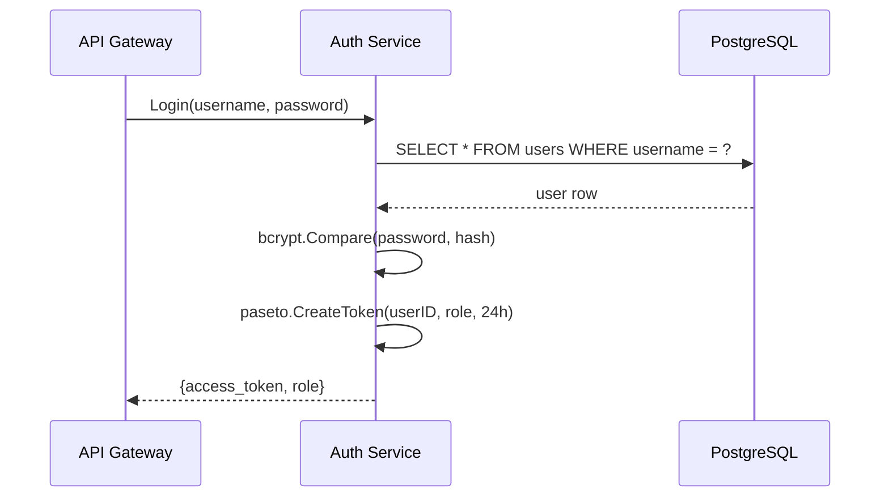

---

### 3.3 Patient Service

```
Module   : patient-service
Protocol : gRPC
Port     : 50052 (Docker: 60052)
Database : simrs_db (table: patients)
Peran    : Data Master Pasien
```

> Menyimpan **identitas pasien** (NIK, nama, tanggal lahir) dan menerbitkan **Nomor Rekam Medis (MRN)** yang unik. Berbeda dengan EMR Service, Patient Service hanya mengelola data demografis dan identitas — bukan data klinis.

**gRPC Methods:**

| Method | Request | Response | Keterangan |
|---|---|---|---|
| `RegisterPatient` | `name`, `nik`, `dob` | `mrn`, `success` | Generate MRN unik, simpan ke DB |
| `GetPatientByMRN` | `mrn` | Patient data | Lookup pasien berdasarkan MRN |

---

### 3.4 Registration Service

```
Module   : registration-service
Protocol : gRPC
Port     : 50053 (Docker: 60053)
Database : simrs_db (tables: encounters, outbox_events)
```

**gRPC Methods:**

| Method | Request | Response | Keterangan |
|---|---|---|---|
| `RegisterEncounter` | `mrn`, `department`, `doctor_id` | `encounter_no`, `success` | Daftarkan kunjungan + emit event |

**Outbox Events yang diterbitkan:**

| Event Type | Payload |
|---|---|
| `EncounterRegistered` | `encounter_no`, `mrn` |

---

### 3.5 EMR Service

```
Module   : emr-service
Protocol : gRPC
Port     : 50054 (Docker: 60054)
Database : simrs_db (tables: medical_records, medical_actions,
           clinic_wait_time_aggregates, outbox_events)
Peran    : Modul Poliklinik
Workers  : aggregator_cron.go (update wait time aggregates)
```

> Berfungsi sebagai **modul Poliklinik** — area kerja dokter dan perawat di dalam poli. Mencakup pencatatan pemeriksaan awal (triage/vital signs), input diagnosa ICD-10, pencatatan tindakan medis beserta tarif, dan kalkulasi estimasi waktu tunggu antrean poli berdasarkan data historis multidimensi.

**gRPC Methods:**

| Method | Request | Response | Keterangan |
|---|---|---|---|
| `SubmitTriage` | `encounter_no`, `mrn`, vital signs | `success` | Buat draft rekam medis + data triage |
| `StartEncounter` | `encounter_no` | `success` | Ubah status MR dari DRAFT → ACTIVE |
| `AddDiagnosis` | `encounter_no`, `icd10_code`, `doctor_id`, `dept_code`, `gender`, `age_bracket` | `success` | Simpan diagnosa + update agregat antrean |
| `AddMedicalAction` | `encounter_no`, `action_code`, `action_name`, `price`, `notes` | `success` | Tambahkan tindakan medis + emit event |
| `GetMedicalRecord` | `encounter_no` | Full MR data | Ambil rekam medis lengkap |
| `GetEstimatedWaitTime` | `doctor_id`, `dept_code`, `gender`, `age_bracket` | `estimated_minutes` | Estimasi waktu tunggu poliklinik |

**Outbox Events yang diterbitkan:**

| Event Type | Payload |
|---|---|
| `MedicalActionAdded` | `encounter_no`, `action_code`, `action_name`, `price` |

---

### 3.6 Pharmacy Service

```
Module   : pharmacy-service
Protocol : gRPC
Port     : 50055 (Docker: 60055)
Database : simrs_db (tables: inventory, prescriptions, prescription_items,
           encounter_payments, pharmacy_wait_time_aggregates, outbox_events)
Consumer : billing_consumer.go (listen InvoicePaid dari Billing)
Workers  : aggregator_cron.go (update wait time aggregates)
```

**gRPC Methods:**

| Method | Request | Response | Keterangan |
|---|---|---|---|
| `CreatePrescription` | `encounter_no`, `items[]`, `is_compounded`, demographic data | `prescription_id`, `success` | Buat resep + validasi stok |
| `DispensePrescription` | `prescription_id` | `success` | Keluarkan obat (hanya jika PAID) + deduct stok |
| `RollbackPrescription` | `prescription_id` | `success` | Batalkan resep (Saga compensation) |
| `GetEstimatedWaitTime` | `doctor_id`, `dept_code`, `gender`, `age_bracket`, `is_compounded` | `estimated_minutes` | Estimasi waktu tunggu farmasi |

**Outbox Events yang diterbitkan:**

| Event Type | Payload |
|---|---|
| `PrescriptionDispensed` | `encounter_no`, `prescription_id`, `price` |

**Events yang dikonsumsi:**

| Event Source | Event Type | Aksi |
|---|---|---|
| Billing Service | `InvoicePaid` | Update status payment `encounter_payments` → PAID |

---

### 3.7 Billing Service

```
Module   : billing-service
Protocol : gRPC
Port     : 50056 (Docker: 60056)
Database : simrs_db (tables: invoices, invoice_items, outbox_events)
Consumer : (listen MedicalActionAdded + PrescriptionDispensed)
```

**gRPC Methods:**

| Method | Request | Response | Keterangan |
|---|---|---|---|
| `GenerateInvoice` | `encounter_no` | `invoice_id`, `total_amount` | Buat invoice dari semua tindakan + resep |
| `PayInvoice` | `invoice_id` | `success` | Proses pembayaran + emit event |

**Outbox Events yang diterbitkan:**

| Event Type | Payload |
|---|---|
| `InvoicePaid` | `encounter_no`, `invoice_id`, `paid_at` |

---

## 4. Entity Relationship Diagram (ERD)

> Semua service berbagi satu database `simrs_db` namun mengakses tabel yang berbeda-beda (Database-per-Service pattern secara logical).

### 4.1 Auth Service DB

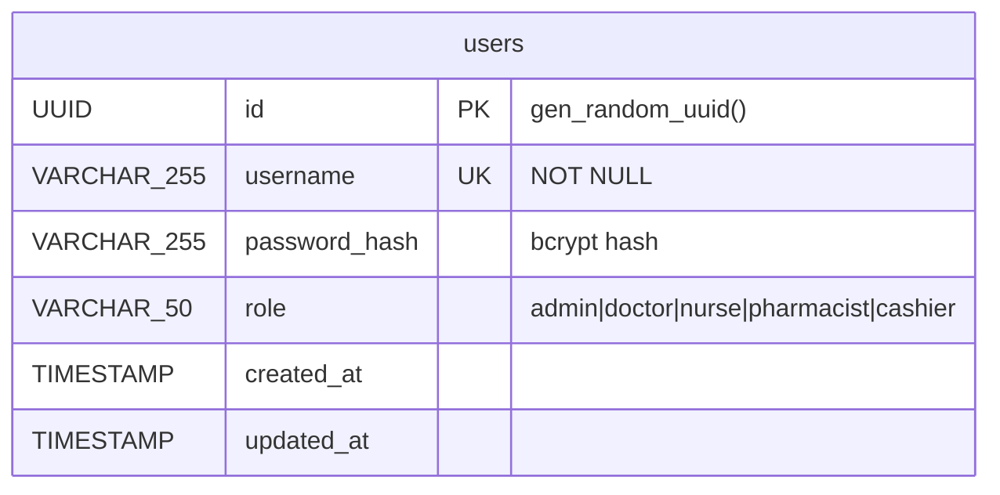

---

### 4.2 Patient Service DB

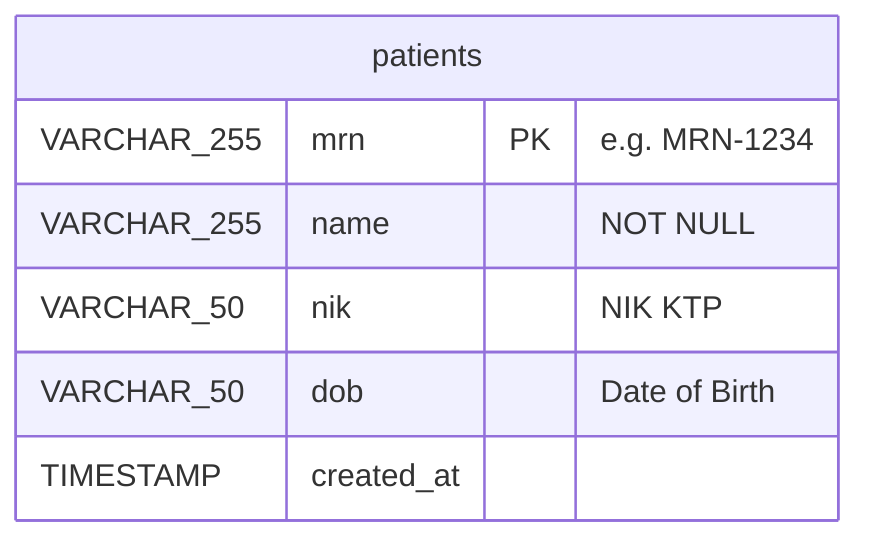

---

### 4.3 Registration Service DB

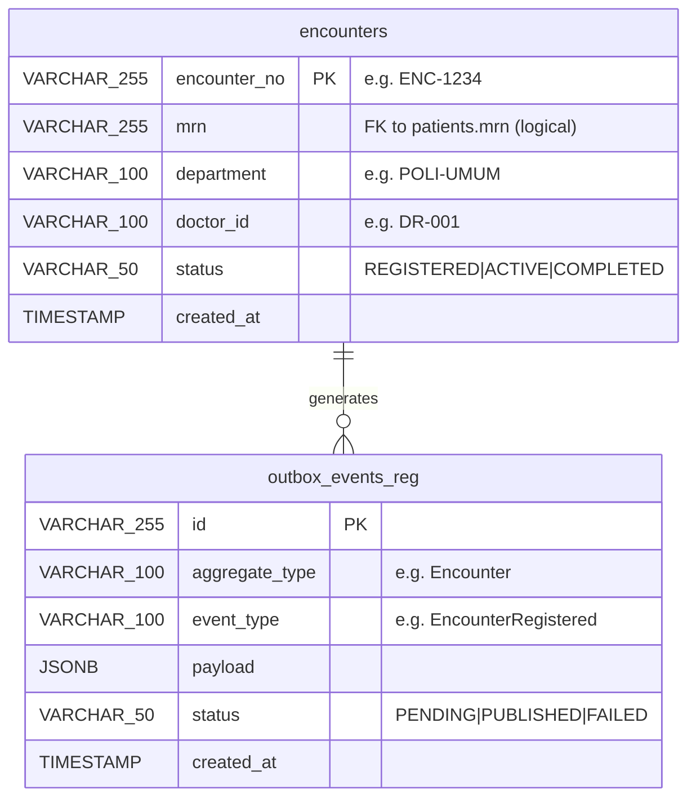

---

### 4.4 EMR Service DB

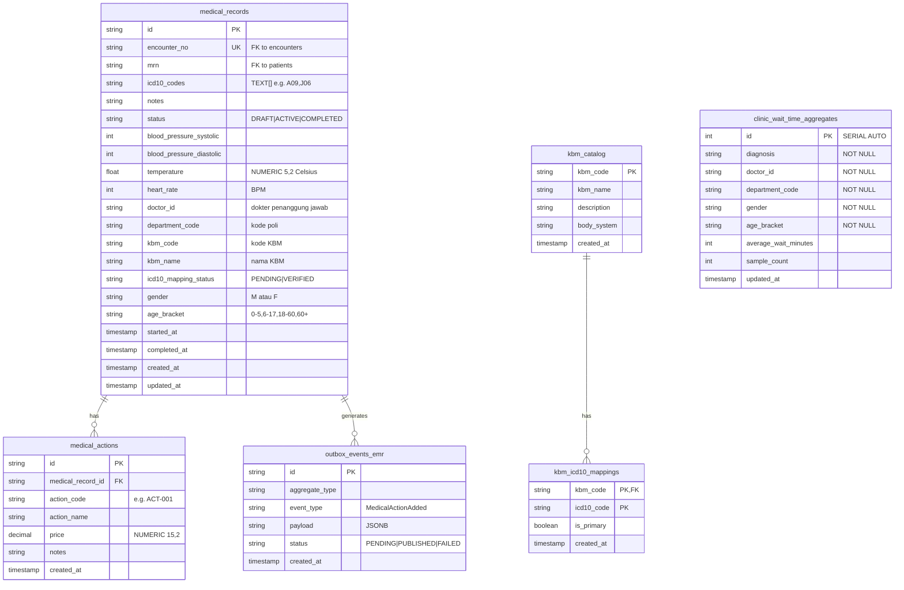

---

### 4.5 Pharmacy Service DB

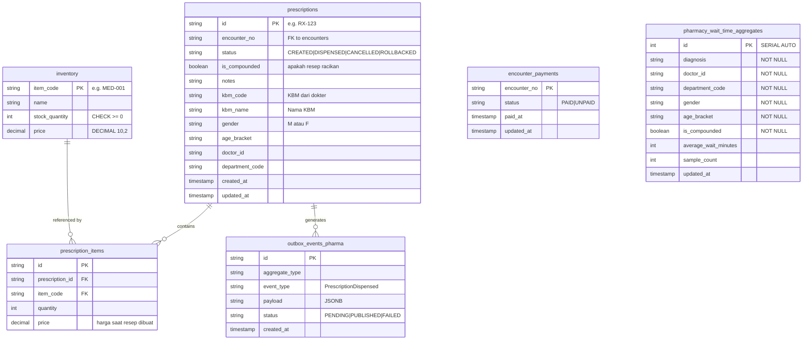

---

### 4.6 Billing Service DB

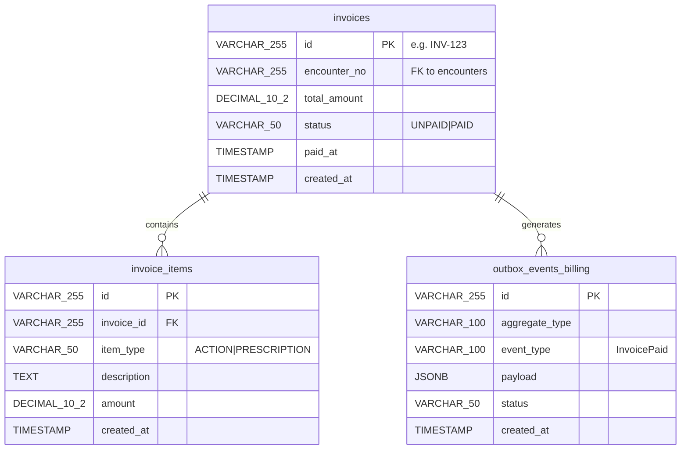

---

### 4.7 Relasi Antar Service (Logical ERD)

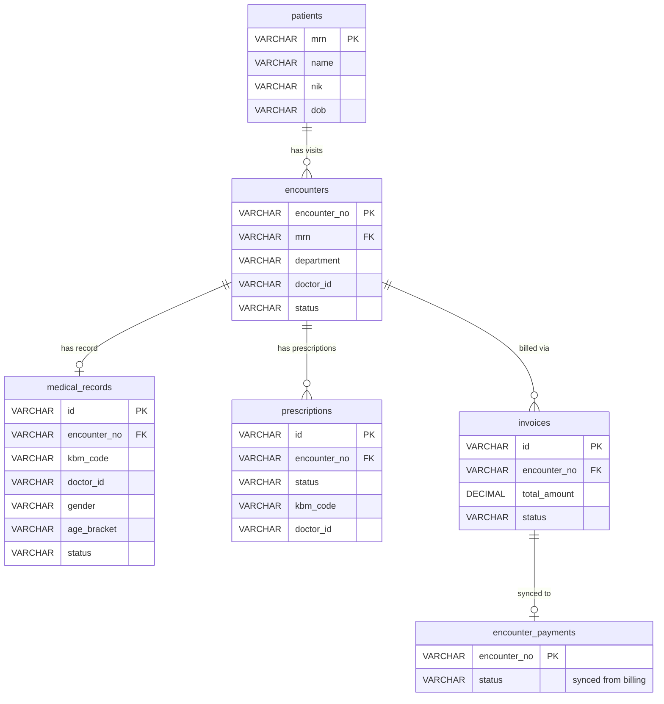

---

## 5. API Endpoint Reference

**Base URL:** `http://localhost:60080/api/v1`

### Legend
- 🔓 = Publik (tidak perlu autentikasi)
- 🔐 = Butuh JWT Bearer Token
- 👤 = RBAC: Role yang diizinkan
- ⚡ = SSE (Server-Sent Events)

### 5.1 System & Queue

| Method | Path | Auth | Role | Keterangan |
|---|---|---|---|---|
| `GET` | `/health` | 🔓 | - | Health check API Gateway |
| `GET` | `/queue/clinic/stream` | 🔓 ⚡ | - | SSE stream antrean poliklinik real-time |
| `GET` | `/queue/pharmacy/stream` | 🔓 ⚡ | - | SSE stream antrean farmasi real-time |
| `GET` | `/queue/clinic/estimate` | 🔓 | - | Estimasi waktu tunggu poli |
| `GET` | `/queue/pharmacy/estimate` | 🔓 | - | Estimasi waktu tunggu farmasi |

**Query params untuk `/queue/clinic/estimate`:**
```
doctor_id, department_code, gender, age_bracket
```

**Query params untuk `/queue/pharmacy/estimate`:**
```
doctor_id, department_code, gender, age_bracket, is_compounded
```

---

### 5.2 Authentication

| Method | Path | Auth | Role | Keterangan |
|---|---|---|---|---|
| `POST` | `/auth/login` | 🔓 | - | Login, dapatkan JWT token |

**Request Body:**
```json
{
  "username": "string (required)",
  "password": "string (required, min 6 chars)"
}
```

---

### 5.3 Patient Management

| Method | Path | Auth | Role | Keterangan |
|---|---|---|---|---|
| `POST` | `/patient/register` | 🔐 | 👤 admin, nurse | Daftar pasien baru |
| `GET` | `/patient/{mrn}` | 🔐 | 👤 admin, nurse | Lookup pasien by MRN |

---

### 5.4 Registration (Pendaftaran Kunjungan)

| Method | Path | Auth | Role | Keterangan |
|---|---|---|---|---|
| `POST` | `/registrations` | 🔐 | 👤 admin, nurse | Daftar kunjungan pasien |

---

### 5.5 EMR (Rekam Medis)

| Method | Path | Auth | Role | Keterangan |
|---|---|---|---|---|
| `POST` | `/emr/triage` | 🔐 | 👤 doctor, nurse | Input data triage (vital signs) |
| `POST` | `/emr/start` | 🔐 | 👤 doctor, nurse | Mulai encounter (DRAFT → ACTIVE) |
| `POST` | `/emr/diagnosis-kbm` | 🔐 | 👤 doctor, nurse | Tambah diagnosa KBM |
| `GET` | `/emr/kbm/search` | 🔐 | 👤 doctor, nurse, medical_records, admin | Pencarian KBM |
| `GET` | `/emr/kbm/{code}` | 🔐 | 👤 doctor, nurse, medical_records, admin | Detail KBM |
| `GET` | `/emr/kbm/{code}/icd10-suggestions` | 🔐 | 👤 medical_records, admin | Rekomendasi ICD-10 dari KBM |
| `GET` | `/emr/pending-icd10` | 🔐 | 👤 medical_records, admin | Daftar RM yang menunggu verifikasi ICD-10 |
| `POST` | `/emr/verify-icd10` | 🔐 | 👤 medical_records, admin | Verifikasi & simpan mapping ICD-10 |
| `POST` | `/emr/actions` | 🔐 | 👤 doctor, nurse | Tambah tindakan medis |
| `GET` | `/emr/record/{encounter_no}` | 🔐 | 👤 doctor, nurse | Ambil rekam medis lengkap |

---

### 5.6 Pharmacy (Farmasi)

| Method | Path | Auth | Role | Keterangan |
|---|---|---|---|---|
| `POST` | `/pharmacy/prescriptions` | 🔐 | 👤 pharmacist, admin | Buat resep obat |
| `POST` | `/pharmacy/dispense` | 🔐 | 👤 pharmacist, admin | Keluarkan obat (setelah lunas) |

---

### 5.7 Billing (Kasir)

| Method | Path | Auth | Role | Keterangan |
|---|---|---|---|---|
| `GET` | `/billing/invoice/{encounter_no}` | 🔐 | 👤 cashier, admin | Generate / lihat invoice |
| `POST` | `/billing/pay` | 🔐 | 👤 cashier, admin | Bayar invoice |

---

## 6. Event Flow (Outbox Pattern)

### Arsitektur Outbox

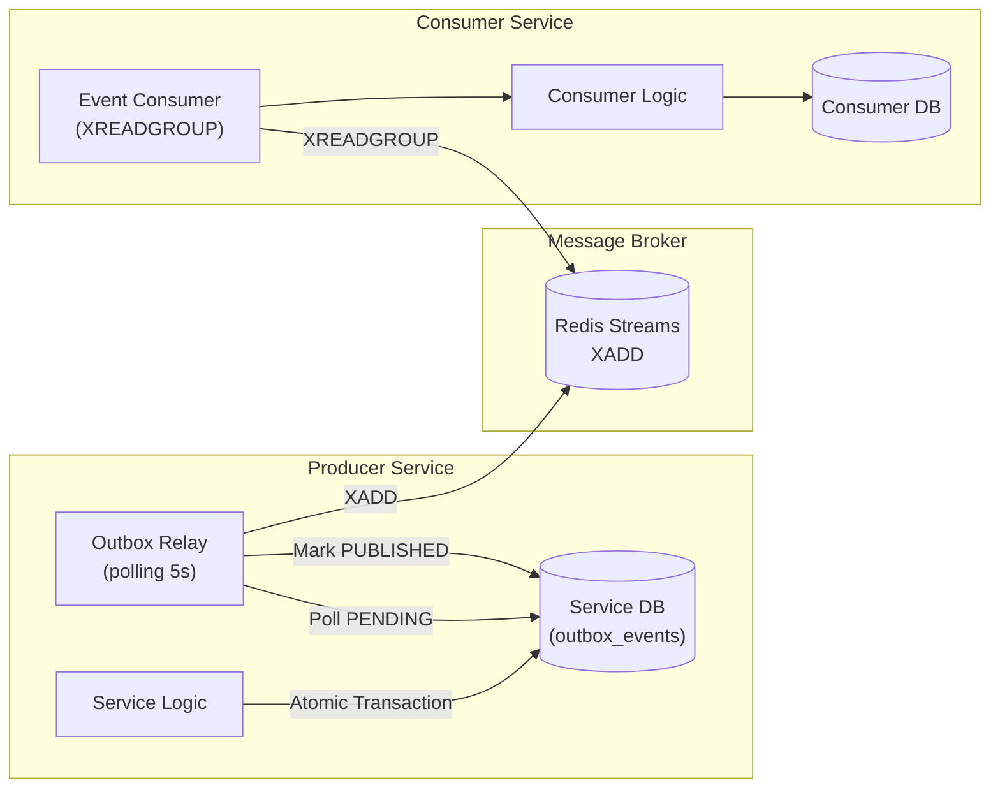

### Alur Event Lengkap

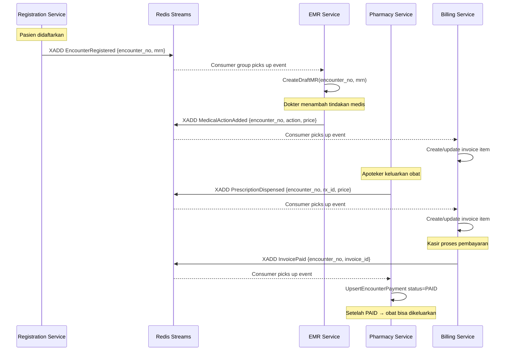

### Peta Event

| Source Service | Event Type | Target Service | Aksi di Target |
|---|---|---|---|
| `registration-service` | `EncounterRegistered` | `emr-service` | `CreateDraftMR` |
| `emr-service` | `MedicalActionAdded` | `billing-service` | Tambah invoice item ACTION |
| `pharmacy-service` | `PrescriptionDispensed` | `billing-service` | Tambah invoice item PRESCRIPTION |
| `billing-service` | `InvoicePaid` | `pharmacy-service` | Set `encounter_payments.status = PAID` |

---

## 7. Shared Packages

Semua shared code berada di module `shared` dan diakses oleh semua service via Go Workspaces.

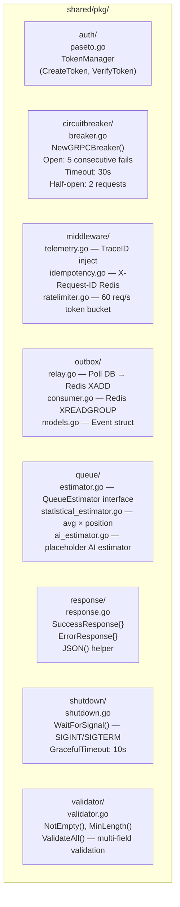

### Detail Shared Packages

| Package | File | Fungsi Utama |
|---|---|---|
| `auth` | `paseto.go` | `TokenManager` — Buat & verifikasi Paseto token simetris (HS256). TTL default 24h. |
| `circuitbreaker` | `breaker.go` | `NewGRPCBreaker(name)` — Buka circuit setelah 5 consecutive failures atau 60% failure rate (min 10 req). Timeout 30s. |
| `middleware` | `telemetry.go` | `TraceIDMiddleware` — Inject `X-Trace-ID` ke setiap request, propagasi ke downstream via context. |
| `middleware` | `idempotency.go` | `IdempotencyMiddleware` — Cache response di Redis dengan key `X-Request-ID` selama 24h. Wajib untuk semua POST. |
| `middleware` | `ratelimiter.go` | `NewRateLimiter(rate, burst)` — Token bucket per IP. Default: 60 req/s, burst 120. |
| `outbox` | `relay.go` | `Relay.Start()` — Polling DB `outbox_events` setiap interval, XADD ke Redis Stream, mark PUBLISHED. |
| `outbox` | `consumer.go` | `Consumer` — XREADGROUP dari Redis Stream, proses event, ACK setelah berhasil. |
| `queue` | `statistical_estimator.go` | `EstimateWaitTime(clinicID, position)` — `position × avgConsultTime`. |
| `response` | `response.go` | `JSON(w, status, data)` — Standard envelope response dengan `RequestID`, `TraceID`, `Success`, `Data`. |
| `shutdown` | `shutdown.go` | `WaitForSignal()` — Listen `SIGINT`/`SIGTERM`, return context yang di-cancel. Timeout graceful 10s. |
| `validator` | `validator.go` | `ValidateAll(map[field]func() error)` — Validasi multi-field sekaligus, return first error. |

---

## 8. Deployment & Port Mapping

### Port Reference

| Service | Internal Port | External Port (Docker) | Protocol |
|---|---|---|---|
| `auth-service` | 50051 | **60051** | gRPC |
| `patient-service` | 50052 | **60052** | gRPC |
| `registration-service` | 50053 | **60053** | gRPC |
| `emr-service` | 50054 | **60054** | gRPC |
| `pharmacy-service` | 50055 | **60055** | gRPC |
| `billing-service` | 50056 | **60056** | gRPC |
| `api-gateway` | 8080 | **60080** | HTTP/REST + SSE |
| `PostgreSQL` | 5432 | **5432** | TCP |
| `Redis` | 6379 | **6379** | TCP |
| `Jaeger UI` | 16686 | **16686** | HTTP |
| `Jaeger OTLP gRPC` | 4317 | **4317** | gRPC |
| `Jaeger OTLP HTTP` | 4318 | **4318** | HTTP |

### Dependency Graph (Docker Compose)

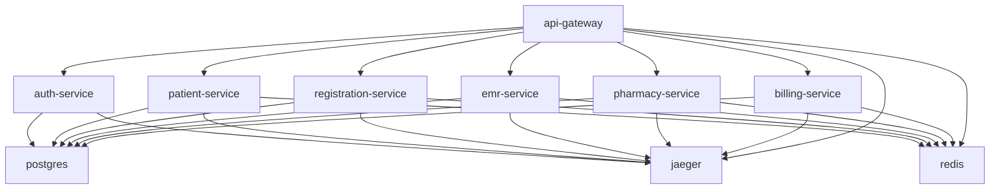

### Cara Menjalankan

```bash
# Jalankan semua service + infrastruktur
docker-compose up --build

# Akses API Gateway
curl http://localhost:60080/api/v1/health

# Akses Jaeger Tracing UI
open http://localhost:16686

# Login
curl -X POST http://localhost:60080/api/v1/auth/login \
  -H "Content-Type: application/json" \
  -d '{"username":"admin","password":"secret123"}'
```

### Alur Bisnis Lengkap (Happy Path)

```mermaid
flowchart TD
    A["👤 Admin/Nurse\nDaftar Pasien\nPOST /patient/register"] -->|"MRN"| B

    B["👤 Admin/Nurse\nDaftar Kunjungan\nPOST /registrations"] -->|"encounter_no"| C

    C["🔔 Event: EncounterRegistered\n(Redis Stream)"] -->|"Auto"| D

    D["EMR Service\nBuat Draft Rekam Medis\n(background event consumer)"] --> E

    E["👨‍⚕️ Nurse\nInput Triage\nPOST /emr/triage"] --> F

    F["👨‍⚕️ Doctor\nMulai Konsultasi\nPOST /emr/start"] --> G

    G["👨‍⚕️ Doctor\nInput Diagnosa KBM\nPOST /emr/diagnosis-kbm"] --> G2

    G2["👨‍⚕️ Medical Records\nVerifikasi ICD-10\nPOST /emr/verify-icd10"] --> H

    H["👨‍⚕️ Doctor\nTambah Tindakan\nPOST /emr/actions"] -->|"Event: MedicalActionAdded"| I

    I["💰 Billing Service\nUpdate Invoice Item\n(background)"] --> J

    J["💊 Pharmacist\nBuat Resep\nPOST /pharmacy/prescriptions"] --> K

    K["🏦 Cashier\nGenerate Invoice\nGET /billing/invoice/{encounter_no}"] --> L

    L["🏦 Cashier\nProses Pembayaran\nPOST /billing/pay"] -->|"Event: InvoicePaid"| M

    M["💊 Pharmacy Service\nUpdate status PAID\n(background)"] --> N

    N["💊 Pharmacist\nKeluarkan Obat\nPOST /pharmacy/dispense"] --> O

    O["✅ Kunjungan Selesai"]
```

---

*Dokumen ini dihasilkan dari analisa kode pada: 2026-08-12*  
*Module: `github.com/aliube/go-micro-simrs-one`*
