# Dokumentasi Teknis: go-micro-simrs-one (SIMRS)

> Sistem Informasi Manajemen Rumah Sakit berbasis Microservices

---

## Daftar Isi

1. [Gambaran Umum Arsitektur](#1-gambaran-umum-arsitektur)
2. [Infrastruktur Global](#2-infrastruktur-global)
3. [Service Catalog](#3-service-catalog)
4. [Entity Relationship Diagram (ERD)](#4-entity-relationship-diagram-erd)
5. [API Endpoint Reference](#5-api-endpoint-reference)
6. [Event Flow (Outbox Pattern)](#6-event-flow-outbox-pattern)
7. [Shared Packages](#7-shared-packages)
8. [Deployment & Port Mapping](#8-deployment--port-mapping)

---

## 1. Gambaran Umum Arsitektur

Sistem SIMRS mengadopsi pola **Microservices** dengan komunikasi internal menggunakan **gRPC**, sementara klien eksternal (Frontend/Mobile) berinteraksi hanya melalui satu pintu yaitu **API Gateway** yang mengekspos **REST HTTP**.

> 🔗 **[Buka Diagram di Live Mermaid Editor](https://mermaid.live/edit#pako:eNp9Ve9Po0AQ_VcmfKoJxPa0P64fLqGVVnpFOUDNRS5mC2u7Z4FmWTSN-r_fbIHK1p58Wt683Z038wZetSiLqTYEbcnJZgXBKEwBn7xYlMB4bltXwX2ojdeMpgLmZEt5qP0pafKZWBid8CwVNI3BoyQS0Lplgp7AKTjZgq0pmJvNfg-ywvTglqkZWHfmbzzIdG2YEkFfyBZal0HgwnDQHrRPlCund8gkG2YsS2YYpp7lBxAW7faiDx6iMGcJ5sBrzCzEClzTt4JrZNsxTTYZJhxta8KY8ahgAkackieUGKa-b-2D157_pQDf8m7tseVjXiMSPclKOCziWU75M4toDq2l545VFeZNcCl1YGZGxcNbh912u9tRiK4ZVE3YECG7cEj_ptA9a4pUTpcsFxw3ZOkh_0zlzySdvBBh_CVr8ondV9iOh-yExiwia4PTKOPx4YZzNftL03NMmfyK8IRE20N6V6GP7PncvpIK0Dlrli4P6b0vG2FfTTx5mZ0-coL6i0gUnKoJTe9boeZmuVhy6v-aQ6eLZ-cs4flDvMBlyynWghl-tKIJgZ9WYAZDhGWjdKhaoEOzwDqGdxV82FVQh6pAD2WBZLhWr0OlC81w0uzCxUim5eHGHPpSbO-s_13aUKAjk1yHMcGEdEBbqjtnpjW1ZFdmhC7R8QEnEZ4vj-j0eoMe3NhyfX7WGcB1MHeP1W9igWH8eJMDdypH6a0eyTI8vduFpYffdr49AlcuPRJBQx5DZ0dAxzt28s5BRwKVV2oRMjGMGtjhEqhS-i-GNS9BzFAh1e8fhJkan6lhx1PC1es-XApQ0_iA9rRKjsJrYjtiowyNrdV7aYWDajTBpvomXgtWsNknqBKmnPghpAk38y5xTQf8buAMsFj-b14lL9QEzhiO5xCXMX0kOHihFqbvkozzlvnbNMIgzjE6Xys2MX7aLxjBWU8q-P0fT9jy9w)** *(Klik kanan → Buka di Tab Baru / Open Link in New Tab)*

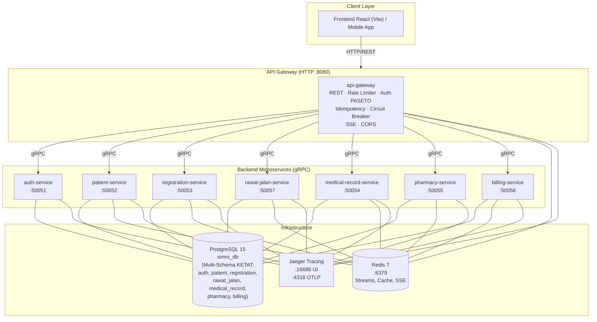

### Prinsip Arsitektur

| Prinsip | Implementasi |
|---|---|
| **Multi-Schema Database KETAT** | Setiap service memiliki skema PostgreSQL terisolasi (`auth`, `patient`, `registration`, `rawat_jalan`, `medical_record`, `pharmacy`, `billing`). **Dilarang keras cross-schema JOIN dan Foreign Keys**. |
| **Clinical Snapshot Pattern** | Transaksi poliklinik (`rawat_jalan`) menyimpan snapshot nama tindakan & diagnosa saat pelayanan berlangsung, mencegah ketergantungan relasi langsung ke master data. |
| **Async Master Data Replication** | Katalog master klinis (ICD-10, KBM, Tindakan) dimiliki oleh `medical-record-service` (SSOT) dan direplikasi secara asinkron ke tabel replika lokal `rawat-jalan-service` via Redis Streams (`clinical_master_stream`). |
| **Loose Coupling & Outbox** | Komunikasi asinkron antar service menggunakan *Transactional Outbox Pattern* + Redis Streams (`XADD` / `XREADGROUP`). |
| **Single Entry Point** | Semua traffic eksternal hanya melalui API Gateway dengan pemetaan rute domain spesifik (`/rawat-jalan/*`, `/rekam-medis/*`). |
| **Resilience** | Circuit Breaker (`hystrix-go`) pada setiap koneksi gRPC di API Gateway. |
| **Idempotency** | Middleware `X-Request-ID` + Redis cache (TTL 24 jam) untuk seluruh operasi POST. |
| **Observability** | Structured logging (`log/slog`) + OpenTelemetry Distributed Tracing yang diekspor ke Jaeger. |
| **Security** | Token PASETO simetris + claims RBAC (*Admin, Doctor, Nurse, Medical Records, Pharmacist, Cashier*). |


---

## 2. Infrastruktur Global

### Komponen Infrastruktur

> 🔗 **[Buka Diagram di Live Mermaid Editor](https://mermaid.live/edit#pako:eNpdkc1OwzAQhF9l5TOVCGnTkBs0VX9UQUjDCSPkxksamsSR7Qihqu_OuoHSsgdL881qx17vWa4ksghYoUW7hVXKG6Ay3aYHnMUq36GGiapbZRAe0H4qveOsb3SVzF5IdjL0JZ25F0KijC00rp9W4I0GomrLBjlv5oQjaHvTEEiUJjAa-jck4vsITFlr8yY3JJ8N6gi0Upaz17-wdBov1ud50h9CirI0MP6fpB0-xQT--PZi1PJuOpumF7OuJSwFFvReUVWDshmos3EfR8ddbRFB5AVBGJB4zFYJzLMsITb0vfAXFWky6dH4lIqNZFfAatS1KKVb-94ZnNkt1sgJcCbxXXSVdQs-uGbRWbX-anIyre6QSNdKYTEuBX1R_YMP3wLIkQc)** *(Klik kanan → Buka di Tab Baru / Open Link in New Tab)*

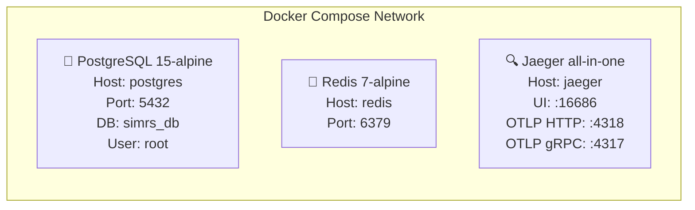

### Peran Redis

Redis digunakan untuk **empat fungsi berbeda**:

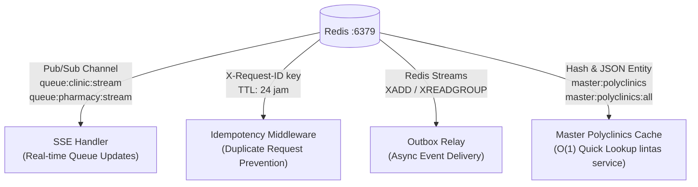

### Alur Request End-to-End

> 🔗 **[Buka Diagram di Live Mermaid Editor](https://mermaid.live/edit#pako:eNptU02P2jAQ_SujnFi1ENpDDzmsBKHKQndLNkGlh1xGziy4JE7WdmjRav97x8ESy4dvmffm2e_N5C0QTUlBBIGh146UoJnEjca6UMCnRW2lkC0qCzGggbiSpOw1mKwdOknnkKClv3i4pmSzqeNkVEpzjea_ev0pih2pEnLSeynomncUSRtjN5ry58drxiJxjAXShnShjng8vL9P1hGky3wFIbYy3H8JR6MRfILfw8w5N3Y4nx3JydqzVxoFzWfwJMuyYlOaYCDVHxKWu3qQe-4umjL2D4-ylpY0DL6NQdNraKDlr3l6SZ50dnsmv8dKlk5hsV6FKRqyzccezjCCeEtiB7Kkum0sj-wAO_J5Y8VzQrEleJB-Su5w29Df2KMlP8q0jTJ04rA-U-IIvo7HsPwBA9Ez_e1UGfLKT9KYszbvezqJz6y4WKWmrKno7gY_llp00sJUE-44HOFcXfB4KSLYZGkMAqvqBHKdUZfFc0f6AKEblTIorGzUiXZ03YtkZLrKniv4h_T6N_Pweee2YT8f8-6juaAukgi-_2sbbcG61QDD23gj3kW-_HlxHS988BmCmnSNsnQ_45sDisBuqaaCC0VQ0gs6B0Gh3h0ZO9vkByUYtLojrnStWxz_-_ry-38yaizh)** *(Klik kanan → Buka di Tab Baru / Open Link in New Tab)*

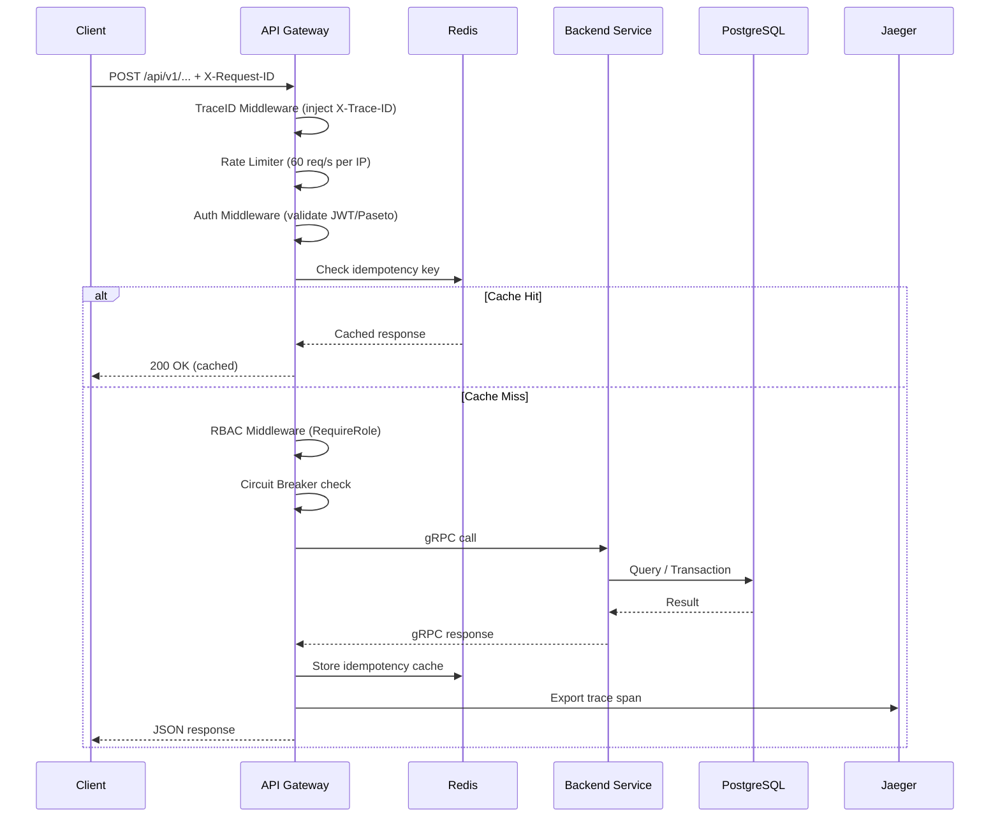

---

## 3. Service Catalog

### 3.1 API Gateway

```
Module   : api-gateway
Protocol : HTTP/1.1 + SSE
Port     : 8080 (Docker: 60080)
```

**Middleware Stack (urutan eksekusi):**

> 🔗 **[Buka Diagram di Live Mermaid Editor](https://mermaid.live/edit#pako:eNpt0ltLwzAUAOC_EvqkYLHt7nsQ5iZY2VDboYL1ISZnbaBptjTdGGP_3dOaVcbsU0m-cziXHBymODhj4qxytWMZ1YbMo6Qg-EUPr5-JExZMSVGkSVJEsKmgNInzRVz3jiz8X7fwkdm7cIbuimXiulWBVUGjaB6-XJCOJR0kc5WmoC9I15Juk4WpLeh_VM-qHqqlkKAqg6bvleTc9a3ro5s-RzGiR1rwHFOeyMCSQZ1KUwZNawvBUe2ohhYOLRzWlVEDZC6kME1xfY9o2NyW5LvSpRn7gddGjWzUCKMmlcnI0_uybmetlQFmgBONxUP5V7Pvncbt1WvhINdIC7bHsA_Xzt8NZyToZn9B7Y6aJd1PpnaPQkOk8raL-G2K9zHorWBwNg3nhjgStKSC18_kUOdLHJOBxOAx_nJY0SrHV5EUxxrTyqh4XzC8NLoCPKnWHOcyEzTVVNrj4w9U08BE)** *(Klik kanan → Buka di Tab Baru / Open Link in New Tab)*

```mermaid
flowchart LR
    REQ["Incoming\nRequest"] --> M1
    M1["RequestID\n(chi)"] --> M2
    M2["RealIP\n(chi)"] --> M3
    M3["Logger\n(chi)"] --> M4
    M4["Recoverer\n(chi)"] --> M5
    M5["Timeout\n60s (chi)"] --> M6
    M6["CORS\nHandler"] --> M7
    M7["TraceID\nMiddleware"] --> M8
    M8["Rate Limiter\n60 req/s burst:120"] --> M9
    M9["Auth JWT\n(protected routes)"] --> M10
    M10["Idempotency\nX-Request-ID 24h"] --> M11
    M11["RBAC\nRequireRole"] --> SVC["Service\nHandler"]
```

**Dependencies yang digunakan:**
- `github.com/go-chi/chi/v5` — HTTP Router
- `github.com/go-chi/cors` — CORS Handler
- `github.com/redis/go-redis/v9` — Redis Client (SSE, Idempotency)
- `github.com/sony/gobreaker` — Circuit Breaker
- `google.golang.org/grpc` — gRPC Client ke semua service

---

### 3.2 Auth Service

```
Module   : auth-service
Protocol : gRPC
Port     : 50051 (Docker: 60051)
Database : simrs_db (table: users)
```

**gRPC Methods:**

| Method | Request | Response | Keterangan |
|---|---|---|---|
| `Login` | `username`, `password` | `access_token`, `role` | Validasi kredensial + generate Paseto token |

**Flow Login:**

> 🔗 **[Buka Diagram di Live Mermaid Editor](https://mermaid.live/edit#pako:eNplkV9rwjAUxb_KJU86qg9jT4U5qu06oWPOCH0JjCy9a8ts0uXPRMTvvsQqyMzjub9z7iH3QISqkMRADP44lALTltead0yCfz3XthVtz6WFvARuIFktIecWd3x_iyT0hDjbAEX92wq8ZdJ5YFbK2FojfS-YHJi8nMxmCY2hUHUrR86glrzDyJuN2SldjQcuoZ5L5zHQrMgWG7iD5_XbKwTeQPmSrTO4eOERngZTOp-c08MMtNpdhQX5U-h9b6cL1fmuOLrsjKDhphn_g_0UrZouNPqP2KhvHOou08gnb33l-4crjzflZQwHLgQa82EDP4BHEgHpUHe8rcIJDsHDiG2wQ-YFRir84m5rGWHyBHNnFd1L4YdWO7-JuL7yJc5HO8vHPwSVlqU)** *(Klik kanan → Buka di Tab Baru / Open Link in New Tab)*

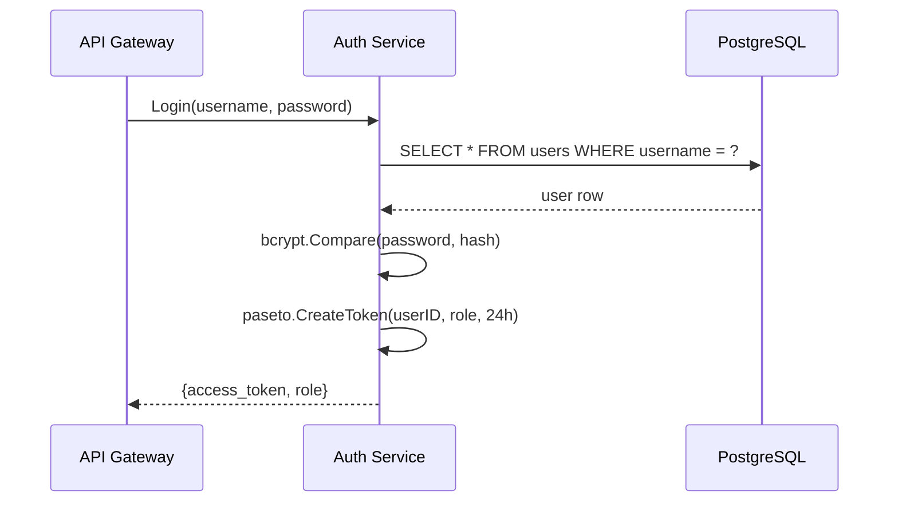

---

### 3.3 Patient Service

```
Module   : patient-service
Protocol : gRPC
Port     : 50052 (Docker: 60052)
Database : simrs_db (table: patients)
Peran    : Data Master Pasien
```

> Menyimpan **identitas pasien** (NIK, nama, tanggal lahir) dan menerbitkan **Nomor Rekam Medis (MRN)** yang unik. Berbeda dengan EMR Service, Patient Service hanya mengelola data demografis dan identitas — bukan data klinis.

**gRPC Methods:**

| Method | Request | Response | Keterangan |
|---|---|---|---|
| `RegisterPatient` | `name`, `nik`, `dob` | `mrn`, `success` | Generate MRN unik, simpan ke DB |
| `GetPatientByMRN` | `mrn` | Patient data | Lookup pasien berdasarkan MRN |

---

### 3.4 Registration Service

```
Module   : registration-service
Protocol : gRPC
Port     : 50053 (Docker: 60053)
Database : simrs_db (tables: encounters, outbox_events)
```

> **Validasi Master Poliklinik KETAT:** Pada saat pendaftaran kunjungan (`RegisterEncounter`) maupun pasien baru, sistem API Gateway & Registration memvalidasi `department_code` terhadap master data resmi poliklinik melalui Redis Hash `master:polyclinics` (atau query ke `rawat-jalan-service`). Penggunaan singkatan lama (misal: `UMU`, `GIG`) atau kode tidak resmi akan ditolak dengan status **`400 Bad Request`**.

**gRPC Methods:**

| Method | Request | Response | Keterangan |
|---|---|---|---|
| `RegisterEncounter` | `mrn`, `department_code`, `doctor_id` | `encounter_no`, `success` | Daftarkan kunjungan + emit event |

**Outbox Events yang diterbitkan:**

| Event Type | Payload |
|---|---|
| `EncounterRegistered` | `encounter_no`, `mrn` |

---

### 3.5 Rawat Jalan Service

```
Module   : rawat-jalan-service
Protocol : gRPC
Port     : 50057 (Docker: 60057, Metrics: 9097)
Database : simrs_db (Schema: rawat_jalan)
           (tables: polyclinics [SSOT Pemilik Resmi], encounters, triage_records, medical_actions,
            encounter_diagnoses, clinic_wait_time_aggregates,
            icd10_catalog [replica], kbm_catalog [replica],
            master_tindakan [replica], outbox_events)
Peran    : Operasional Pelayanan Poliklinik Dokter & Perawat, Pemilik Resmi Master Poliklinik
Consumer : 
  1. registration.events (group: rawat-jalan-group)
  2. clinical_master_stream (group: rawat-jalan-master-sync)
Workers  : aggregator_cron.go (update wait time aggregates)
```

> Berfungsi sebagai **pusat operasional poliklinik (Point-of-Care)** bagi dokter dan perawat serta **pemilik resmi (*Single Source of Truth*) dari master data poliklinik RS** (`rawat_jalan.polyclinics`). Mencakup penerimaan pasien dari registrasi, pengisian triage/vital signs, pelaksanaan encounter, input tindakan medis berbayar, penentuan diagnosis klinis (KBM/ICD-10) beserta derajat keparahan (*Severity Level*), kalkulasi estimasi waktu tunggu antrean poliklinik, serta auto-caching data poliklinik ke Redis Hash `master:polyclinics` dan JSON String `master:polyclinics:all`.

**gRPC Methods:**

| Method | Request | Response | Keterangan |
|---|---|---|---|
| `SubmitTriage` | `encounter_no`, `mrn`, vital signs, keluhan | `success` | Rekam data triage awal perawat |
| `StartEncounter` | `encounter_no` | `success` | Mulai sesi pemeriksaan dokter (ACTIVE) |
| `CompleteEncounter` | `encounter_no` | `success` | Selesaikan pemeriksaan poli (COMPLETED) |
| `AddMedicalAction` | `encounter_no`, `action_code`, `action_name`, `price`, `notes` | `action_id`, `success` | Catat tindakan + simpan snapshot harga + emit ke outbox |
| `RemoveMedicalAction` | `action_id` | `success` | Batalkan tindakan medis |
| `AddEncounterDiagnosis` | `encounter_no`, `kbm_code`, `icd10_code`, `diagnosis_type`, `severity_level` | `diagnosis_id`, `success` | Catat diagnosa klinis + snapshot |
| `UpdateEncounterDiagnosis` | `diagnosis_id`, fields | `success` | Perbarui status diagnosa |
| `RemoveEncounterDiagnosis` | `diagnosis_id` | `success` | Hapus diagnosa dari kunjungan |
| `GetEncounterDetails` | `encounter_no` | Detail encounter | Ambil data lengkap pemeriksaan poli |
| `GetWaitingList` | `department_code`, `doctor_id` | List antrean | Daftar antrean aktif poliklinik |
| `GetEstimatedWaitTime` | `doctor_id`, `dept_code`, `gender`, `age_bracket` | `estimated_minutes` | Estimasi waktu antrean dokter poli |
| `GetPolyclinics` | `page`, `page_size`, `search` | `data[]`, `total_count` | Master poliklinik resmi + auto-populate Redis cache |

**Outbox Events yang diterbitkan:**

| Event Type | Stream Target | Payload |
|---|---|---|
| `MedicalActionAdded` | `rawat_jalan_stream` | `encounter_no`, `action_code`, `action_name`, `price` |
| `EncounterCompleted` | `rawat_jalan_stream` | `encounter_no`, `mrn`, `completed_at` |

---

### 3.6 Medical Record Service

```
Module   : medical-record-service
Protocol : gRPC
Port     : 50054 (Docker: 60054, Metrics: 9094)
Database : simrs_db (Schema: medical_record)
           (tables: medical_records, encounter_diagnoses,
            kbm_catalog [SSOT], icd10_catalog [SSOT],
            icd9_catalog [SSOT], snomed_catalog [SSOT],
            tindakan_catalog [SSOT], mappings, outbox_events)
Peran    : Arsip Rekam Medis, Verifikasi Koding, Casemix BPJS & Master Data SSOT
Workers  : MasterPublisher (Publish master events to outbox)
```

> Berfungsi sebagai **pengelola arsip legal rekam medis dan pusat kodifikasi klinis**. Bertanggung jawab atas verifikasi dan pemetaan kode KBM ke ICD-10/ICD-9 untuk klaim asuransi INA-CBGs BPJS Kesehatan, validasi tingkat keparahan (*Severity Level*), serta bertindak sebagai **Single Source of Truth (SSOT)** seluruh katalog terminologi klinis RS.

**gRPC Methods:**

| Method | Request | Response | Keterangan |
|---|---|---|---|
| `GetMedicalRecord` | `encounter_no` | Full MR data | Ambil berkas rekam medis permanen |
| `GetPatientMedicalRecords` | `mrn` | List MR data | Riwayat seluruh kunjungan pasien |
| `VerifyKBMDiagnosis` | `diagnosis_id`, `icd10_code`, `is_primary` | `success` | Perekam Medis memverifikasi kode ICD-10 untuk klaim BPJS |
| `FinalizeEncounterSeverity` | `encounter_no`, `severity_level`, `notes` | `success` | Finalisasi severity level untuk tarif INA-CBGs |
| `GetPendingVerification` | `page`, `page_size` | List diagnoses | Daftar diagnosa yang menunggu verifikasi koder |
| `GetMaster*` / `UpsertMaster*` | Berbagai master terminologi | Master Data | CRUD katalog KBM, ICD-10, ICD-9, SNOMED, Tindakan |

**Outbox Events yang diterbitkan:**

| Event Type | Stream Target | Payload |
|---|---|---|
| `ClinicalMasterUpdated` | `clinical_master_stream` | `entity_type` (ICD10/KBM/Tindakan), `action` (UPSERT/DELETE), `data` |
| `RecordArchived` | `medical_record_stream` | `encounter_no`, `mrn`, `archived_at` |

---

### 3.7 Pharmacy Service

```
Module   : pharmacy-service
Protocol : gRPC
Port     : 50055 (Docker: 60055, Metrics: 9095)
Database : simrs_db (Schema: pharmacy)
           (tables: inventory, prescriptions, prescription_items,
            encounter_payments, pharmacy_wait_time_aggregates, outbox_events)
Consumer : billing_consumer.go (listen InvoicePaid dari Billing via billing_stream)
Workers  : aggregator_cron.go (update wait time aggregates)
```

**gRPC Methods:**

| Method | Request | Response | Keterangan |
|---|---|---|---|
| `CreatePrescription` | `encounter_no`, `items[]`, `is_compounded`, demographic data | `prescription_id`, `success` | Buat resep + validasi stok |
| `DispensePrescription` | `prescription_id` | `success` | Keluarkan obat (hanya jika PAID) + deduct stok |
| `RollbackPrescription` | `prescription_id` | `success` | Batalkan resep (Saga compensation) |
| `GetEstimatedWaitTime` | `doctor_id`, `dept_code`, `gender`, `age_bracket`, `is_compounded` | `estimated_minutes` | Estimasi waktu tunggu farmasi |

**Outbox Events yang diterbitkan:**

| Event Type | Stream Target | Payload |
|---|---|---|
| `PrescriptionDispensed` | `pharmacy_stream` | `encounter_no`, `prescription_id`, `price` |

**Events yang dikonsumsi:**

| Event Source | Stream | Event Type | Aksi |
|---|---|---|---|
| Billing Service | `billing_stream` | `InvoicePaid` | Update status payment `encounter_payments` → PAID |

---

### 3.8 Billing Service

```
Module   : billing-service
Protocol : gRPC
Port     : 50056 (Docker: 60056, Metrics: 9096)
Database : simrs_db (Schema: billing)
           (tables: invoices, invoice_items, outbox_events)
Consumer : billing_consumer.go
  1. rawat_jalan_stream (group: billing_group, worker: billing_worker_rawat_jalan)
  2. pharmacy_stream (group: billing_group, worker: billing_worker_pharmacy)
```

> **Operasional Kasir Terpadu:** Modul Kasir di API Gateway (`/api/v1/billing/*`) mengintegrasikan billing data dengan data registrasi pasien dan lookup nama poliklinik dinamis melalui Redis Hash `master:polyclinics` ($O(1)$). Setelah pembayaran dilunasi (`POST /billing/pay`), status kunjungan pasien diperbarui otomatis ke antrean poliklinik (`QUEUED_FOR_POLI`).

**gRPC Methods:**

| Method | Request | Response | Keterangan |
|---|---|---|---|
| `GenerateInvoice` | `encounter_no` | `invoice_id`, `total_amount` | Buat invoice dari tindakan poli + resep obat |
| `PayInvoice` | `invoice_id` | `success` | Proses pelunasan kasir + emit event |
| `GetInvoice` | `encounter_no` | Invoice details | Lihat rincian tagihan beserta status |

**Outbox Events yang diterbitkan:**

| Event Type | Stream Target | Payload |
|---|---|---|
| `InvoicePaid` | `billing_stream` | `encounter_no`, `invoice_id`, `paid_at` |

---

## 4. Entity Relationship Diagram (ERD)

> Semua service berbagi satu database `simrs_db` namun mengakses tabel yang berbeda-beda (Database-per-Service pattern secara logical).

### 4.1 Auth Service DB (Schema: `auth`)

> 🔗 **[Buka Diagram di Live Mermaid Editor](https://mermaid.live/edit#pako:eNrlV99v2zYQ_lcIPa1AHDgt8rACHeDFauslcQPHKfpggLiIZ5mRRAok1cyL8r_vKEuJpMpBVgRrgerBsO4Xjx_vjp_ugkgLDN6yAM1UQmwgWylGT2HRWHa3e_HP1dVsyqRgF6dsFcSouAEldMaLQorfXq2CR8vPk8XJx8mCvz4-rsIoyJBdnQ4b5GDtrTaCb8BuKPJ1ZLa5Y_5tKObxmBmdIhm-P2UJsgysQ8O97FCKwSzGzDpwhSWfi3A-nc0_lJOT5exzWC7Cv8KTZTgtZ_OdpO3_56dPZ-FkztbaRMijDagYeZPto9lydh5eLifnFyylVHiqY6k4uCGDyCA4FHu0RS6e0ApM0WuF651Io7je7hT3K7X700KmfYwtIJvDtEVOhiAyqcrHXytLoRMKUZIWbsGVCVhpSvqhwLTHXDtMvJokqNrQLcMvS0rMJkbmVr7MdgyuDdoNdzpBtacwezJfe5wU7_eUXhWqqruhFPHvXNKKzzzLPuwpXGPKc6PXaGU729l8-QD8ZbiYTc6GivZoPGbUNrCL821RSsorcvIrvgy41CDrdZWtTPG_gnsw2NtUX0rme9t-XaQp94NhWI0ZyHSwl_ONVtiFs4N1_8B_VPvtwOS7FnoRRH1N2Jy2CKm00O6rjgWBTpVVGHBs9o9U7MJA4mTS6c8fi0k9T14OFGceYjZbX9LlBGyBMQ0r48EKfoaJnOdSxXVN8Fyn8lkY1PZ7Jhk1mo_E_T1O2z-jCyiClO7GLRv9wSpU-A2koA7JbBulUsnIHnrrNibTyTL0Y8A47jfdU6ASlZji_07P6Oj16M0Ru5EJMF9c6-9B9_vxq8_6-QA2Dr88gjcgbsGPSloTk5-m-PwQ34CRnLhHHBegKNT43Xn1csCO3l2ikuqACev6MNGOMp4VKcgBuSUYbFvj10kK7eD_wNpuiQj4JJyjjdghDuZvOg9VG_SKO32FtMBv-VREfMpJrZ47rDpEvNY_yRPLcjTSdzX3f0unIHAtFTGCSqsfqnRnUFv3mJl3I07FLFpLudoBn7JPOBqfWtC4DHKpetWBCJXd8Hrd27hZTujIacMIGHjKq7lbGjdVGIsdr274OsOhce9D0CeEjBUK4p89_2ahXoDOvHs6QjeDXrt7V_pPvDEixKhQguCABRkaIlvCfwJWJboK3AaJlwX1-UORVm13742hcPpyqyJSOlMgSXZ1VX861uL7fwHA_1ov)** *(Klik kanan → Buka di Tab Baru / Open Link in New Tab)*

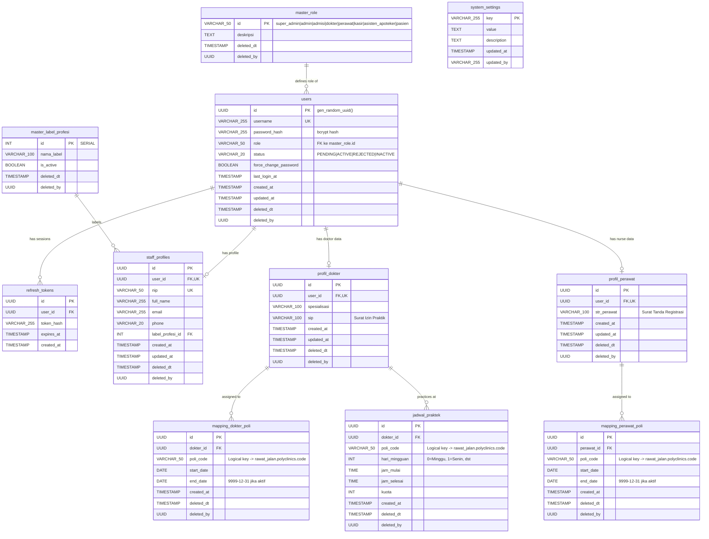

Tabel-tabel pada skema `auth` dikelola secara eksklusif oleh `auth-service` untuk manajemen identitas pengguna, otentikasi PASETO, otorisasi RBAC (*Role-Based Access Control*), profil kepegawaian staf (SDM), kredensial klinis dokter/perawat (SIP/STR), serta penugasan dinas dan jadwal praktek ke poliklinik:

| Tabel | Fungsi & Tanggung Jawab | Keterangan Relasi |
|---|---|---|
| `users` | Akun pengguna sistem (username, password hash bcrypt, status aktif/pending, dan role). | Induk seluruh akun login SIMRS. |
| `master_role` | Definisi peran resmi sistem (`super_admin`, `admin`, `admisi`, `dokter`, `perawat`, `kasir`, `asisten_apoteker`, `pasien`). | Foreign Key ke `users.role`. |
| `refresh_tokens` | Penyimpanan token hash sesi refresh token PASETO untuk perpanjangan token akses. | Relasi ke `users.id` (ON DELETE CASCADE). |
| `master_label_profesi` | Master label profesi kepegawaian (Dokter Poliklinik, Perawat Poliklinik, Administrator IT, dll.). | Relasi ke `staff_profiles.label_profesi_id`. |
| `staff_profiles` | Profil data identitas kepegawaian internal (NIP, nama lengkap, email, nomor HP). | Relasi 1-to-1 ke `users.id`. |
| `profil_dokter` | Data profesional dokter rumah sakit: bidang `spesialisasi` dan nomor `sip` (Surat Izin Praktik). | Relasi 1-to-1 ke `users.id` (role `dokter`). |
| `profil_perawat` | Data profesional perawat rumah sakit: nomor `str_perawat` (Surat Tanda Registrasi). | Relasi 1-to-1 ke `users.id` (role `perawat`). |
| `mapping_dokter_poli` | Riwayat dan status penugasan dokter ke poliklinik dengan periode dinas (`start_date` s.d. `end_date`). | `poli_code` merujuk secara **logikal** ke `rawat_jalan.polyclinics(code)`. |
| `mapping_perawat_poli` | Riwayat dan status penugasan perawat ke poliklinik dengan periode dinas (`start_date` s.d. `end_date`). | `poli_code` merujuk secara **logikal** ke `rawat_jalan.polyclinics(code)`. |
| `jadwal_praktek` | Jadwal mingguan praktek dokter di poliklinik (`hari_mingguan` 0=Minggu s.d. 6=Sabtu, `jam_mulai`, `jam_selesai`, `kuota` pasien). | `poli_code` merujuk secara **logikal** ke `rawat_jalan.polyclinics(code)`. |
| `system_settings` | Konfigurasi sistem global berbasis key-value (misal model OCR KTP `gemini_ocr_model`). | Berdiri sendiri (konfigurasi runtime). |

> 📌 **Catatan Arsitektur (Ketentuan KETAT):** Kolom `poli_code` pada tabel `mapping_dokter_poli`, `mapping_perawat_poli`, dan `jadwal_praktek` tidak memiliki Foreign Key fisik ke skema lain, melainkan berupa **Logical Business Key** yang merujuk ke tabel master `polyclinics` yang dimiliki oleh **`rawat-jalan-service`**.

---

### 4.2 Patient Service DB

> 🔗 **[Buka Diagram di Live Mermaid Editor](https://mermaid.live/edit#pako:eNp10D1vwkAMBuC_YnkuiNJmYQsfUlFIGoXAdFJkcgZO9C7o6gwI8d-5AAMDePPrR5bsM9aNZhwBsp8a2nmyykGoI4lhJ_9wvvddreNi8hMX1TCKwHoHeQIKub_rQ1pkvc_h17fC19qR5WCz3xKy1WLxikUDcObQoXkCSZm_MbrZBDMlYWi2MDZe9s-ynKezZRmnOdSeA9IVyX16wQ9Ay96S0d29t7sUyp4tqxAo1Lyl9k-6dTdMrTTLk6vDUHzLIWmPOux8_OkRX65K-lyM)** *(Klik kanan → Buka di Tab Baru / Open Link in New Tab)*

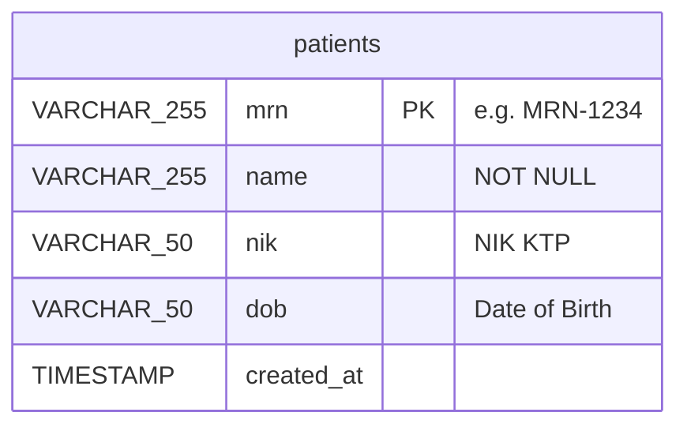

---

### 4.3 Registration Service DB

> 🔗 **[Buka Diagram di Live Mermaid Editor](https://mermaid.live/edit#pako:eNqVkl1vgjAUhv9K06stGQbdvPEOoSpTlAB6RUI6esZIoCWlLDPif1_xY_MCl6w3bU7f55yet-eAU8EATxAG6eQ0k7SMOdILeCoarkDW6HCOdGtnBfbCCpLRePyrSLhA_hLFGAbZAJG1bQxHzy8x7sdKybV0tkRKoIqqHLiqB13woRBZntLisY8cmiZiUFGpSg1ca_mblWtsva13FxGpEjLJ2ZVwAsM0h33ysYlqRVVTa2lA5m4YkYA4rWVH7o609sbzVyQizi0auR4JI8vzUSqBKmAJVefbY8zPB9GoN_GVwGfXZiIhu-emfqK_7G-CZpkGdf5E7Sv48flq_73eTzX7kQCyvNY7sFv4Ndysp_pP9oWg7G-DfLJ23PW89bfTlRsutE8zy139252bIWtbwxCHHr8mulwGHKROUccYPyFcgixpzrqpPbkZY_UBJcS40zJ4p02hupccOzFtlAj3PNWXSjagI03FdK7LtF_Cx2942Oj2)** *(Klik kanan → Buka di Tab Baru / Open Link in New Tab)*

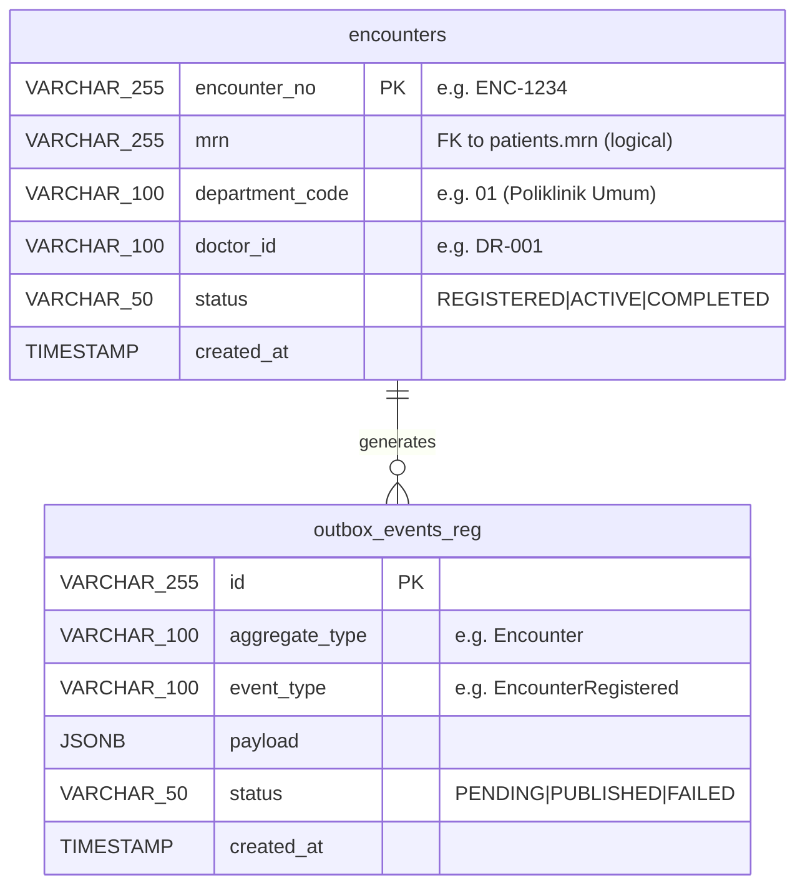

---

### 4.4 Rawat Jalan Service DB (Schema: `rawat_jalan`)

> 🔗 **[Buka di Live Mermaid Editor (Interaktif)](https://mermaid.live/edit#pako:eNq9V91vozgQ_1esPF-ldqW-9C0J3JZrIBGk1a0UCTkwm7qAjWxTXdT2f78xJAQokOyqd3mIEs-H5_M347dJJGKY3JEJSIvRnaTZhhP85CLdRynjLFLkrToyn6epP7-f-uHtNTGCZPVANpMgWK6JS5UGSVYiZYmRSzaTz2Lfbm8JpxmgkEczOsC9tv9ekxhUJFmumeAnymy5XNhTjzAV0kizV2gIOa4drKfuikQSqIY4pLqPWuTxCDWGFAw1blAfHx2rJmz3FeFjczALeCQKjq6rUL70hcr4XDOFXFQx80QmJEkK_lLwHeVDwcokL5mJDwnNiAsxU328mI8Ycip1BlyHZWr-NNfgVwLNZPYJ31yjtIi0kCGLUQjdtUSC1g7cpDTVhUJG3_7uBGvbty2Czkzna-fJNr_mS3e1sNe21crqbyaojrSWWKAQSoiEjFtVWWYITS8juwMeSspjkYVFweKhyLZS8vhwYnK8NdmmQsRhLkGpQkKo9kpjpUajTDGjXS7v0bV9Zx7eht-IhiwHiYGTpvrnkCpWtLJhVD4DphCt14ZntnK7dLwrZ0gWcl9ydXpGFdsXKPsCSyDLU8q4RkUPkBbPlJNCY88NFQAvpALM_yUJq1OSYT1GNC2bUfBuB5zScj4F_UZVest67ldxYDhgSuBNV8E9ghE34KIZj2nS7i3LnjvudBHemJTkkkUtMU0l-_kJibjQoM50zS9F7eQ31syOCwVfH7lkm42EzVB7Y_YwcweankXxzfWIyoreq9SZW1c310OwVYUAEV3vcyO78jFD_g-DI4E9X3oW_ultYgQieAXJ9D5M8UeKsq6zKKHIXVq2P13blZInRKjLkKhOkQnQCTXDjOY547uhUXgMdgVAiLlaVGdU01TsBjxv6O8KDwD2BYYfi_4XrK9Fjgha2ZCVAz3s66L_2omqli734FSbzfsPp_9_DloX47zKcSjQs1uUb_gSSlKR0HSkZ0yz_f5yNDhdG_V6xuR2tbfNHsCPJub049VWxPtyzkL2VR51CviMV41R0-fYeqQNOoNobNoMjJH26vZVARCF3op_QsRGrse204FBUw7g3U7CDtUf0dk-Tp4SZqvxPy19H1osyutrcfOnfAI02f8Klt6M5HSfChqPr5wr27Mc77u5ffU4WzjB_aVbZh2W5tPm_f3qSrx1lvg7vEeBfMV81a3fIzQ0I0rxSOSgmu3Qo2AUqxtauhDco2oYMRt62pjS9rnU897dsY3wM1WH4xHJt75V8Ch9OBoVH9iJjirqw1Elnwr-rnoPmL3biE7-IJMMZEZZbJ68ZTtsJvoZTDka3hh-0iLV5pIPw0wLLYI9j5CoZQF4UjXb4al8OP74F6VTsH4)** | **[Lihat Gambar Langsung (Direct SVG)](https://mermaid.ink/svg/pako:eNq9V91vozgQ_1esPF-ldqW-9C0J3JZrIBGk1a0UCTkwm7qAjWxTXdT2f78xJAQokOyqd3mIEs-H5_M347dJJGKY3JEJSIvRnaTZhhP85CLdRynjLFLkrToyn6epP7-f-uHtNTGCZPVANpMgWK6JS5UGSVYiZYmRSzaTz2Lfbm8JpxmgkEczOsC9tv9ekxhUJFmumeAnymy5XNhTjzAV0kizV2gIOa4drKfuikQSqIY4pLqPWuTxCDWGFAw1blAfHx2rJmz3FeFjczALeCQKjq6rUL70hcr4XDOFXFQx80QmJEkK_lLwHeVDwcokL5mJDwnNiAsxU328mI8Ycip1BlyHZWr-NNfgVwLNZPYJ31yjtIi0kCGLUQjdtUSC1g7cpDTVhUJG3_7uBGvbty2Czkzna-fJNr_mS3e1sNe21crqbyaojrSWWKAQSoiEjFtVWWYITS8juwMeSspjkYVFweKhyLZS8vhwYnK8NdmmQsRhLkGpQkKo9kpjpUajTDGjXS7v0bV9Zx7eht-IhiwHiYGTpvrnkCpWtLJhVD4DphCt14ZntnK7dLwrZ0gWcl9ydXpGFdsXKPsCSyDLU8q4RkUPkBbPlJNCY88NFQAvpALM_yUJq1OSYT1GNC2bUfBuB5zScj4F_UZVest67ldxYDhgSuBNV8E9ghE34KIZj2nS7i3LnjvudBHemJTkkkUtMU0l-_kJibjQoM50zS9F7eQ31syOCwVfH7lkm42EzVB7Y_YwcweankXxzfWIyoreq9SZW1c310OwVYUAEV3vcyO78jFD_g-DI4E9X3oW_ultYgQieAXJ9D5M8UeKsq6zKKHIXVq2P13blZInRKjLkKhOkQnQCTXDjOY547uhUXgMdgVAiLlaVGdU01TsBjxv6O8KDwD2BYYfi_4XrK9Fjgha2ZCVAz3s66L_2omqli734FSbzfsPp_9_DloX47zKcSjQs1uUb_gSSlKR0HSkZ0yz_f5yNDhdG_V6xuR2tbfNHsCPJub049VWxPtyzkL2VR51CviMV41R0-fYeqQNOoNobNoMjJH26vZVARCF3op_QsRGrse204FBUw7g3U7CDtUf0dk-Tp4SZqvxPy19H1osyutrcfOnfAI02f8Klt6M5HSfChqPr5wr27Mc77u5ffU4WzjB_aVbZh2W5tPm_f3qSrx1lvg7vEeBfMV81a3fIzQ0I0rxSOSgmu3Qo2AUqxtauhDco2oYMRt62pjS9rnU897dsY3wM1WH4xHJt75V8Ch9OBoVH9iJjirqw1Elnwr-rnoPmL3biE7-IJMMZEZZbJ68ZTtsJvoZTDka3hh-0iLV5pIPw0wLLYI9j5CoZQF4UjXb4al8OP74F6VTsH4)** *(Tips: Tekan Ctrl+Klik atau klik kanan → Buka di Tab Baru)*

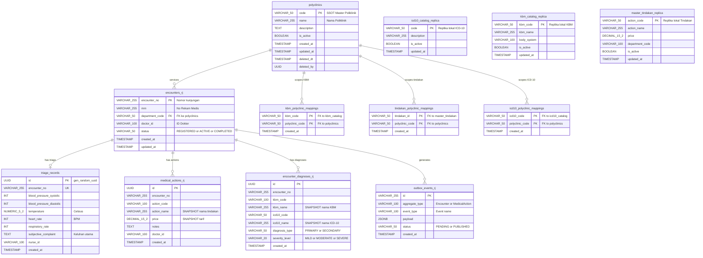

> 🏥 **Pemilik Utama Master Poliklinik (SSOT):** `rawat-jalan-service` adalah pemilik utama (*Single Source of Truth*) dari tabel `polyclinics`. Seluruh modul lain (`auth-service` untuk penugasan dinas staf, `registration-service` untuk loket pendaftaran, dan `pharmacy-service` untuk pemetaan formularium poli) merujuk ke kode poliklinik `polyclinics.code` sebagai referensi logikal. Selain itu, relasi tindakan medis, diagnosa KBM, dan ICD-10 yang relevan dibatasi per spesialisasi poliklinik melalui tabel mapping `kbm_polyclinic_mappings`, `tindakan_polyclinic_mappings`, dan `icd10_polyclinic_mappings`.

---

### 4.5 Medical Record Service DB (Schema: `medical_record`)

> 🔗 **[Buka di Live Mermaid Editor (Interaktif)](https://mermaid.live/edit#pako:eNqtVm1v2jAQ_itWPheJTuJD9w1CuqYQQBC6aUKy3NilVrEd2c401Pa_75ykaaDOoFKRIpL47nL33HMvz0GmKAu-o4DpMSdbTcRGIvgJRnlGdlizTGlqsNDouTpxv_U6HiNO0WKCNsGWSayJpErgouB0E7zL3Q2X4c1wib8NBojJTBXSMo2lQuuJX0ho-fHgst9HVGVWaQzm_ccsJ9oKJi12Ab0LpdGvFGlmCsGwi8l81B_0kbHEFgZiGYZpfBchpdF1PBtO49_R2D04SXg_bseWxkm0SofJAmWaEcsoJtZ3WuT04PR1U4f4DggF5KUyrBvm05B64-IZvewfITKaz6fRcIa4wbnmgui9V_XpXhwptg7_MM0fgB-WK4kb8BbRbBzPfjjA7qJlfB1X4C2j2yhMD8Fr564yBgjd78EIRLxgmj0RgZIyX17IG5025g00kFDmJOwe7-BmB2an5X98gWK4iCUF3MQIctwLRz-ajzS5KaMHsZ3aYmOUbWfFA1JVCCsutzuGVqrQGUPqAaW6sI9oMkq6asLpSyKO-UqZyTTPHbp-yO4V3WOzN5aJcwjZhFXz4XRgJ4OKw3Hvso9-3sy7YvMG0SIfySz_wzy4V04KkufwaXMW8tcTZFU7aT6nDuqhrXeASlvzf6VyBtqWS0qeiDwHcIcG1NK7awmB7GqU1jYQhSslwPouvGsLh3QaR2GcDKf4coC_IYghY5_on23aXH2ONbX3jiVXvTBBCw3tjRb6S8nS4Fv6d4IwHwCucn-co27iXPl4c_UZ2jSOG6lgFp2HqMxYbvHbrK1xXc3mSTTuhSmaMEjaEztsk66HgJjw59owQaTlGbZk63fsrAo8dq3C5DC0rynDeJYicMaBqVxTP3JaFfZe_cXQ4KU9nqBtjnUMUgcJ2W4120IVY7vPGXgU7rh0-0-NN0yxpFqIluU-1DXKSh_8NtbVGlAOxNLGUGePwOkDW7er-WyEcrLfKUL_v6m0hu1iPZrGq5tz15MGOM-O9_LS66nnrtXkO3wX0m4Jlw3hPkzK2oSnkzt1eDCQ7Ddtz0A6qZ8Dig9aiTcb_jZbm-noER5XfEVZG_GXRYkG9DXTc5Y2QXCBAgFVRzh1C3XJwk1gH6FCN4ETpuyBFDvrPvjqhElh1WovMzi0umDwptoV60W8fv36D75nj9w)** | **[Lihat Gambar Langsung (Direct SVG)](https://mermaid.ink/svg/pako:eNqtVm1v2jAQ_itWPheJTuJD9w1CuqYQQBC6aUKy3NilVrEd2c401Pa_75ykaaDOoFKRIpL47nL33HMvz0GmKAu-o4DpMSdbTcRGIvgJRnlGdlizTGlqsNDouTpxv_U6HiNO0WKCNsGWSayJpErgouB0E7zL3Q2X4c1wib8NBojJTBXSMo2lQuuJX0ho-fHgst9HVGVWaQzm_ccsJ9oKJi12Ab0LpdGvFGlmCsGwi8l81B_0kbHEFgZiGYZpfBchpdF1PBtO49_R2D04SXg_bseWxkm0SofJAmWaEcsoJtZ3WuT04PR1U4f4DggF5KUyrBvm05B64-IZvewfITKaz6fRcIa4wbnmgui9V_XpXhwptg7_MM0fgB-WK4kb8BbRbBzPfjjA7qJlfB1X4C2j2yhMD8Fr564yBgjd78EIRLxgmj0RgZIyX17IG5025g00kFDmJOwe7-BmB2an5X98gWK4iCUF3MQIctwLRz-ajzS5KaMHsZ3aYmOUbWfFA1JVCCsutzuGVqrQGUPqAaW6sI9oMkq6asLpSyKO-UqZyTTPHbp-yO4V3WOzN5aJcwjZhFXz4XRgJ4OKw3Hvso9-3sy7YvMG0SIfySz_wzy4V04KkufwaXMW8tcTZFU7aT6nDuqhrXeASlvzf6VyBtqWS0qeiDwHcIcG1NK7awmB7GqU1jYQhSslwPouvGsLh3QaR2GcDKf4coC_IYghY5_on23aXH2ONbX3jiVXvTBBCw3tjRb6S8nS4Fv6d4IwHwCucn-co27iXPl4c_UZ2jSOG6lgFp2HqMxYbvHbrK1xXc3mSTTuhSmaMEjaEztsk66HgJjw59owQaTlGbZk63fsrAo8dq3C5DC0rynDeJYicMaBqVxTP3JaFfZe_cXQ4KU9nqBtjnUMUgcJ2W4120IVY7vPGXgU7rh0-0-NN0yxpFqIluU-1DXKSh_8NtbVGlAOxNLGUGePwOkDW7er-WyEcrLfKUL_v6m0hu1iPZrGq5tz15MGOM-O9_LS66nnrtXkO3wX0m4Jlw3hPkzK2oSnkzt1eDCQ7Ddtz0A6qZ8Dig9aiTcb_jZbm-noER5XfEVZG_GXRYkG9DXTc5Y2QXCBAgFVRzh1C3XJwk1gH6FCN4ETpuyBFDvrPvjqhElh1WovMzi0umDwptoV60W8fv36D75nj9w)** *(Tips: Tekan Ctrl+Klik atau klik kanan → Buka di Tab Baru)*

```mermaid
erDiagram
    medical_records_mr {
        UUID id PK "gen_random_uuid"
        VARCHAR_255 encounter_no UK
        VARCHAR_255 mrn
        VARCHAR_100 doctor_id
        VARCHAR_100 department_code
        TEXT resume_medis
        VARCHAR_50 status "ACTIVE or FINALIZED or ARCHIVED"
        TIMESTAMP created_at
        TIMESTAMP updated_at
    }

    encounter_diagnoses_mr {
        UUID id PK
        VARCHAR_255 encounter_no
        VARCHAR_50 icd10_code
        BOOLEAN is_primary
        VARCHAR_50 kbm_code
        VARCHAR_50 verification_status "PENDING or VERIFIED or REJECTED"
        VARCHAR_100 verified_by "ID Perekam Medis"
        TIMESTAMP verified_at
        VARCHAR_20 severity_level "Level I, II, atau III INA-CBGs"
    }

    kbm_catalog_ssot {
        VARCHAR_50 kbm_code PK "Single Source of Truth KBM"
        VARCHAR_255 kbm_name
        TEXT description
        VARCHAR_100 body_system
        TIMESTAMP created_at
    }

    icd10_catalog_ssot {
        VARCHAR_50 code PK "Single Source of Truth ICD-10 WHO"
        VARCHAR_255 description
        BOOLEAN is_active
    }

    kbm_icd10_mappings {
        VARCHAR_50 kbm_code PK "FK to kbm_catalog"
        VARCHAR_50 icd10_code PK "FK to icd10_catalog"
        BOOLEAN is_primary
        TIMESTAMP created_at
    }

    tindakan_catalog_ssot {
        VARCHAR_50 action_code PK "Master Tindakan dan Tarif"
        VARCHAR_255 action_name
        DECIMAL_15_2 price
        VARCHAR_100 department_code
    }

    icd9_catalog_ssot {
        VARCHAR_50 code PK "Master ICD-9-CM Prosedur"
        VARCHAR_255 description
        BOOLEAN is_active
    }

    tindakan_icd9_mappings {
        VARCHAR_50 action_code PK "FK to tindakan_catalog"
        VARCHAR_50 icd9_code PK "FK to icd9_catalog"
        BOOLEAN is_primary
    }

    snomed_catalog_ssot {
        VARCHAR_50 concept_id PK "Master SNOMED-CT Kemenkes"
        TEXT term
        VARCHAR_100 semantic_tag
    }

    snomed_icd10_mappings {
        VARCHAR_50 concept_id PK "FK to snomed_catalog"
        VARCHAR_50 icd10_code PK "FK to icd10_catalog"
        INT map_priority
    }

    outbox_events_mr {
        VARCHAR_255 id PK
        VARCHAR_100 aggregate_type "ClinicalMaster or MedicalRecord"
        VARCHAR_100 event_type "ClinicalMasterUpdated or RecordArchived"
        JSONB payload
        VARCHAR_50 status "PENDING or PUBLISHED"
        TIMESTAMP created_at
    }

    medical_records_mr ||--o{ encounter_diagnoses_mr : "contains"
    kbm_catalog_ssot ||--o{ kbm_icd10_mappings : "maps to"
    icd10_catalog_ssot ||--o{ kbm_icd10_mappings : "mapped from"
    tindakan_catalog_ssot ||--o{ tindakan_icd9_mappings : "maps to"
    snomed_catalog_ssot ||--o{ snomed_icd10_mappings : "cross-maps"
```

---

### 4.6 Pharmacy Service DB (Schema: `pharmacy`)

> 🔗 **[Buka Diagram di Live Mermaid Editor](https://mermaid.live/edit#pako:eNqVVd9v2jAQ_lesPG1SqWj3VmmTgKQrIwQERdoDUnTE19SC2JntdEOl_3vP4fcwbM1LrLvvzue77-5eg0xxDO5YgDoUkGsoppLRJ-QLSqv0kr2uBe4zVguZM2GxSJ0dG_bYNMDr_Jr1o7DRbN5MgxO0hAL3QiEtKVQ2T39VIK2wS_LQeYg6PfbtK2se2nPMRAELVmqRIaHCqNPtt2J207y63eLepnJ9KDWaTIvSCiWNL2Z-EOzoZ-Pm9osnVpSZqqRFnUpF4FjlIqMIND4xq_Za4zE1Fmxl3GNGUesxCldhdzyMkjGdOq2kE8UxnUaDOG63Or0oPPQwU2qBIJkwlNWipDs4cvIEJczhmW43WDINmZiD9CVYWTQn0vlsU6Np0Gv3GQctGFdzit7jwoFdnQicQAGMLDyoHCkwTZg-AwsVu_dgIMd0RrHO0Z7ouMqIUangpxosQduCGFfHvNdbUSBltihZphEs8hSsT1uV_Ejr5UXqiHuWHCfSY1PO7nsXOuFQ6Ti-Zfd5Oj-DzoEZALupMBeziuL_m9l7TpawdCnyveCIuJ637Ng5bHXD1SRxP_bJLGVGTHvSqmAzsVgQ8vNhTff5LUF8PPX0wgKyZfobhE2dQQp5rjEn-NEbXL62_TmORl3q8dbkceBhF6cRJZUR7iXJ4JElkzj2wbZE-wfsmHWXwTvyX8AckP8M8Fyr-7AuLfCC2nmtU1gIWR21ej1MqQYLTOvyf6g8qrIz9SdFN-dNui7Wf_fGrpCpXZZ4SkfntFY5yh30UShMidIg92SP6L1Q4LLxYzxI2pdmLA3WsJt8Xw0n7bg7fqDJet_qxsdT9fzoOLM0VqtGQ736JsYdXZkpaUHI3ejfL8jLdrQ7UGPdZ7Pl1th7sbcgzgVRj1jgKh8EVywokBSCu6Vdl2sa2GekHRs4LMcnqBb1FHlzYKisGlObk9LqCkmyJsRm2W_Eb-8Rn47H)** *(Klik kanan → Buka di Tab Baru / Open Link in New Tab)*

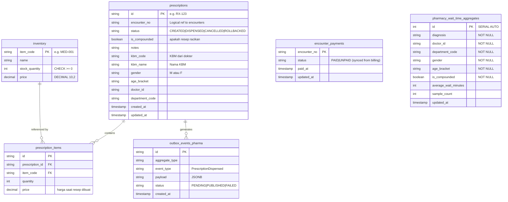

---

### 4.7 Billing Service DB (Schema: `billing`)

> 🔗 **[Buka Diagram di Live Mermaid Editor](https://mermaid.live/edit#pako:eNqdU8tuwjAQ_BXL54KAigu3NKRqyisCinqIZJlkSS0lduRsUBHw77V5lEcDautDJHtndjyz8ZpGKgbaIRR0V_BE8yyUxCwhl0pEUJD1fm_XzBm7L86YtdptImIS9EhIoZ7UiT-c1Zqtx5BWY0FGqpQImkllKH2ViIinRMOCoDpVi3N-13P9gdNnzQZrGRTylPHM4n5KtBukQI5lYXq_DQPH727s57zb1B94k6kzCEjORcw4VpUiDRzhVN2G8iILJhCy-4HcKB35MXnuVd7fdma4ysFYcNypPxpugrE3ccd-YDcXVrz3KYmhiLTIUSh5I7LrsH5hU5U4V58MliCxYHORpkImf7TbbDQITxINidHYOarG7ESOjv19PoEZzbnT18lo-GQGtkoVj--M_T-zLMhmU6up9dVsO-Y2kZLIhfz-G68Z1TFZZgIStJE1VPpAaAY6M5bs49qFGFL8gAxCarExLHiZohXZWjAvUU1WMjJF1CWYkzKPTa_Dozwcb78Au0Ub2w)** *(Klik kanan → Buka di Tab Baru / Open Link in New Tab)*

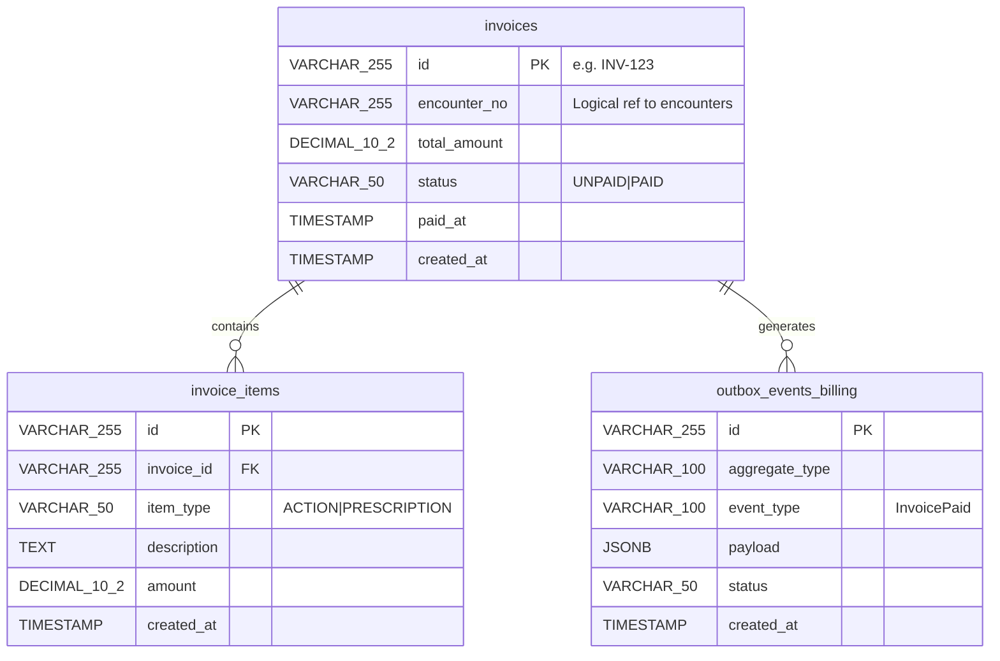

---

### 4.8 Aturan Isolasi Relasi Antar Skema KETAT

1. **Zero Foreign Keys Lintas Skema**: Tidak ada constraint `FOREIGN KEY` antar tabel beda skema (contoh: `billing.invoices.encounter_no` tidak memiliki FK ke `registration.encounters`).
2. **Korelasi Menggunakan Business Key**: Entitas dikorelasikan secara logikal melalui `mrn`, `encounter_no`, `doctor_id`, dan `poli_code`. Integritas divalidasi pada *application domain layer*.
3. **Clinical Snapshot Pattern**: Perubahan harga master tindakan atau nama diagnosa di masa mendatang tidak akan merubah transaksi pelayanan masa lalu di poliklinik atau invoice kasir.
4. **Local Read-Replica**: Rawat Jalan membaca data katalog klinis (ICD-10, KBM, Tindakan) dari tabel replika lokal dalam skema `rawat_jalan`, bukan via `JOIN` langsung ke `medical_record`.
5. **Master Poliklinik SSOT di Rawat Jalan**: Tabel master `polyclinics` dimiliki dan dikelola secara terpusat oleh `rawat-jalan-service`. Service lain (`auth`, `registration`, `pharmacy`) mereferensikan kode poliklinik secara logikal.

---

### 4.9 Relasi Antar Service (Logical ERD)

> 🔗 **[Buka Diagram di Live Mermaid Editor](https://mermaid.live/edit#pako:eNq9Vm1v2jAQ_itWPm3Smh_Ah0kMqFpBR9WWfkKK3MSEK4kd2Q4Tgv73nUNeHZO20za-APbz3D13vjv76IUiYt6IeExOgcaSpmtO8JMrJhU5nv-Yz2p1OyUQkfs5WXs011u_gKy9BvI8fpjcjB8KLqcp6-9IkZSrb2t-_pFJsYEkiMROMznssANtOy6gxmuA-Ot536_KmAKagKIKHLuQuUVlTNJfVH9IVYn9nCwta15XQEqzDHhcxhpkIoFhFQ5CT0q5d0GMoQSmGtDkQsQQ0oRItiFX383WIUyAQ6h8g6gs9-SWwXxCb5vRE1xt_gPFLUBbaGW6sFqoPSt4pQnlfpv05fFx-UTuWQoJ7MhK05R-dTVDtxF-LJeL2fgnARXQUMO-1w1UA-PaqSmV_CypBPkV-H239SrsLIeMhyLnWBYqkCx2ua0RARdlSlgMWLroXXC_MeCSYTRfz63z0YIMSY9YRqVOcdvBa07ASRWhFkWF95mXhkfTjFTnaiA9rx_MTqtghpPTBOqq4v8RLRLHk6fb59lpsry7X8yeZtN-b7PIWMbyCIWMnJVZdXYX6ltMl4xO-laOQhnOoB2FWcbvfhCZZCqUkJmSHQwh21KZ0vDgdxjvSr_-Q-mWTOB7ASEbVPgCCZZE7FfYv6htOpvc3o0XCNB4bDQ1kM82SpDRQ3pphPW7pc5338DggasDD1lENlKkpMxI79DPb5jT6epKnKx3xghNbGntwoWsLn8L2rVTUI7O69rwqFIQc9SphcWvrFsGOhfoJQutW-gd_9h5DC8ZVY6KD1joCahN8FwqNmDBukkMF7O6bwq0vtsuEzDPZA8KmsO3QOURdcfymcmjBNP0chhm2tOsyLEMtxhihO03RD5aU6QS7JwUbgN1f4_KRkane6AVqd62w2yaatTUvqkI7xvBqYsdBJF5xBctt_b0luHt7xlsxDY0T4pn6ZsB4-NLPCIfN7XMGa7kWUQ1Kx__5fLbbz7f4_Q)** *(Klik kanan → Buka di Tab Baru / Open Link in New Tab)*

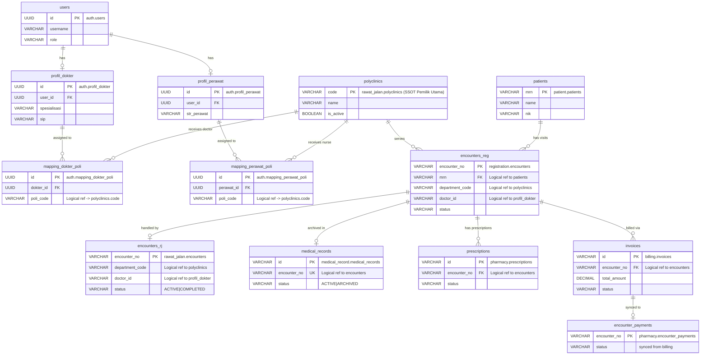

---

## 5. API Endpoint Reference

**Base URL:** `http://localhost:60080/api/v1`

### Legend
- 🔓 = Publik (tidak perlu autentikasi)
- 🔐 = Butuh PASETO Bearer Token
- 👤 = RBAC: Role yang diizinkan
- ⚡ = SSE (Server-Sent Events)

### 5.1 System & Queue

| Method | Path | Auth | Role | Keterangan |
|---|---|---|---|---|
| `GET` | `/health` | 🔓 | - | Health check API Gateway |
| `GET` | `/queue/clinic/stream` | 🔓 ⚡ | - | SSE stream antrean poliklinik real-time |
| `GET` | `/queue/pharmacy/stream` | 🔓 ⚡ | - | SSE stream antrean farmasi real-time |
| `GET` | `/queue/clinic/estimate` | 🔓 | - | Estimasi waktu tunggu poli |
| `GET` | `/queue/pharmacy/estimate` | 🔓 | - | Estimasi waktu tunggu farmasi |

**Query params untuk `/queue/clinic/estimate`:**
```
doctor_id, department_code, gender, age_bracket
```

**Query params untuk `/queue/pharmacy/estimate`:**
```
doctor_id, department_code, gender, age_bracket, is_compounded
```

---

### 5.2 Authentication

| Method | Path | Auth | Role | Keterangan |
|---|---|---|---|---|
| `POST` | `/auth/login` | 🔓 | - | Login, dapatkan PASETO token |
| `POST` | `/auth/refresh` | 🔓 | - | Rotasi sesi via refresh token |
| `POST` | `/auth/signup/patient` | 🔓 | - | Pendaftaran mandiri pasien baru (akun + MRN) |

**Request Body `/auth/login`:**
```json
{
  "username": "string (required)",
  "password": "string (required, min 6 chars)"
}
```

---

### 5.3 Patient Management

| Method | Path | Auth | Role | Keterangan |
|---|---|---|---|---|
| `POST` | `/patient/register` | 🔐 | 👤 admin, nurse | Registrasi master pasien oleh petugas |
| `GET` | `/patient/{mrn}` | 🔐 | 👤 admin, doctor, nurse | Lookup identitas pasien by MRN |

---

### 5.4 Registration (Pendaftaran Kunjungan)

| Method | Path | Auth | Role | Keterangan |
|---|---|---|---|---|
| `POST` | `/registrations` | 🔐 | 👤 admin, nurse | Daftarkan antrean kunjungan ke Poliklinik |

---

### 5.5 Pelayanan Rawat Jalan (Poliklinik)

| Method | Path | Auth | Role | Keterangan |
|---|---|---|---|---|
| `POST` | `/rawat-jalan/triage` | 🔐 | 👤 doctor, nurse, admin | Input data triage awal & tanda vital |
| `POST` | `/rawat-jalan/encounter/start` | 🔐 | 👤 doctor, admin | Mulai sesi pemeriksaan pasien di poli |
| `POST` | `/rawat-jalan/encounter/complete` | 🔐 | 👤 doctor, admin | Selesaikan pemeriksaan poli |
| `GET` | `/rawat-jalan/encounter/{encounter_no}` | 🔐 | 👤 doctor, nurse, admin | Ambil detail pemeriksaan rawat jalan |
| `GET` | `/rawat-jalan/queue` | 🔐 | 👤 doctor, nurse, admin | Daftar antrean aktif di poli bersangkutan |
| `POST` | `/rawat-jalan/actions` | 🔐 | 👤 doctor, nurse, admin | Tambah tindakan medis (otomatis tertagih ke kasir) |
| `DELETE` | `/rawat-jalan/actions/{id}` | 🔐 | 👤 doctor, admin | Batalkan tindakan medis |
| `POST` | `/rawat-jalan/diagnosis` | 🔐 | 👤 doctor, admin | Tambah diagnosa klinis (KBM/ICD-10) + severity |
| `PUT` | `/rawat-jalan/diagnosis/{id}` | 🔐 | 👤 doctor, admin | Update diagnosa klinis |
| `DELETE` | `/rawat-jalan/diagnosis/{id}` | 🔐 | 👤 doctor, admin | Hapus diagnosa klinis |
| `GET` | `/rawat-jalan/master/icd10` | 🔐 | 👤 doctor, nurse, admin | Autocomplete ICD-10 dari replika lokal |
| `GET` | `/rawat-jalan/master/kbm` | 🔐 | 👤 doctor, nurse, admin | Autocomplete KBM dari replika lokal |
| `GET` | `/rawat-jalan/master/tindakan` | 🔐 | 👤 doctor, nurse, admin | Autocomplete Tindakan dari replika lokal |

> *Catatan:* Endpoint legacy `/api/v1/emr/triage`, `/api/v1/emr/start`, `/api/v1/emr/complete`, `/api/v1/emr/actions`, dan `/api/v1/emr/diagnosis` secara transparan diteruskan ke `rawat-jalan-service` untuk menjaga kompatibilitas klien lama.

---

### 5.6 Pengelolaan Rekam Medis & Koding (Medical Records)

| Method | Path | Auth | Role | Keterangan |
|---|---|---|---|---|
| `GET` | `/rekam-medis/record/{encounter_no}` | 🔐 | 👤 medical_records, doctor, admin | Ambil berkas rekam medis permanen |
| `GET` | `/rekam-medis/patient/{mrn}` | 🔐 | 👤 medical_records, doctor, admin | Riwayat rekam medis seluruh kunjungan pasien |
| `POST` | `/rekam-medis/diagnosis/{id}/verify-kbm` | 🔐 | 👤 medical_records, admin | Verifikasi & mapping KBM ke kode ICD-10 final |
| `POST` | `/rekam-medis/encounter/{encounter_no}/severity/finalize` | 🔐 | 👤 medical_records, admin | Finalisasi tingkat keparahan (Severity) klaim BPJS |
| `GET` | `/rekam-medis/pending-verification` | 🔐 | 👤 medical_records, admin | Daftar diagnosa yang menunggu verifikasi koder |

---

### 5.7 Master Data Katalog Medis (SSOT)

| Method | Path | Auth | Role | Keterangan |
|---|---|---|---|---|
| `GET` | `/master/kbm` | 🔐 | 👤 medical_records, admin | Daftar master KBM (Single Source of Truth) |
| `GET` | `/master/kbm/poli/{poli_code}` | 🔐 | 👤 doctor, nurse, admin | KBM yang dipetakan ke poliklinik tertentu |
| `GET` | `/master/icd10` | 🔐 | 👤 medical_records, admin | Daftar master ICD-10 WHO |
| `GET` | `/master/icd10/kbm/{kbm_code}` | 🔐 | 👤 medical_records, admin | Rekomendasi ICD-10 berdasarkan KBM |
| `GET` | `/master/icd9` | 🔐 | 👤 medical_records, admin | Daftar master ICD-9-CM Prosedur |
| `GET` | `/master/snomed` | 🔐 | 👤 medical_records, admin | Master SNOMED-CT Kemenkes RI |
| `GET` | `/master/snomed/{concept_id}/cross-map` | 🔐 | 👤 medical_records, admin | Cross-mapping SNOMED ke ICD-10/ICD-9 |
| `GET` | `/master/tindakan` | 🔐 | 👤 medical_records, admin | Master katalog tindakan medis RS |

---

### 5.8 Pharmacy (Farmasi)

| Method | Path | Auth | Role | Keterangan |
|---|---|---|---|---|
| `POST` | `/pharmacy/prescriptions` | 🔐 | 👤 doctor, pharmacist, admin | Buat resep obat elektronik |
| `POST` | `/pharmacy/dispense` | 🔐 | 👤 pharmacist, admin | Keluarkan obat & potong stok (setelah PAID) |
| `GET` | `/pharmacy/inventory` | 🔐 | 👤 pharmacist, admin | Pantau stok obat apotek |

---

### 5.9 Billing (Kasir)

| Method | Path | Auth | Role | Keterangan |
|---|---|---|---|---|
| `GET` | `/billing/invoice/{encounter_no}` | 🔐 | 👤 cashier, admin | Generate / lihat invoice tagihan terpadu |
| `POST` | `/billing/pay` | 🔐 | 👤 cashier, admin | Pelunasan tagihan kasir |

---

## 6. Event Flow (Outbox Pattern)

### Arsitektur Outbox

> 🔗 **[Buka Diagram di Live Mermaid Editor](https://mermaid.live/edit#pako:eNp9kl1vwiAUhv8K4com88ZLL5aoNJtJ1aadi4ssBstZJVowQM2M-t8HtX5M3bhqDg8vh-d0hzPFAbcRzjVbL1CUUIncMuX8WKA41oqXGWiUgt6IDCg-In6l770pxfUGilQuMoo_L_ukO_NI48KQLqWyoUo7V98z2IC0JqA4uDqThFHnw6WOKgYlsGJbf4ZvJStEhozVwAqkXYaQeXC-DySn8q77ARjDckBdrZagr3tPQtJPfWsJcGFQWsUad9OkQ8ilpcexPSVNWTyW0hsN0_EgTNwbQv9AdIL9KyZJ2CEvyWgcB79MOU2t6VXuXy5bvuMz5Ww-atRxqNl83lPcsco7e9NMGpZZoSTF-zrqyFa6azpWqxWKwyHpD1_-47wh1KgHwYWfi5_i_uj0nh8wvUTxuBv109eQ3CaffJ3Cz4ZuEq-5ytf5sa2qVAvCTwg7NwUT3P_XO09RbBdQuCm13SeHL1aurB_ZwcOstCrdysxtWl2Cq5RrziwQwdy4i7p8-AEejfUr)** *(Klik kanan → Buka di Tab Baru / Open Link in New Tab)*

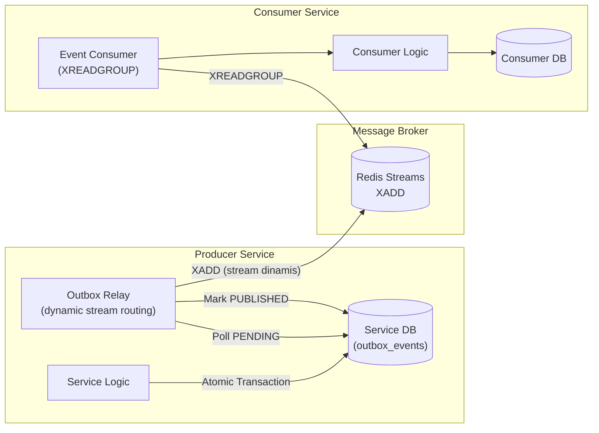

### Alur Event Lengkap

> 🔗 **[Buka Diagram di Live Mermaid Editor](https://mermaid.live/edit#pako:eNq9Vdtq20AQ_ZVFT22xk_bV0IAcQWsnCkZuoA8GM9ZO5I20l-6u3JqQf--sVr4lcehTDQZpdM7MnDOj1VNSao7JiCUOf7WoSswEVBbkQjH6GbBelMKA8qyYM3CswEo4b8ELrdgc7UaU-AY2G0cwF47NvUWQ7g3UtAPBb_BsCg28kzAvAjSnfCU0lLfUlp9Hz76nRZ4GxmwNVkK5PY8dT25vJ3ffAngsmkao6oCN6DvtkekNWrJgxGbgBComUXF48GBZ3arHVlXUvdGNiJRiPry6IhNG7GeaZcwemXaBG1TesScyW7fKo10qPWDSqueem42HgT0dsWutXCupsA0eDR-DR8PK6tYwI8raMbro0vXMac-bCzA1NUT6yHrFOP335fo2X2kjXqbrABDKtJ55QQpDFtlNkYtjfdNTfaG9Zdfe0nXT3o0qLYPmlHPkR4oHDLr4gBlLRp8K7wdypH4V57I8r7znHLN_gFzBOvQvPMqDmhqZh0qsQb32IO7NiKWGQjUFHNqYQ69oRz-QDwaVw4-RGOEnTph-33Y2zCy60goT1GY9-9QJ-2cp-H80ghpC864Le-Z-1ZtW0eWOEVahpnv7suTBhl2jvQsTtdEkbwaCv9x7ER-RB6fid6PYa987e178fh478r3hQKoOFQ1sZff2OQ--dV9n6SR7bUBe0ApwKdTlDR2Olqp0aWrw0OiKTa6z4ZfPlzfjPBLz4kR7ScrD6i8luFCz9-C6D-ddNHbWueGF3w7oFfXwjwdAzDt0W1W-fwzcG9pfH2e9woZGbxpRA2t0TYfo0Ut78SkZsITqSJpQ-Bg8hUyLxK9R4oICi4TjA7SNXyQL9RzA0Ho9pw7oobctUiS61H8--vDzXzkkKRs)** *(Klik kanan → Buka di Tab Baru / Open Link in New Tab)*

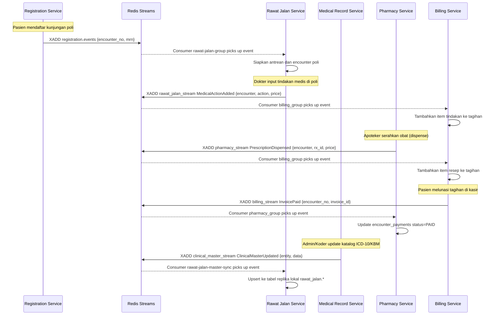

### Peta Event

| Source Service | Event Type | Redis Stream Target | Target Consumer Group | Aksi di Target |
|---|---|---|---|---|
| `registration-service` | `EncounterRegistered` | `registration.events` | `rawat-jalan-group` | Siapkan encounter aktif di poli |
| `rawat-jalan-service` | `MedicalActionAdded` | `rawat_jalan_stream` | `billing_group` | Catat tagihan tindakan medis |
| `rawat-jalan-service` | `EncounterCompleted` | `rawat_jalan_stream` | `medical_record_group` | Selesaikan berkas rekam medis |
| `pharmacy-service` | `PrescriptionDispensed` | `pharmacy_stream` | `billing_group` | Catat tagihan obat ke invoice |
| `billing-service` | `InvoicePaid` | `billing_stream` | `pharmacy_group` | Set `encounter_payments.status = PAID` |
| `medical-record-service` | `ClinicalMasterUpdated` | `clinical_master_stream` | `rawat-jalan-master-sync` | Upsert katalog replika lokal di `rawat_jalan` |

---

## 7. Shared Packages

Semua shared code berada di module `shared` dan diakses oleh semua service via Go Workspaces.

> 🔗 **[Buka Diagram di Live Mermaid Editor](https://mermaid.live/edit#pako:eNptVNtu4jAQ_RUrTyCVhXZvUt8oZCmrUmhCL9JmVRlnknjxJesLXVT133ecQEWk5gV75vjMmcPYrxHTOUSXJCoNrSuyvsoUwc_6TRtIr8dJPP2VRbaiBvJhvS2HWfS7RYVvfL--xjT1rhpmmaqpBac_lRrXa70FtaCKlmBw25sYoA6a6Bl5AMOLfbPpdwgnV0jHuGGeuw2e2IIJxIdly3wLL7NkNblqY70-hpY1qEvylTCtLDDv-A5IQbmwQQiXoL27JJ9HYXtNRTHQDf6CGPjrwTrb0TANGvJN05C2rjRg28ITrRQwtzoEe5ZVIGmoP1d_MEEsUMOq55q6qsO4eERGyfNcwAsaGZgdCJDgzB6pSeYvRudfyNpQBvMp4Q0bgngOstYOFDuFPQ2SVvYAsQnkPLRl0FzBJXeNS0fot1FocWiJC1aTjWdbcB1py9As2rPR_4IsA4Ke1pruFZWcEevQbUkMIrkqERic9rJTrJFCnpJ4PJ0ly_sVoiTOl7AnmHgHygU2z7o67lAGNuUbc7A3LqnTp-x3IRkfE-gRdlqgXwi3jjqOGUbF80dH6a7E5WiUfyf4h3LHtcJTlH8IrgWSVlrkYMh4Tt4hHbVJnKJenIE6DFxrXLtuJyX1jIG1ySH4-oax2BhtOpGf6fK21ycViBq6_Gl76bzL9YsK9Md1S_9IufuhTcpLRQUyHKSn89n8dj3En3WcLBA3CwNVePF-Bc5H3VF_GN9goR0VPA89hkrvm8Nl0y6Wtdv3-mdkwdUNqNJVzZ17aIEwFicSpBeODwoOIicHpuD2sSaoPDojEc6NpDwPL89rSGSRw5sEGQbw5kFBkSWLMvUWwPi46HSvGCZxbAAjvg51p5ziKyUP4bf_PNyikg)** *(Klik kanan → Buka di Tab Baru / Open Link in New Tab)*

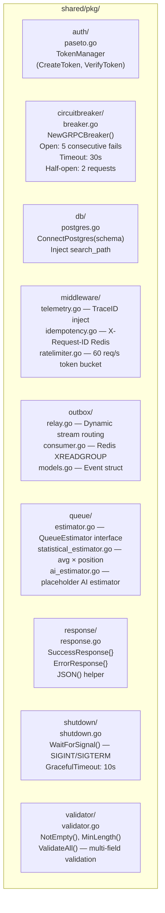

### Detail Shared Packages

| Package | File | Fungsi Utama |
|---|---|---|
| `auth` | `paseto.go` | `TokenManager` — Buat & verifikasi PASETO token simetris. TTL default 24h. |
| `circuitbreaker` | `breaker.go` | `NewGRPCBreaker(name)` — Circuit breaker per service menggunakan Sony gobreaker / hystrix. |
| `db` | `postgres.go` | `ConnectPostgres(schema)` — Koneksi PostgreSQL aman yang mengikat DSN ke `search_path` spesifik skema. |
| `middleware` | `telemetry.go` | `TraceIDMiddleware` — Inject `X-Trace-ID` ke setiap request, propagasi via context gRPC. |
| `middleware` | `idempotency.go` | `IdempotencyMiddleware` — Cache response di Redis dengan key `X-Request-ID` selama 24h. |
| `middleware` | `ratelimiter.go` | `NewRateLimiter(rate, burst)` — Token bucket per IP. Default: 60 req/s, burst 120. |
| `outbox` | `relay.go` | Polling DB `outbox_events`, routing dinamis event (`clinical_master_stream`, `rawat_jalan_stream`, dll), mark PUBLISHED. |
| `outbox` | `consumer.go` | `Consumer` — XREADGROUP dari Redis Stream, proses event, ACK setelah sukses. |
| `queue` | `statistical_estimator.go` | `EstimateWaitTime(clinicID, position)` — Kalkulasi moving average antrean. |
| `response` | `response.go` | Standard envelope response dengan `RequestID`, `TraceID`, `Success`, `Data`. |
| `shutdown` | `shutdown.go` | Graceful shutdown listener `SIGINT`/`SIGTERM` dengan timeout 10 detik. |
| `validator` | `validator.go` | `ValidateAll()` — Validasi multi-field form input. |

---

## 8. Deployment & Port Mapping

### Port Reference

| Service | Internal Port | External Port (Docker) | Metrics Port | Protocol | Skema Database |
|---|---|---|---|---|---|
| `auth-service` | 50051 | **60051** | 9091 | gRPC | `auth` |
| `patient-service` | 50052 | **60052** | 9092 | gRPC | `patient` |
| `registration-service` | 50053 | **60053** | 9093 | gRPC | `registration` |
| `rawat-jalan-service` | 50057 | **60057** | 9097 | gRPC | `rawat_jalan` |
| `medical-record-service` | 50054 | **60054** | 9094 | gRPC | `medical_record` |
| `pharmacy-service` | 50055 | **60055** | 9095 | gRPC | `pharmacy` |
| `billing-service` | 50056 | **60056** | 9096 | gRPC | `billing` |
| `api-gateway` | 8080 | **60080** | - | HTTP/REST + SSE | - |
| `PostgreSQL` | 5432 | **5432** | - | TCP | Multi-Schema |
| `Redis` | 6379 | **6379** | - | TCP | - |
| `Jaeger UI` | 16686 | **16686** | - | HTTP | - |
| `Jaeger OTLP gRPC` | 4317 | **4317** | - | gRPC | - |
| `Jaeger OTLP HTTP` | 4318 | **4318** | - | HTTP | - |

### Dependency Graph (Docker Compose)

> 🔗 **[Buka Diagram di Live Mermaid Editor](https://mermaid.live/edit#pako:eNp1k9FugyAUhl-FcLUl-gK9WGLTxtbUprEuuxhLw5QpjaJBXNM0ffcdEGPpolfy8_Odww_ccNbkDC8QLiRtS5SuiEDwHcJPgtumU4VkHSHiJe4rxf1jVrKaLhDtVemhlirOhPKQZIUHJkkvVJ3OtKLCQzXLeUark2RZI3Mwl1TW1EPfvKq4KF4J_kJDrWS1hGIS_B2Igxbp-mfKCiaNNqjBe7oBXVf3OyZ_ecY0xvffoOHJYoQoHFcdgnS73qd6Q0PDc2ut0WjQ1H9xYibr0PRc8E5JoDZiDgpOFzgKD7BIs3R4vglvFhU9kaInUJwAyAbvD8HPseLEZdnxQ2qbIIkDHZo5uOw6m5oxPoU2aRNxud3ttnudm70Dc0RrdJGP4sQMP_R9aLlfUMUu9Dqi9DUYHQN7OEZHg5Nwx5EzjBOXYPbkSLYnFzI2bMdRiD0EhwIZ8lw_tJueJljBS4KdL-A3Zz8UnhfBRNy1Ge53c7yKDCaV7BkofZvD_lacwiutrXz_A0FmERE)** *(Klik kanan → Buka di Tab Baru / Open Link in New Tab)*

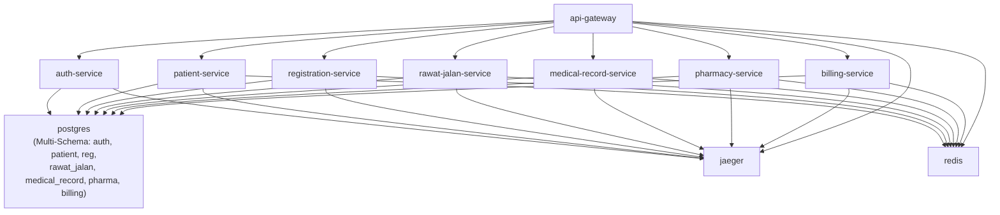

### Cara Menjalankan

```bash
# 1. Jalankan database & infrastruktur
make be-infra-up

# 2. Inisialisasi skema database multi-schema
make db-schemas

# 3. Jalankan migrasi seluruh service
make migrate-up

# 4. Jalankan seluruh microservices lokal
make be-run-local-all

# Akses API Gateway
curl http://localhost:60080/api/v1/health

# Akses Jaeger Tracing UI
open http://localhost:16686
```

### Alur Bisnis Lengkap (Happy Path)

> 🔗 **[Buka Diagram di Live Mermaid Editor](https://mermaid.live/edit#pako:eNqVlW1P20gQx7_KyC9OoLucA1cox4uT8gQNIdSNKW_qE5p412Fre23tA1VE-e6dtbOJU6hU8sKKxrv7--_Mf8ZPQVoxHpxDkBXVt_QBlYHbcSKBfoMvSZBYdvYPo2d6-g4GrBQyvLFK8ySRY8wMKohQCy5hiMpSMPoY30JYo6GYCRVfCW24SoL_odf773sSzBc3SfAdholsGcPfYsys_GrlCiVEVSG2mPZ4RbBK6h2Dy7SykrD3snKwkYeNujB29A4mj6TyHCZ-w2KjlzNiHCw4ExpioziW59CF_c3dRn24Yyr8hqb3FQuUvZWqbO3AYw8ee3BKz4yfwMIthyu3HGKuHkXqbhsLrHOKbPU014VBbkS2QcHEnznxZ3J68vcIPmdTWVsqohK44hDCnTBYQCxWlKJt4nZqQ9Ms9Mdf-OMv9gtzltjjfp_-H5_-e5LYjPczGFepqRQdOrcFCoh4yZXINaJ8FbQtS6ippsYTLz3x8g3E9o5jUi4rjXAwG87D6WjcO-ofwp-U0UdSYtavymDtJuENAx-8gA9vFnArJENXsbmzyqs4TH9y58ZzbkeKxaB5PWCstVyz877Zea8b4x06I029xOmexGUfhqIohFx1TDRCQ9a6xZV4IGFbhTmHGXWq036wxDR3JpUMUtJmqW7eynDlUVdvzsaCa17DxyXhJwXPjaqkyHczgWZLiek6rBXXqRJ1Ny8w89jZG7AxL7hG4a7XMd9PM-JVB6ZVWRfcbG1_7fHX-516CiPUD4I72jUllC4pZCpcYn2CuaqRudF3OSHcsq1HKORjRfUIn7rD6Nnj5h43_zUuUpXmmi5WWIm6veIS16g67eVpNa5fGGzaKohQNM7aLO266saruNnL-RlCtKlVx1afa4aGA7WusaRqMB3DH-AHlqv5y0JTS9Rc6m2SI8-L9njsyDcDOSitFOtQ76ioGRVYC5hVzBm97XJiXwiJhdDule93GEZXcefrkGPZK11n7po-fBLsOXTLs3UvX5Ze2yev7VOj7fh9_8SlnvItmxHdGI2oVO6chGw0xVxbCscGqcvcVy74CwIyYklJd9_UJ3dmEpgHcmdCgSRgPENb0PBL5LNbjNZU8Vqm9NIoyylim0S70aaw3ISffwBpcJhy)** *(Klik kanan → Buka di Tab Baru / Open Link in New Tab)*

```mermaid
flowchart TD
    A["👤 Admin/Nurse\nDaftar Pasien Baru\nPOST /patient/register"] -->|"MRN"| B

    B["👤 Admin/Nurse\nDaftar Kunjungan Poli\nPOST /registrations"] -->|"encounter_no"| C

    C["🔔 Event: EncounterRegistered\n(Redis Stream: registration.events)"] -->|"rawat-jalan-group"| D

    D["🏥 Rawat Jalan Service\nSiapkan Encounter Poli Aktif"] --> E

    E["🩺 Nurse\nInput Triage / Vital Signs\nPOST /rawat-jalan/triage"] --> F

    F["👨‍⚕️ Doctor\nMulai Pemeriksaan\nPOST /rawat-jalan/encounter/start"] --> G

    G["👨‍⚕️ Doctor\nInput Diagnosa (KBM/ICD-10) + Severity\nPOST /rawat-jalan/diagnosis"] --> H

    H["👨‍⚕️ Doctor\nInput Tindakan Medis\nPOST /rawat-jalan/actions"] -->|"Event: MedicalActionAdded\n(rawat_jalan_stream)"| I

    I["💰 Billing Service\nCatat Tagihan Tindakan ke Kasir\n(background consumer)"] --> J

    J["👨‍⚕️ Doctor\nInput Resep Obat Elektronik\nPOST /pharmacy/prescriptions"] --> K

    K["👨‍⚕️ Doctor\nSelesaikan Pemeriksaan Poli\nPOST /rawat-jalan/encounter/complete"] --> L

    L["🏦 Cashier\nLihat Rincian Tagihan Terpadu\nGET /billing/invoice/{encounter_no}"] --> M

    M["🏦 Cashier\nProses Pelunasan Pembayaran\nPOST /billing/pay"] -->|"Event: InvoicePaid\n(billing_stream)"| N

    N["💊 Pharmacy Service\nUpdate status PAID & Siapkan Obat\nPOST /pharmacy/dispense"] --> P

    P["📑 Medical Record Service\nVerifikasi Koding ICD-10 & Finalisasi Severity BPJS\nPOST /rekam-medis/diagnosis/{id}/verify-kbm"] --> Q

    Q["✅ Pelayanan Selesai & Terkodifikasi Sesuai Standar"]
```

---

*Dokumen ini diperbarui sesuai implementasi: 2026-09-01*  
*Module: `github.com/aliube/go-micro-simrs-one`*

